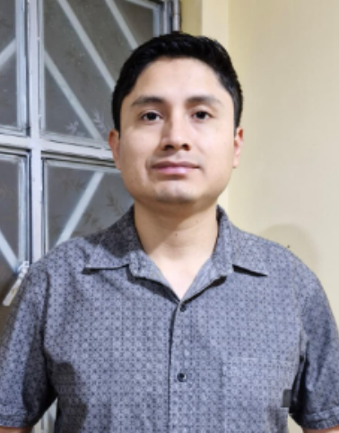

# Capítulo I: Introducción

## 1.1. Startup Profile

### 1.1.1. Descripción de la Startup

Axiom es una startup tecnológica enfocada en el desarrollo de soluciones para el turismo de aventura en el Perú, orientada a mejorar la seguridad, trazabilidad y gestión operativa en entornos de baja conectividad. Surge para cubrir la falta de sistemas que permitan el monitoreo en tiempo real de turistas en zonas remotas.

Su producto principal, TourMate, es una plataforma web y móvil que centraliza la gestión de tours, permitiendo a las agencias supervisar la ubicación, estado y progreso de sus grupos mediante dashboards y alertas ante anomalías. A su vez, los turistas acceden a herramientas de navegación offline, registro de su experiencia y visualización de información contextual del recorrido.

A nivel técnico, TourMate integra un ecosistema IoT con dispositivos wearables y checkpoints Bluetooth que capturan datos de geolocalización y signos vitales. Estos se sincronizan de forma asincrónica, asegurando operatividad incluso sin conexión continua, lo que permite un sistema escalable, resiliente y orientado a la prevención de riesgos.

### 1.1.2 Perfiles de integrantes del equipo 

|||
|------|-------------|
|  | **Verastigue Martinez, Giancarlo Jose**   Código de Estudiante: U202419483   Mi nombre es Giancarlo Jose Verastigue Martinez, estudiante de Ingeniería de Software. Soy una persona responsable y enfocada en sus proyectos y metas, a nivel académico cuento con conocimientos en programación en el lenguaje de C++, con experiencia trabajando en equipo y bajo presión. Considero que soy organizado y detallista en mis proyectos. La experiencia laboral y la universidad me han hecho desarrollar habilidades para afrontar problemas o dificultades de manera exitosa, habilidades que aportaré a este grupo de trabajo y de esta manera sacar adelante nuestro proyecto.  |
---