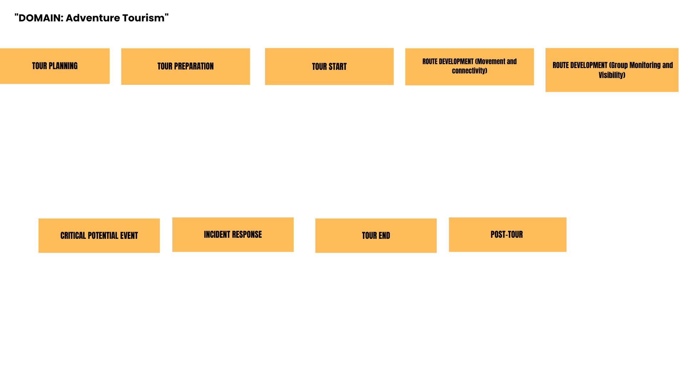
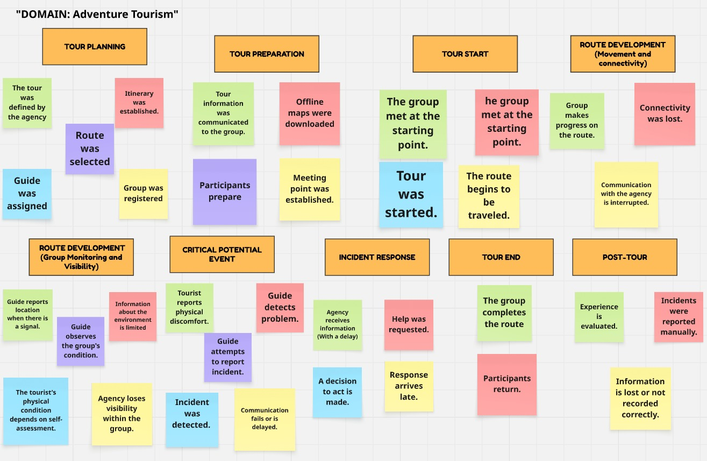
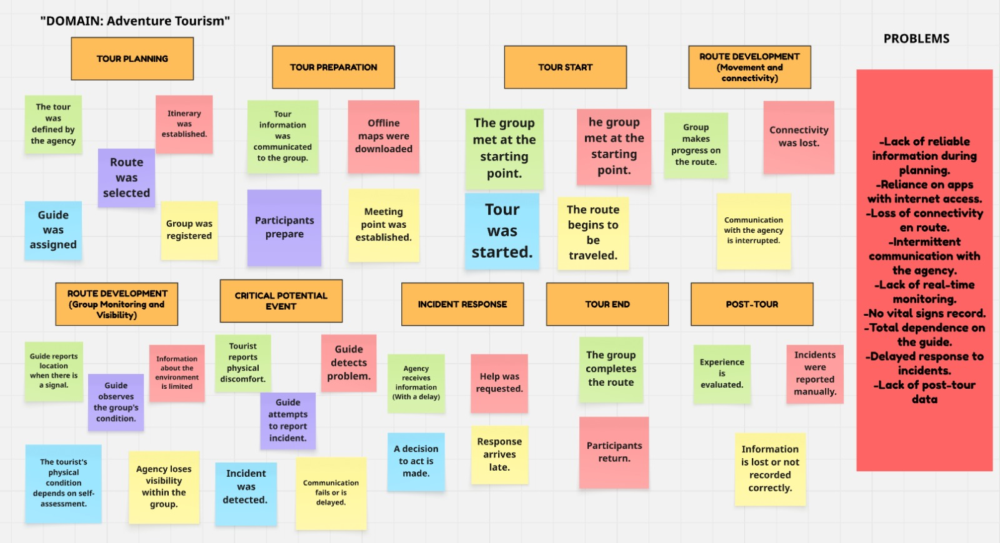
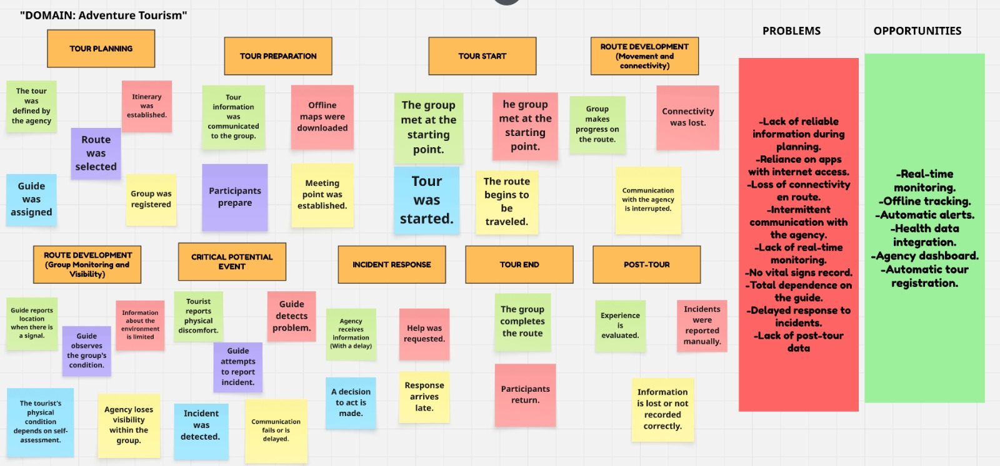

## 2.4. Big Picture Event Storming

En esta sección se presenta el Big Picture Event Storming del proyecto TourMate, elaborado como una visión general del dominio del turismo de aventura (Adventure Tourism) en zonas de baja conectividad. Mediante una sesión colaborativa, el equipo identificó y ordenó los eventos más importantes que ocurren durante un tour, desde la planificación hasta el cierre.

Ahora, aquí se va a explicar a paso a paso como se desarrollo el Big Picture Event Storming:

* Para empezar, antes de poner los Post-its, dividimos todo este Event Storming en Etapas, basandonos en el As-is Scenario Mapping:

* Luego, ubicamos todos los Post-its, que representan los Eventos de Dominio (Domain Events) en sus respectivas etapas:

* Después de esto, creamos la sección de "Problems", donde identificamos todos los problemas que se pueden presentar en las etapas del turismo:

* Finalmente, en la sección de "Opportunities" identificamos todas las oportunidades de mejora:

Mediante este proceso, al identificar las oportunidades de mejora, logramos definir mejor el cómo vamos a desarrollar nuestra plataforma.

---