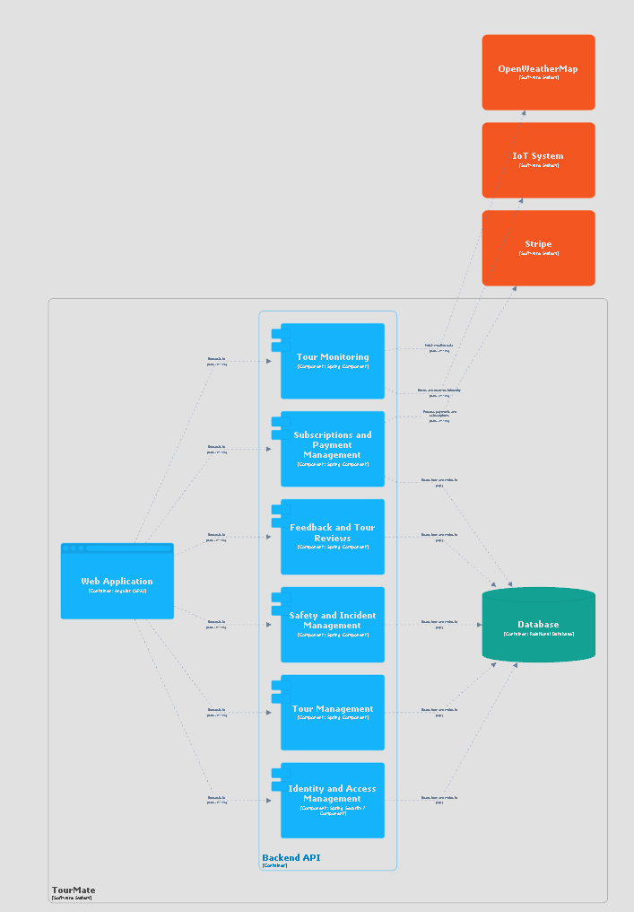

## 4.6. Domain-Driven Software Architecture

### 4.6.1. Design-Level EventStorming

En esta sección se presenta el Design-Level EventStorming del proyecto Tourmate, el cúal se desarrollo en 4 pasos, los cúales se van a explicar a continuación:

* Para empezar, identificamos todos los Domain Events de Tourmate. En esta etapa analizamos cada funcionalidad obtenida durante el análisis del negocio y registramos todos los eventos importantes que modifican el estado del sistema, como el registro de usuarios, la creación de tours, el inicio de recorridos, el reporte de incidentes o la generación de reportes:

* Luego, procedimos a organizar los Domain Events, eliminando los eventos repetidos, agrupamos aquellos que pertenecían al mismo flujo de negocio y ordenamos la secuencia lógica de cada proceso. Este refinamiento permitió obtener una visión más clara de los distintos procesos que forman parte de Tourmate antes de incorporar elementos adicionales del modelo:

* Después de esto, comenzamos a construir cada flujo funcional. Para cada Domain Event identificamos el comando que lo desencadena, representado por notas azules. Además, agregamos los actores responsables de ejecutar cada comando mediante notas amarillas, cada Read Model para la toma de decisiones de los actores antes de realizar un comando y las políticas representadas en color morado, las cuales automatizan determinadas acciones cuando ocurre un evento. De esta manera logramos modelar el comportamiento completo de cada proceso de negocio:

* Finalmente, integramos todos los flujos individuales en los respectivos Bounded Context del dominio:

Enlace para acceder al tablero de Miro:
https://miro.com/app/board/uXjVHrbqRdA=/?share_link_id=127054225300

### 4.6.2. Software Architecture Context Level Diagram

### 4.6.3. Software Architecture Container Level Diagrams

### 4.6.4. Software Architecture Component Level Diagrams

