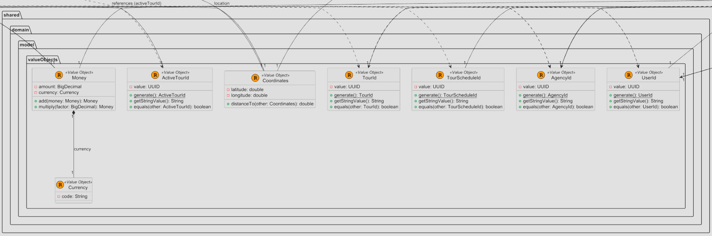
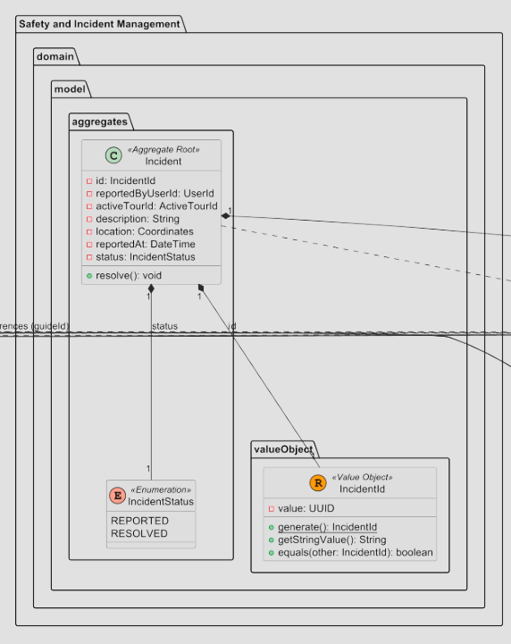
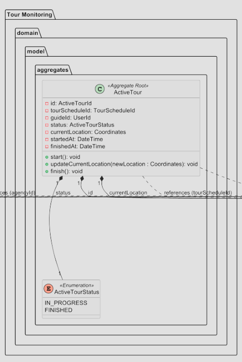
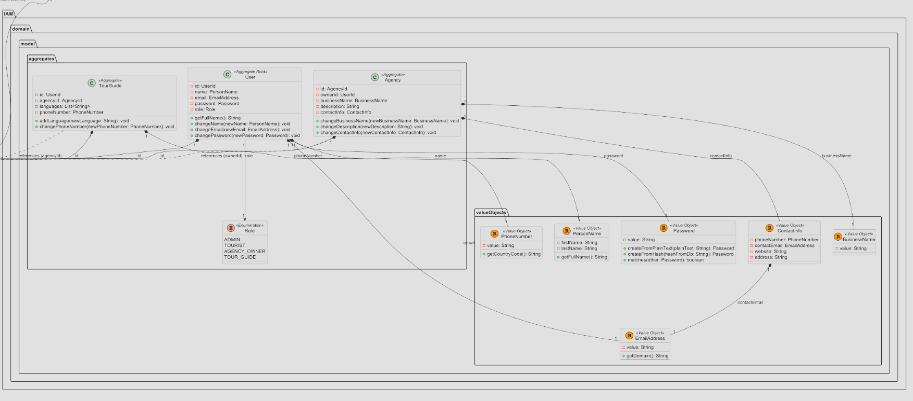
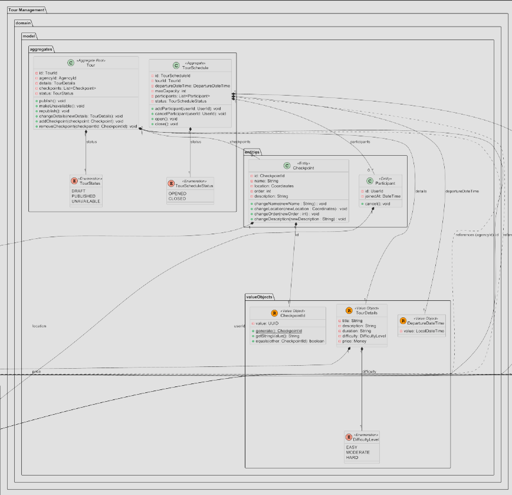
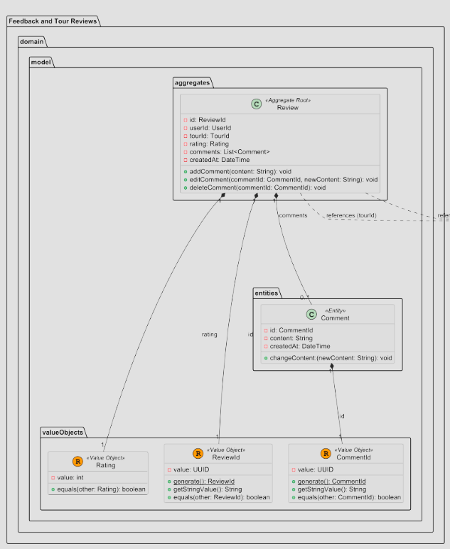
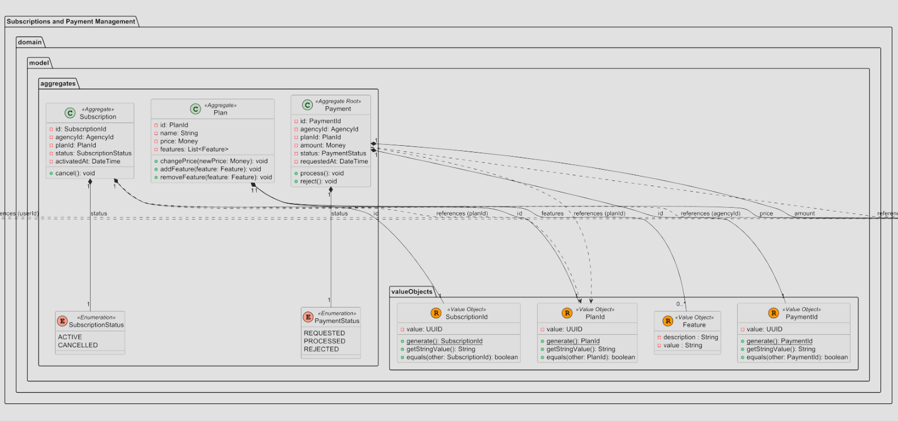

## 4.7. Software Object-Oriented Design

### 4.7.1. Class Diagrams

**Bounded Context: Shared**
Agrupa los Value Objects transversales reutilizados por todo el dominio de la aplicación. Incluye `Money`, `Currency`, `ActiveTourId`, 
`Coordinates`, `TourId`, `TourScheduleId`, `AgencyId` y `UserId`.
.

**Bounded Context: Safety and Incident Management**
Supervisa y documenta incidentes de los turistas o guias durante la expedición mediante monitoreo en tiempo real. Administra `Incident` y sus dos estados `REPORTED` y `RESOLVED`, permitiendo detectar anomalías y exportar reportes operativos.

**Bounded Context: Tour Monitoring**
Gestiona la información de tours en actividad mediante el aggregate root `ActiveTour`. Administra quien es el guia asignado, el estado del tour, la locación actual del grupo, a que hora inició y a que hora terminó. Permite empezar y finalizar los tours.

**Bounded Context: Identity and Access Management**
Gestiona el registro, ciclo de vida de las cuentas de usuario. Se centra en `User` como puerta de entrada para la creación de cuentas con roles definidos. `TourGuide` y `Agency` son aggregates centrados en un segmento objetivo distinto a un user común.

**Bounded Context: Tour Management**
Controla la creación y administración del catálogo de tours por parte de las agencias. La entidad principal es `Tour` que se compone de `Checkpoint` y se asocia con `TourSchedule` que se compone de `Participant` para la gestión de un tour programado con turistas participantes.

**Bounded Context: Feedback and Tour Reviews**
Administra los ratings y comentarios que puede hacer un turista luego de finalizar un tour. Se tiene a `Review` como punto de entrada para la creación de ratings y comentarios. Además se puede validar la información de un comentario con el entity `Comment` y manejar un estandar en rating que van de 0 a 5 puntos con el value object `Rating`.

**Bounded Context: Subscriptions and Payment Management**  
Gestiona los planes de suscripción y el procesamiento de pagos de los usuarios. Incluye `Subscription`, `Plan` y `Payment`. 

