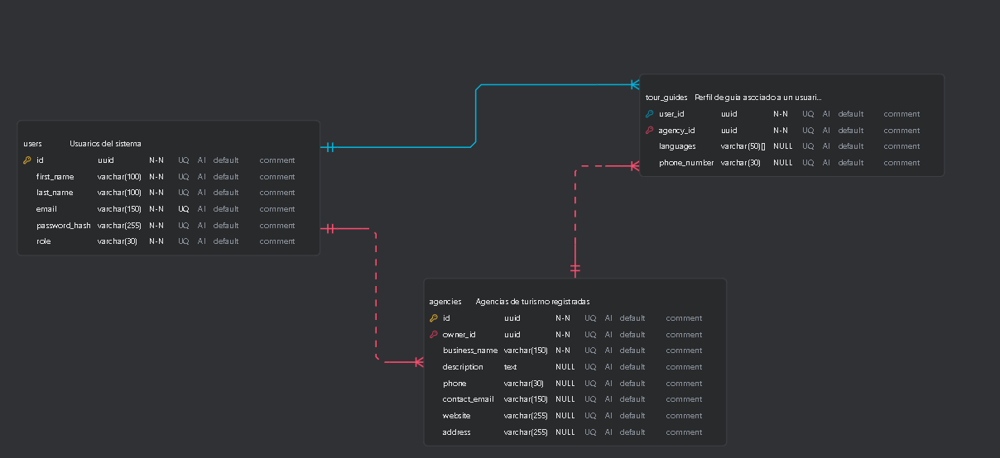
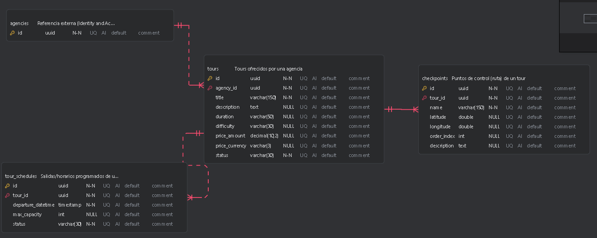
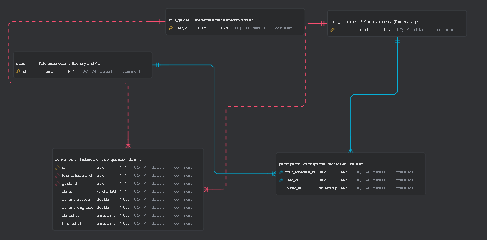
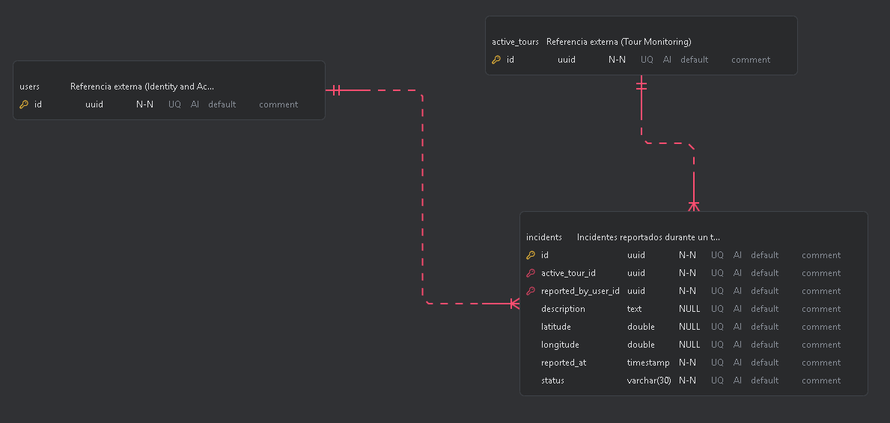
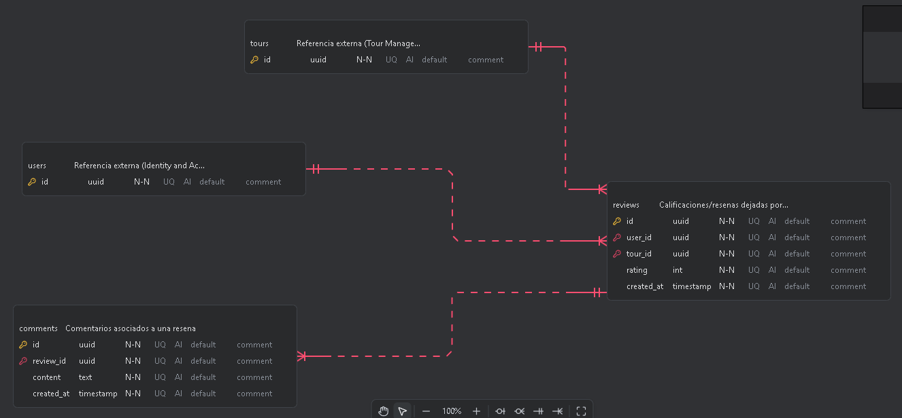
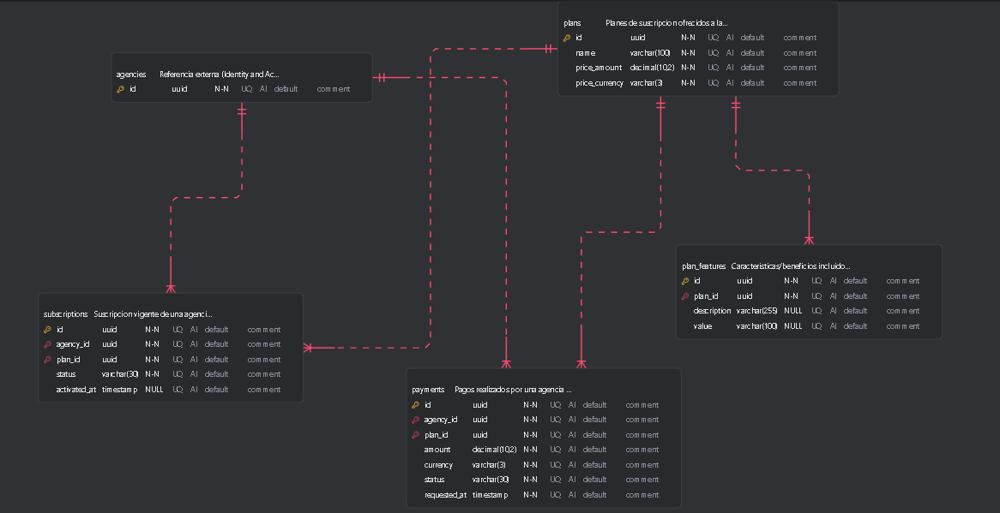

## 4.8. Database Design
### 4.8.1. Database Diagrams

El diseño de base de datos de Tourmate está estructurado en 6 bounded contexts con  tablas, siguiendo los principios de Domain-Driven Design para garantizar modularidad, escalabilidad y mantenibilidad. Cada contexto —Safety and Incident Management, Tour Monitoring, Identity and Access Management, Tour Management,  Feedback and Tour Reviews y Subscriptions and Payment Management— gestiona de forma autónoma una parte específica del sistema, pero todos están integrados mediante claves foráneas UUID que reflejan el flujo operativo del negocio: desde el registro del usuario y la configuración del tour, hasta la ejecución de la expedición, el monitoreo de seguridad en tiempo real y la creación de Reviews. Esta arquitectura desacoplada pero conectada logicamente garantiza trazabilidad completa del recorrido, monitoreo biométrico continuo, sincronización y una gestión eficiente de toda la operación de turismo de aventura.

#### 4.8.1.1. IAM Component Diagram

#### 4.8.1.2. Tour Management Component Diagram

#### 4.8.1.3. Tour Monitoring Component Diagram

#### 4.8.1.4. Safety Incident Component Diagram

#### 4.8.1.5. Feedback and Review Component Diagram

#### 4.8.1.6. Subscriptions and Payment Management Component Diagram

---