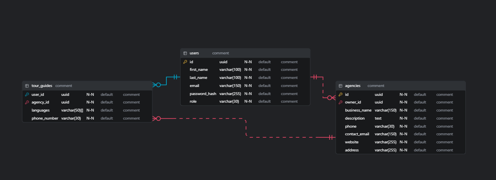
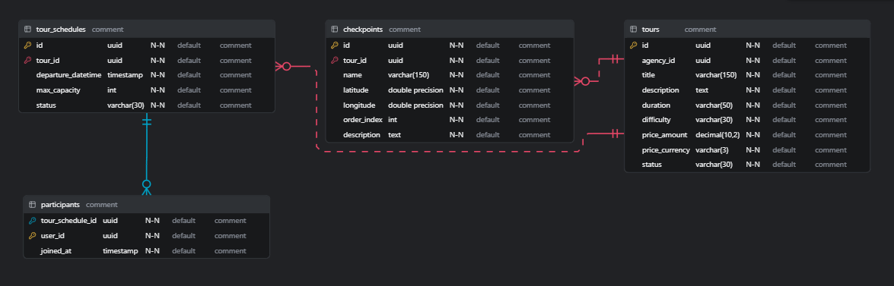
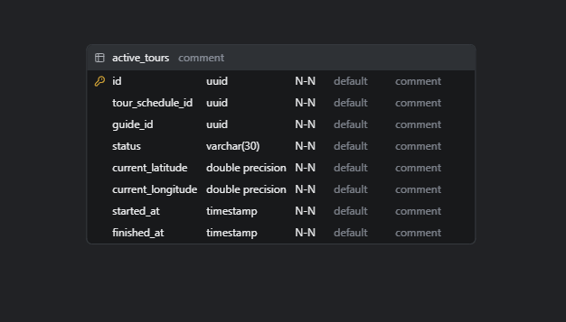
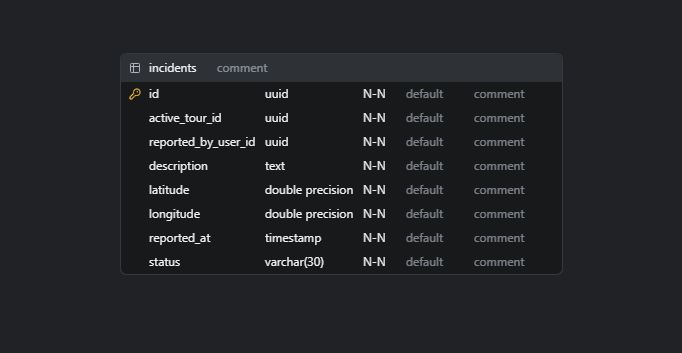
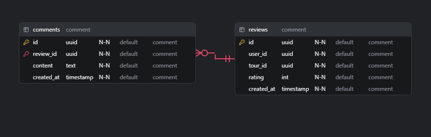
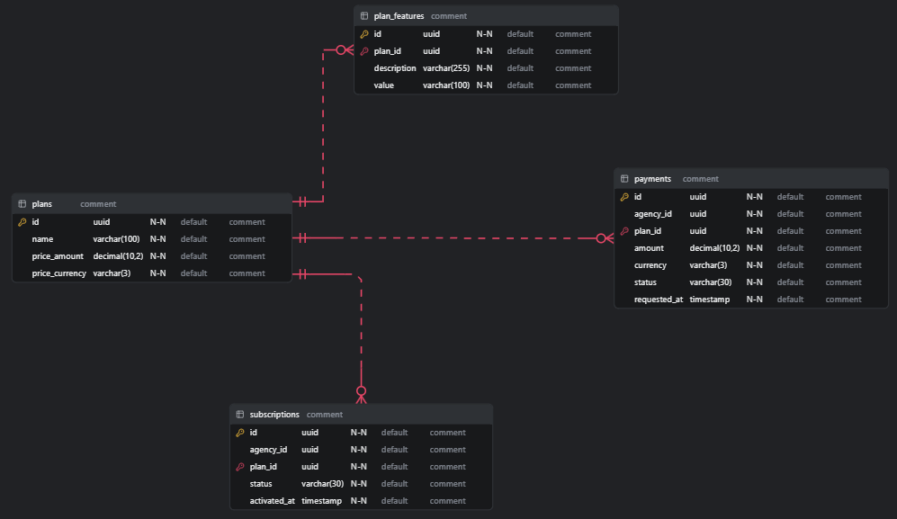

## 4.8. Database Design
### 4.8.1. Database Diagrams

El diseño de base de datos de Tourmate está estructurado en 6 bounded contexts con  tablas, siguiendo los principios de Domain-Driven Design para garantizar modularidad, escalabilidad y mantenibilidad. Cada contexto —Safety and Incident Management, Tour Monitoring, Identity and Access Management, Tour Management,  Feedback and Tour Reviews y Subscriptions and Payment Management— gestiona de forma autónoma una parte específica del sistema, pero todos están integrados mediante claves foráneas UUID que reflejan el flujo operativo del negocio: desde el registro del usuario y la configuración del tour, hasta la ejecución de la expedición, el monitoreo de seguridad en tiempo real y la creación de Reviews. Esta arquitectura desacoplada pero conectada logicamente garantiza trazabilidad completa del recorrido, monitoreo biométrico continuo, sincronización y una gestión eficiente de toda la operación de turismo de aventura.

**Bounded Context: Identity and Access Management**

**Bounded Context: Tour Management**

**Bounded Context: Tour Monitoring**

**Bounded Context: Safety and Incident Management**

**Bounded Context: Feedback and Tour Reviews**

**Bounded Context: Subscriptions and Payment Management**  

### 4.8.2 Database Dictionary

| Entidad | Descripción |
|---|---|
| `users` | Usuarios de la plataforma |
| `agencies` | Agencias de turismo registradas |
| `tour_guides` | Perfil de guía asociado a un usuario y a una agencia |
| `tours` | Catálogo de tours ofrecidos por las agencias |
| `checkpoints` | Puntos de control/paradas que componen la ruta de un tour |
| `tour_schedules` | Salidas programadas de un tour |
| `participants` | Usuarios inscritos en una salida programada |
| `active_tours` | Tours en ejecución, con seguimiento de ubicación en tiempo real |
| `incidents` | Incidentes reportados durante un tour activo |
| `plans` | Planes de suscripción disponibles para agencias |
| `plan_features` | Características incluidas en cada plan |
| `subscriptions` | Suscripción de una agencia a un plan |
| `payments` | Pagos realizados por las agencias por un plan |
| `reviews` | Calificaciones de usuarios sobre tours |
| `comments` | Comentarios asociados a una reseña |

---