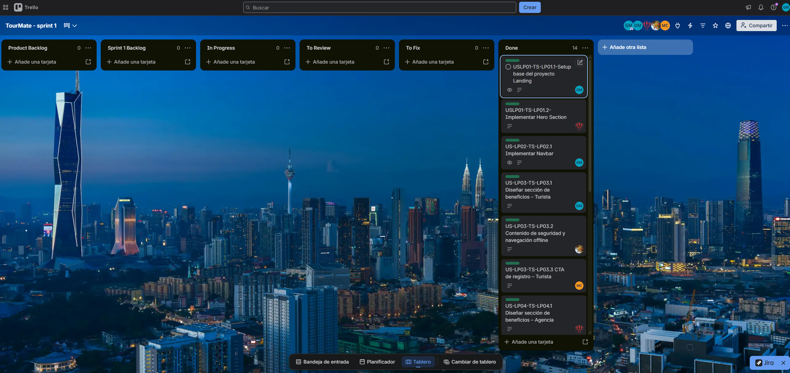
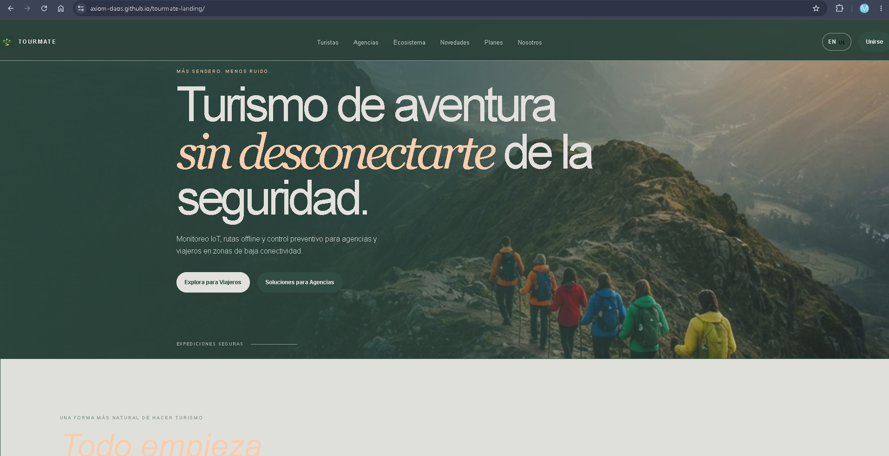
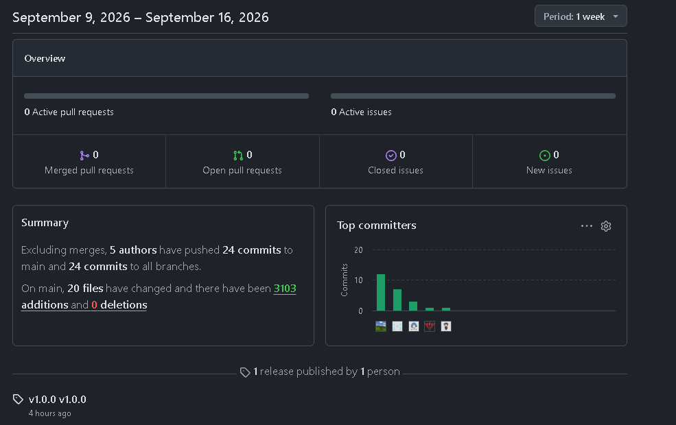

### 5.2.1. Sprint 1

#### *5.2.1.1. Sprint Planning 1*

Para el desarrollo del primer sprint nos centramos en el desarrollo de la landing page de nuestra aplicación. Para ello designamos tareas específicas para cada sección, de modo que podamos repartirnos estas tareas entre los integrantes del grupo por sección de la landing, agilizando su desarrollo. Dentro de la landing se presenta quienes somos, funcionalidades, planes, manera de contactarnos y sobre la organización.

| **Sprint #** | 1                                                                                                                                                                                                                                        |
| --- |------------------------------------------------------------------------------------------------------------------------------------------------------------------------------------------------------------------------------------------|
| **Sprint Planning Background** |                                                                                                                                                                                                                                          |
| **Date** | 2026-09-10                                                                                                                                                                                                                               |
| **Time** | 4:00 PM                                                                                                                                                                                                                                  |
| **Location** | Reunión virtual                                                                                                                                                                                                                          |
| **Prepared By** | Giancarlo Verastigue Martinez                                                                                                                                                                                                            |
| **Attendees** | Giancarlo Verastigue Martinez, Matias Carrillo Acho, xxx, xxxx, xxxx                                                                                                                                                                     |
| **Sprint n – 1 Review Summary** | N/A (Primer Sprint del proyecto. Se establecieron las bases de la arquitectura, infraestructura en la nube y repositorios).                                                                                                              |
| **Sprint n – 1 Retrospective Summary** | N/A (Primer Sprint. El equipo acordó usar GitFlow y Conventional Commits rigurosamente desde el primer día).                                                                                                                             |
| **Sprint Goal & User Stories** |                                                                                                                                                                                                                                          |
| **Sprint 1 Goal** | Our focus is on delivering a fast, static Landing Page (HTML/CSS/JS) with language support to attract clients and validate our value proposition. This will be confirmed when the Landing Page is deployed and fully navigable by users. |
| **Sprint 1 Velocity** | 10 Story Points (Velocidad estimada para el primer ciclo del equipo).                                                                                                                                                                    |
| **Sum of Story Points** | 10                                                                                                                                                                                                                                       |

#### *5.2.1.2. Aspect Leaders and Collaborators*

A continuación se detalla la matriz de liderazgo y colaboración (LACX) para brindar claridad en la comunicación del equipo durante el desarrollo de las tareas de este Sprint.

| Team Member (Last Name, First Name) | GitHub Username | Landing Page UI/UX | Landing Page Structure | Basic Funcs | Special Funcs |
|-------------------------------------|-----------------| --- | --- | --- | --- |
| Verastigue Martinez, Giancarlo      | @CaLoVM         | C | L | C | C |
| Carrillo Acho, Matias               | @xxx            | C | C | C | L |
| xxxxxxx                             | @xx             | C | C | L | C |
| xxxxxxx                             | @xxx            | C | C | L | C |
| xxxxxxx                             | @xx             | L | C | C | C |

#### *5.2.1.3. Sprint Backlog 1*

El sprint backlog se estructuró en torno a la creación de una Landing Page estática, rápida y responsiva, con soporte para cambio de idioma (Español/Inglés) y navegación fluida. Cada User Story se descompuso en tareas técnicas concretas, asignadas a los miembros del equipo según sus roles de liderazgo y colaboración definidos en la matriz LACX.

**Trello link:** [https://trello.com/)

| User Story Id | User Story Title | Work-Item / Task Id | Work-Item / Task Title | Description | Estimation (Hours) | Assigned To | Status |
| --- | --- | --- | --- | --- | --- |-------------| --- |
| US19 | Landing Page Value Proposition | TS19.1 | Setup Static Proj | Inicializar el repositorio del Landing con la estructura base HTML5 y CSS (Tailwind/CSS puro). | 2 | @xxx        | Done |
| US19 | Landing Page Value Proposition | TS19.2 | Implement Hero Section | Desarrollar la sección principal responsiva con Flexbox/Grid. | 4 | @xxx        | Done |
| US20 | Landing Page Navigation | TS20.1 | Vanilla JS Smooth Scroll | Implementar el script JS para navegación interna y el anchor tag externo hacia la Web App. | 2 | @xxx        | Done |
| US21 | Product Promotional Video | TS21.1 | Embed YouTube Iframe | Integrar el componente de video nativo con fallbacks de imagen vía CSS. | 2 | @xxx        | Done |
| US26 | Landing Page Language Switcher | TS26.1 | Implement JS Dictionary | Crear el script Vanilla JS para alternar los nodos de texto entre Español e Inglés del DOM. | 3 | @xxx        | Done |

#### *5.2.1.4. Development Evidence for Sprint Review*

En la siguiente tabla se resumen los principales commits realizados en los repositorios de Axiom correspondientes al alcance del primer Sprint, aplicando Conventional Commits.

| Repository             | Branch | Commit Id | Commit Message | Commit Message Body | Committed on |
|------------------------| --- | --- | --- | --- |--------------|
| axiom/tourmate-landing | feature/struct | 0ea6e9e | feat: add initial structure | Implementa la estructura principal del proyecto así como el header y el footer. | 2026-09-11   |
| axiom/tourmate-landing | feature/hero-trustedbar-drivers | a5693ee | feat: add structure and styles of hero, trustedbar and drivers section | Implementa las secciones de hero, trustedbar y drivers section. | 2026-09-11   |
| axiom/tourmate-landing | feature/operators-stats | 58c8633 | feat: add operators and stats sections | Implementa las secciones de operators y stats | 2026-09-12   |
| axiom/tourmate-landing | feature/pricing-faq | 11ed754 | feat: add pricing, testimonials and faq sections | Implementa las secciones de pricing, testimonials y faq | 2026-09-13   |
| axiom/tourmate-landing | feature/cta-section-lang | e3a5413 | feat: add cta section and language features | Implementa la sección cta section y las language features | 2026-09-13   |

#### *5.2.1.5. Execution Evidence for Sprint Review*

Durante este Sprint, el equipo logró implementar la versión inicial del Landing Page funcional, rápido y estático, incluido el sistema de idiomas.

*Figura  (Landing Page)*

*Figura (Landing Page - Lang)*

**Landing Page Demonstration Video:** [https://upcedupe-my.sharepoint.com/)

#### *5.2.1.6. Services Documentation Evidence for Sprint Review*

N/A. Durante el Sprint 1 el esfuerzo de desarrollo se enfocó exclusivamente en la creación del sitio web estático promocional (Landing Page), por lo que aún no se han implementado APIs RESTful ni Endpoints backend que requieran ser documentados a través de Swagger/OpenAPI. Esta documentación se estructurará a partir del Sprint 2.

#### *5.2.1.7. Software Deployment Evidence for Sprint Review*

Para el despliegue continuo (CI/CD) de este Sprint, se configuró el entorno de GitHub Pages conectado directamente al repositorio de GitHub del Landing Page estático, permitiendo publicaciones automáticas y ultra-rápidas con cada PR fusionado en la rama main.

#### *5.2.1.8. Team Collaboration Insights during Sprint*

Todos los miembros del equipo han participado activamente en la implementación de los productos del Sprint 1, lo cual se evidencia mediante los reportes de actividad y contribución del repositorio de GitHub de la organización Axiom.

### Conclusiones
### Bibliografía
### Anexos