### 5.2.1. Sprint 1

#### *5.2.1.1. Sprint Planning 1*

Para el desarrollo del primer sprint nos centramos en el desarrollo de la landing page de nuestra aplicación. Para ello designamos tareas específicas para cada sección, de modo que podamos repartirnos estas tareas entre los integrantes del grupo por sección de la landing, agilizando su desarrollo. Dentro de la landing se presenta quienes somos, funcionalidades, planes, manera de contactarnos y sobre la organización.

| **Sprint #** | 1                                                                                                                                                                                                                                        |
| --- |------------------------------------------------------------------------------------------------------------------------------------------------------------------------------------------------------------------------------------------|
| **Sprint Planning Background** |                                                                                                                                                                                                                                          |
| **Date** | 2026-09-10                                                                                                                                                                                                                               |
| **Time** | 4:00 PM                                                                                                                                                                                                                                  |
| **Location** | Reunión virtual                                                                                                                                                                                                                          |
| **Prepared By** | Giancarlo Verastigue Martinez                                                                                                                                                                                                            |
| **Attendees** | Giancarlo Verastigue Martinez, Matias Carrillo Acho, Frank Anthony Huingo Tello, Manuel Alejandro Molina Vasquez, Tony Jhunior Quispe Palomino                                                                                                                                                                     |
| **Sprint n – 1 Review Summary** | N/A (Primer Sprint del proyecto. Se establecieron las bases de la arquitectura, infraestructura en la nube y repositorios).                                                                                                              |
| **Sprint n – 1 Retrospective Summary** | N/A (Primer Sprint. El equipo acordó usar GitFlow y Conventional Commits rigurosamente desde el primer día).                                                                                                                             |
| **Sprint Goal & User Stories** |                                                                                                                                                                                                                                          |
| **Sprint 1 Goal** | Our focus is on delivering a fast, static Landing Page (HTML/CSS/JS) with language support to attract clients and validate our value proposition. This will be confirmed when the Landing Page is deployed and fully navigable by users. |
| **Sprint 1 Velocity** | 10 Story Points (Velocidad estimada para el primer ciclo del equipo).                                                                                                                                                                    |
| **Sum of Story Points** | 10                                                                                                                                                                                                                                       |

#### *5.2.1.2. Aspect Leaders and Collaborators*

A continuación se detalla la matriz de liderazgo y colaboración (LACX) para brindar claridad en la comunicación del equipo durante el desarrollo de las tareas de este Sprint.

| Team Member (Last Name, First Name) | GitHub Username | Landing Page UI/UX | Landing Page Structure | Basic Funcs | Special Funcs |
|-------------------------------------|-----------------| --- | --- | --- | --- |
| Verastigue Martinez, Giancarlo      | @CaLoVM         | C | L | C | C |
| Carrillo Acho, Matias               | @lonybreux      | C | C | C | L |
| Huingo Tello, Frank Anthony         | @Franz2308      | C | C | L | C |
| Molina Vasquez, Manuel Alejandro    | @AleDusty       | C | C | L | C |
| Quispe Palomino, Tony Jhunior     | @GonzJunior18p  | L | C | C | C |

#### *5.2.1.3. Sprint Backlog 1*

El objetivo principal de este Sprint es desarrollar el sitio web estático (Landing Page) de TourMate, encargado de comunicar la propuesta de valor de la plataforma a los dos segmentos objetivo: turistas y agencias. Durante este Sprint se implementarán las secciones de contenido principal, navegación, beneficios diferenciados por segmento, funcionalidades del producto, testimonios, información del equipo y el formulario de contacto, además de los flujos de acceso al registro y el manejo de estados de error/no disponibilidad definidos en las User Stories asociadas a EP06.

**Trello link:** [https://trello.com/b/gCKcMjVR/tourmate-sprint-1)

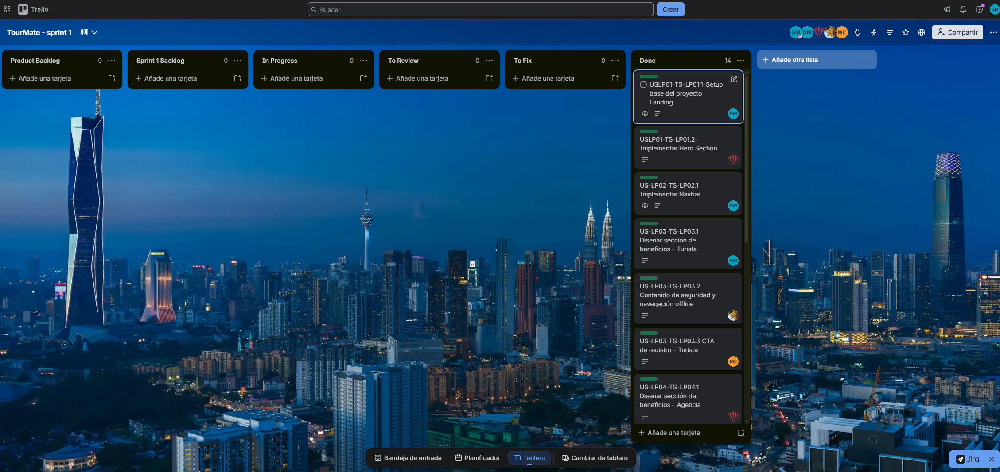
## Sprint 1

| User Story Id | User Story Title | Work-Item / Task Id | Work-Item / Task Title | Description                                                                                    | Estimation (Hours) | Assigned To | Status |
| --- | --- |---------------------| --- |------------------------------------------------------------------------------------------------| --- | --- |--------|
| US-LP01 | Conocer la propuesta de valor | TS-LP01.1           | Setup base del proyecto Landing | Inicializar el repositorio con la estructura base HTML5/CSS para la Landing Page.              | 2 | @lonybreux | Done   |
| US-LP01 | Conocer la propuesta de valor | TS-LP01.2           | Implementar Hero Section | Desarrollar la sección principal con el propósito y beneficio central de TourMate.             | 4 | @lonybreux | Done  |
| US-LP02 | Navegar entre secciones | TS-LP02.1           | Implementar Navbar | Crear el componente de navegación con enlaces a cada sección de la Landing.                    | 2 | @Franz2308 | Done  |
| US-LP03 | Conocer beneficios para turistas | TS-LP03.1           | Diseñar sección de beneficios – Turista | Maquetar la sección con los beneficios orientados al segmento turista.                         | 3 | @GonzJunior18p | Done  |
| US-LP03 | Conocer beneficios para turistas | TS-LP03.2           | Contenido de seguridad y navegación offline | Redactar e integrar el contenido sobre funcionalidades de seguridad y modo offline.            | 2 | @lonybreux | Done  |
| US-LP03 | Conocer beneficios para turistas | TS-LP03.3           | CTA de registro – Turista | Implementar botón que redirige al proceso de registro del segmento turista.                    | 1 | @CaLoVM | Done  |
| US-LP04 | Conocer beneficios para agencias | TS-LP04.1           | Diseñar sección de beneficios – Agencia | Maquetar la sección con los beneficios orientados al segmento agencia.                         | 3 | @Franz2308 | Done  |
| US-LP04 | Conocer beneficios para agencias | TS-LP04.2           | Contenido de monitoreo, alertas y gestión | Redactar e integrar el contenido sobre funcionalidades de monitoreo y gestión de expediciones. | 2 | @Franz2308 | Done  |
| US-LP04 | Conocer beneficios para agencias | TS-LP04.3           | CTA de registro – Agencia | Implementar botón que redirige al proceso de registro del segmento agencia.                    | 1 | @AleDusty | Done  |
| US-LP05 | Conocer las funcionalidades principales | TS-LP05.1           | Sección de funcionalidades principales | Desarrollar grid/cards con las funcionalidades clave de TourMate.                              | 3 | @AleDusty | Done  |
| US-LP05 | Conocer las funcionalidades principales | TS-LP05.2           | Contenido de operatividad offline | Integrar contenido claro sobre la compatibilidad y uso sin conexión.                           | 2 | @GonzJunior18p | Done  |
| US-LP08 | Contactar al equipo de Tourmate | TS-LP08.1           | Formulario de contacto | Maquetar el formulario de contacto con los campos requeridos.                                  | 3 | @Franz2308 | Done  |
| US-LP08 | Contactar al equipo de Tourmate | TS-LP08.2           | Endpoint de envío de mensaje | Implementar el servicio que registra el mensaje y retorna confirmación de recepción.           | 4 | @GonzJunior18p | Done  |
| US-LP09 | Conocer al equipo de la startup | TS-LP09.1           | Sección "Sobre el equipo" | Maquetar la sección con la información de los miembros de Axiom.                               | 2 | @CaLoVM | Done  |

#### *5.2.1.4. Development Evidence for Sprint Review*

En la siguiente tabla se resumen los principales commits realizados en los repositorios de Axiom correspondientes al alcance del primer Sprint, aplicando Conventional Commits.

| Repository | Branch | Commit Id | Commit Message | Commit Message Body | Committed on |
|---|---|---|---|---|---|
| axiom/tourmate-landing | feature/plans-section | da1f6c1 | style: add smooth scrolling and enhance plans section layout and resp... | Añade desplazamiento suave (smooth scrolling) y mejora el diseño y la adaptabilidad de la sección de planes. | 2026-09-17 |
| axiom/tourmate-landing | feature/plans-section | d820385 | feat: add plans section with pricing options for tourists and agencies | Implementa la sección de planes con las opciones de precios para turistas y agencias. | 2026-09-17 |
| axiom/tourmate-landing | feature/team-development-section | b9d8364 | feat: add social media links for team members in the team section | Añade los enlaces a las redes sociales de los miembros en la sección del equipo. | 2026-09-16 |
| axiom/tourmate-landing | feature/team-development-section | 0cb46b6 | style: enhance team section layout and responsiveness | Mejora el diseño y la adaptabilidad de la sección del equipo para dispositivos móviles. | 2026-09-16 |
| axiom/tourmate-landing | feature/navigation | 9208502 | style: enhance navigation links with hover effects and transitions | Mejora los enlaces de navegación añadiendo efectos hover y transiciones visuales. | 2026-09-16 |
| axiom/tourmate-landing | refactor | e4f16c0 | refactor: rename sections for clarity and consistency in index.html | Refactoriza y renombra las secciones en el archivo index.html para mantener consistencia y claridad. | 2026-09-16 |
| axiom/tourmate-landing | main | 8b89273 | fix(i18n): move team-dev block out of nested plans object in en.json | Corrige la ubicación del bloque team-dev sacándolo del objeto anidado en el archivo de traducciones al inglés. | 2026-09-16 |
| axiom/tourmate-landing | main | c343560 | chore: delete docs file | Elimina el archivo de documentación innecesario del repositorio. | 2026-09-16 |
| axiom/tourmate-landing | feature/team-development-section | 83b3f1d | feat: add Matias Carrillo photo in team development section | Añade la fotografía de Matias Carrillo a la sección del equipo de desarrollo. | 2026-09-16 |
| axiom/tourmate-landing | feature/inicio-section | 16c1f03 | fix: resolve i18n error in hero section | Resuelve un error de internacionalización (i18n) en la sección hero. | 2026-09-16 |
| axiom/tourmate-landing | feature/team-development-section | c764aa8 | fix: delete team section styles and put it on global styles css | Elimina los estilos locales de la sección de equipo y los unifica en los estilos globales. | 2026-09-16 |
| axiom/tourmate-landing | develop | 898542c | Merge branch 'feature/team-development-section' into develop | Integra los cambios de la rama de la sección de equipo de desarrollo en la rama develop. | 2026-09-16 |
| axiom/tourmate-landing | feature/agencias-viajeros-section | aaa60ed | fix: delete test button in viajeros-turistas section | Elimina un botón de prueba que había quedado en la sección de viajeros/turistas. | 2026-09-16 |
| axiom/tourmate-landing | develop | 99e6cd7 | Merge branch 'feature/inicio-section' into develop | Integra los cambios de la rama de la sección de inicio en la rama develop. | 2026-09-16 |
| axiom/tourmate-landing | feature/agencias-viajeros-section | 2d01fd1 | fix: add agencias-viajeros section styles to global styles | Mueve y añade los estilos de la sección de agencias y viajeros a los estilos globales. | 2026-09-16 |
| axiom/tourmate-landing | develop | 651f25e | Merge branch 'feature/agencias-viajeros-section' into develop | Integra los cambios de la rama de la sección de agencias y viajeros en la rama develop. | 2026-09-16 |
| axiom/tourmate-landing | feature/inicio-section | 9da572d | Merge branch 'develop' into feature/inicio-section | Actualiza la rama de la sección de inicio con los últimos cambios de develop. | 2026-09-16 |
| axiom/tourmate-landing | feature/vision-section | 79a74f9 | feat: add i18n to vision section | Implementa el soporte de múltiples idiomas (i18n) para la sección de visión. | 2026-09-16 |
| axiom/tourmate-landing | feature/team-development-section | 7a20af0 | feat: add team development section with responsive design | Implementa la sección del equipo de desarrollo asegurando que su diseño sea responsivo. | 2026-09-15 |
| axiom/tourmate-landing | feature/agencias-viajeros-section | f5d0426 | feat(landing): add agencias and viajeros sections with language support and structure | Añade la estructura y soporte de idiomas para las secciones de agencias y viajeros en la landing. | 2026-09-15 |
| axiom/tourmate-landing | main | 0ede294 | feat(i18n): implement core i18n engine with language toggle and DOM translation support | Implementa el motor central de internacionalización, incluyendo el cambio de idioma y soporte de traducción en el DOM. | 2026-09-15 |
| axiom/tourmate-landing | feature/agencias-viajeros-section | b12acba | feat(i18n): add Spanish translations for agencias and viajeros sections | Añade las traducciones al español para los textos de las secciones de agencias y viajeros. | 2026-09-15 |
| axiom/tourmate-landing | feature/agencias-viajeros-section | 314f9f5 | feat(i18n): add English translations for agencias and viajeros sections | Añade las traducciones al inglés para los textos de las secciones de agencias y viajeros. | 2026-09-15 |
| axiom/tourmate-landing | feature/agencias-viajeros-section | 54d6f63 | feat(styles): add agencia-viajeros section styles | Implementa los estilos visuales principales para la sección de agencias y viajeros. | 2026-09-15 |
| axiom/tourmate-landing | feature/agencias-viajeros-section | d727252 | feat(assets): add viajeros-mockup.png | Agrega la imagen de mockup correspondiente a la sección de viajeros a los recursos del proyecto. | 2026-09-15 |
| axiom/tourmate-landing | feature/inicio-section | c983833 | feat(landing): add hero-expedition.png | Agrega la imagen hero-expedition a los recursos del proyecto para la sección de inicio. | 2026-09-15 |
| axiom/tourmate-landing | main | eea0313 | add | Añade archivos o cambios generales al repositorio. | 2026-09-15 |
| axiom/tourmate-landing | main | 1da7469 | added the logo | Añade el archivo del logo oficial al proyecto. | 2026-09-15 |
| axiom/tourmate-landing | feature/inicio-section | 672a92f | feat: add hero section and navigation to feature/inicio-section | Implementa la sección hero y la barra de navegación dentro de la rama de inicio. | 2026-09-15 |
| axiom/tourmate-landing | feature/contact-footer | ab8aed9 | feat: add contact and footer sections with responsive design | Implementa las secciones de contacto y el footer garantizando un diseño adaptable a diferentes dispositivos. | 2026-09-14 |
| axiom/tourmate-landing | feature/vision-section | a300ccd | feat: add vision section styles | Implementa y aplica los estilos visuales para la sección de visión. | 2026-09-14 |
| axiom/tourmate-landing | feature/vision-section | 2e2e0c2 | Merge branch 'develop' into feature/vision-section | Actualiza la rama de la sección de visión con los cambios más recientes de la rama develop. | 2026-09-14 |
| axiom/tourmate-landing | feature/vision-section | 65c74bd | feat: add vision section structure | Construye el marcado HTML y la estructura principal para la sección de visión. | 2026-09-14 |
| axiom/tourmate-landing | main | 01f9539 | chore: add project directories | Crea y organiza los directorios y carpetas base del proyecto. | 2026-09-14 |
| axiom/tourmate-landing | main | 1ad6c2b | add initial structure | Implementa la estructura base y los archivos iniciales del código. | 2026-09-14 |
| axiom/tourmate-landing | main | 1607422 | Initial commit | Realiza el commit inicial configurando la base del repositorio. | 2026-09-01 |

#### *5.2.1.5. Execution Evidence for Sprint Review*

Durante este Sprint, el equipo logró implementar la versión inicial del Landing Page funcional, rápido y estático, incluido el sistema de idiomas.

*Figura  (Landing Page)*
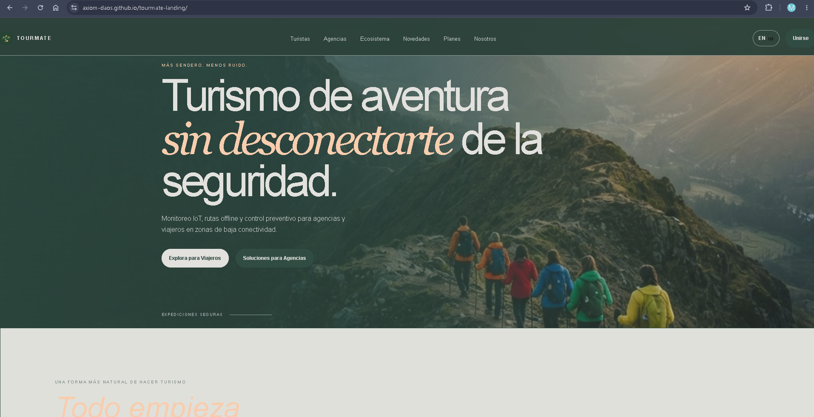

**Landing Page Demonstration Video:** [https://upcedupe-my.sharepoint.com/:v:/g/personal/u202419483_upc_edu_pe/IQDPy8lARpAQRp4FrzFWEwqxAe1KOWcMdKkZwhyLW45DKmo?nav=eyJyZWZlcnJhbEluZm8iOnsicmVmZXJyYWxBcHAiOiJPbmVEcml2ZUZvckJ1c2luZXNzIiwicmVmZXJyYWxBcHBQbGF0Zm9ybSI6IldlYiIsInJlZmVycmFsTW9kZSI6InZpZXciLCJyZWZlcnJhbFZpZXciOiJNeUZpbGVzTGlua0NvcHkifX0&e=jmEFH0](https://upcedupe-my.sharepoint.com/:v:/g/personal/u202419483_upc_edu_pe/IQDPy8lARpAQRp4FrzFWEwqxAe1KOWcMdKkZwhyLW45DKmo?nav=eyJyZWZlcnJhbEluZm8iOnsicmVmZXJyYWxBcHAiOiJPbmVEcml2ZUZvckJ1c2luZXNzIiwicmVmZXJyYWxBcHBQbGF0Zm9ybSI6IldlYiIsInJlZmVycmFsTW9kZSI6InZpZXciLCJyZWZlcnJhbFZpZXciOiJNeUZpbGVzTGlua0NvcHkifX0&e=jmEFH0)

#### *5.2.1.6. Services Documentation Evidence for Sprint Review*

Durante el Sprint 1 el esfuerzo de desarrollo se enfocó exclusivamente en la creación del sitio web estático promocional (Landing Page), por lo que aún no se han implementado APIs RESTful ni Endpoints backend que requieran ser documentados a través de Swagger/OpenAPI. Esta documentación se estructurará a partir del Sprint 2.

#### *5.2.1.7. Software Deployment Evidence for Sprint Review*

#### Despliegue de la Landing Page
El despliegue de la Landing Page de TourMate se realizó utilizando GitHub Pages, aprovechando sus capacidades para publicar sitios web estáticos directamente desde un repositorio. Este enfoque permitió una implementación sencilla, automatizada y accesible sin necesidad de servicios externos adicionales.

#### Infraestructura de Despliegue

- **Repositorio de código fuente:** GitHub
- **Plataforma de despliegue:** GitHub Pages
- **Tipo de aplicación:** Landing Page estática (HTML, CSS, JavaScript)
- **Acceso:** URL pública generada por GitHub

#### Proceso de Despliegue

1. **Creación del repositorio**
    - Se creó un repositorio en GitHub que contiene todos los archivos de la Landing Page (HTML, CSS, imágenes y scripts).
    - Se organizó el proyecto asegurando que el archivo principal sea `index.html`, requerido por GitHub Pages.

   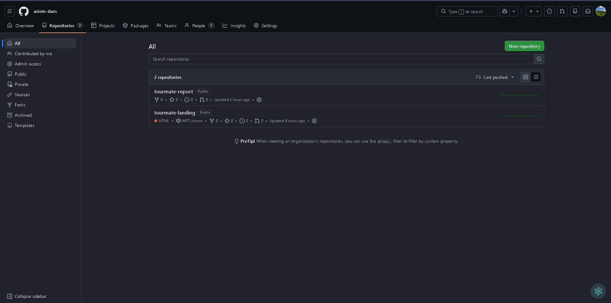

2. **Subida del código**
    - Se realizó el `push` del proyecto a la rama principal (`main`) del repositorio.
    - Se verificó que todos los recursos estén correctamente enlazados (rutas relativas).

   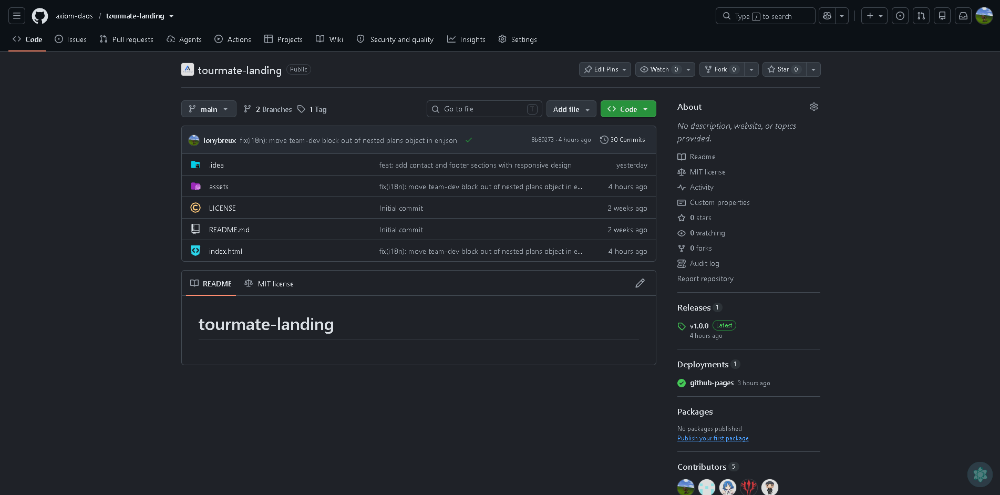

3. **Configuración de GitHub Pages**
    - En la sección *Settings* del repositorio, se habilitó **GitHub Pages**.
    - Se seleccionó la rama `main` como fuente de despliegue.
    - Se definió la carpeta raíz (`/root`) como directorio de publicación.

   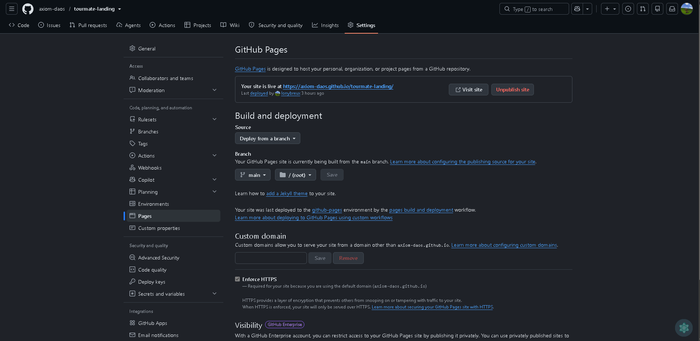

4. **Publicación automática**
    - GitHub Pages procesó automáticamente el contenido del repositorio.
    - En pocos minutos, generó una URL pública donde la Landing Page quedó disponible.

   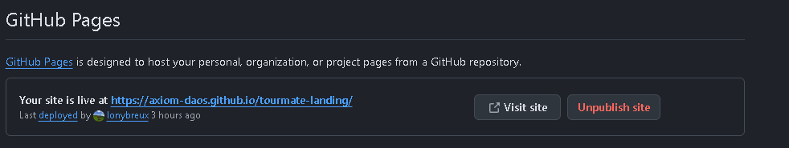

5. **Actualizaciones**
    - Cada vez que se realiza un nuevo `push` a la rama `main`, GitHub Pages actualiza automáticamente la página.
    - Esto permite mantener la Landing Page sincronizada con los cambios del repositorio sin intervención manual adicional.

#### Resultado
La Landing Page de TourMate fue desplegada exitosamente mediante GitHub Pages, permitiendo su acceso público a través de una URL estable. Esto facilita la presentación del producto a usuarios potenciales y valida la propuesta de valor del sistema de manera rápida y efectiva.

URL: https://axiom-daos.github.io/tourmate-landing/

#### *5.2.1.8. Team Collaboration Insights during Sprint*

Todos los miembros del equipo han participado activamente en la implementación de los productos del Sprint 1, lo cual se evidencia mediante los reportes de actividad y contribución del repositorio de GitHub de la organización Axiom.

**Insights**
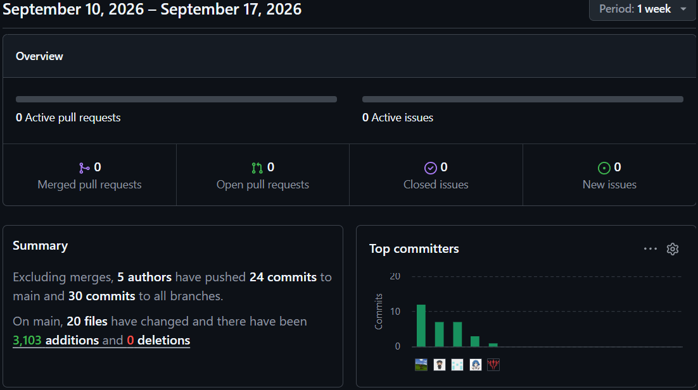

**Contributors**
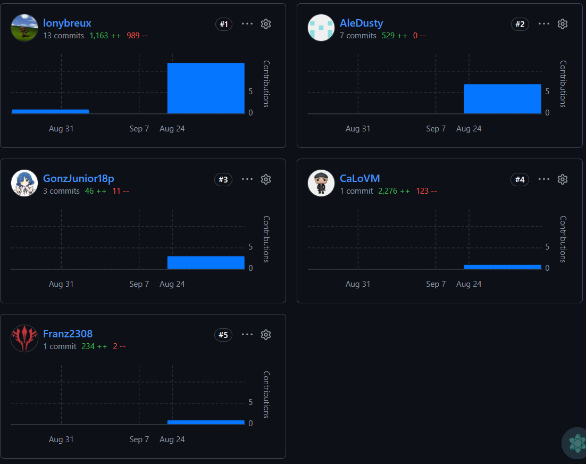

**Network graph**
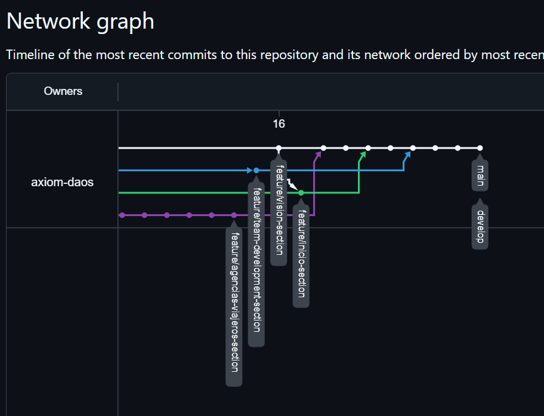

### 5.2.2. Sprint 2

#### *5.2.2.1. Sprint Planning 2*
Para el desarrollo del segundo sprint, nos centraremos en la implementación del frontend de nuestra aplicación web. Hemos diseñado tareas específicas basadas en las historias de usuario orientadas a la gestión de tours, el monitoreo en tiempo real, el soporte de rutas offline y la configuración de perfiles. Al subdividir cada historia de usuario en múltiples tareas técnicas, podemos distribuir la carga de trabajo de manera eficiente entre los desarrolladores del equipo, asegurando la construcción de una interfaz interactiva, escalable y lista para integrarse con nuestra API.

| **Sprint #** | 2 |
| --- |------------------------------------------------------------------------------------------------------------------------------------------------------------------------------------------------------------------------------------------|
| **Sprint Planning Background** | |
| **Date** | 2026-09-28 |
| **Time** | 4:00 PM |
| **Location** | Reunión virtual |
| **Prepared By** | Giancarlo Verastigue Martinez |
| **Attendees** | Giancarlo Verastigue Martinez, Matias Carrillo Acho, Frank Anthony Huingo Tello, Manuel Alejandro Molina Vasquez, Tony Jhunior Quispe Palomino |
| **Sprint n – 1 Review Summary** | La Landing Page fue completada y desplegada exitosamente. Se lograron los objetivos de comunicar la propuesta de valor y habilitar las rutas de redirección hacia el registro para turistas y agencias. |
| **Sprint n – 1 Retrospective Summary** | El equipo mantuvo una buena comunicación y uso de GitFlow. Se acordó mejorar la granularidad de las estimaciones dividiendo obligatoriamente cada Historia de Usuario en al menos dos tareas (Tasks) para un seguimiento más preciso. |
| **Sprint Goal & User Stories** | |
| **Sprint 2 Goal** | Our focus is on delivering the core frontend application for TourMate, including tour management, interactive live maps, offline capabilities, and user profiles. This will be confirmed when all UI components are built and functional mockups are ready. |
| **Sprint 2 Velocity** | 133 Story Points (Velocidad estimada sumando la carga completa de las vistas e integraciones Frontend proyectadas para este ciclo). |
| **Sum of Story Points** | 133 |

#### *5.2.2.2. Aspect Leaders and Collaborators*

A continuación se detalla la matriz de liderazgo y colaboración (LACX) para brindar claridad en la comunicación del equipo durante el desarrollo de las tareas de este Sprint.

Para este segundo sprint, los aspectos se han definido en base a los módulos principales del Frontend: Gestión de Tours (Tour Management), Mapas y Monitoreo (Maps & Tracking), Capacidades Offline (Offline & Sync), y Perfiles y Alertas (Profile & Alerts).

| Team Member (Last Name, First Name) | GitHub Username | Tour Management Views | Maps & Tracking UI | Offline & Sync Modules | Profile & Alerts Settings |
|-------------------------------------|-----------------| --- | --- | --- | --- |
| Verastigue Martinez, Giancarlo      | @CaLoVM         | C | C | C | L |
| Carrillo Acho, Matias               | @lonybreux      | C | L | C | C |
| Huingo Tello, Frank Anthony         | @Franz2308      | L | C | C | C |
| Molina Vasquez, Manuel Alejandro    | @AleDusty       | L | C | C | C |
| Quispe Palomino, Tony Jhunior       | @GonzJunior18p  | C | C | L | C |

#### *5.2.2.3. Sprint Backlog 2*

**Trello link:** [https://trello.com/b/gCKcMjVR/tourmate-sprint-2)

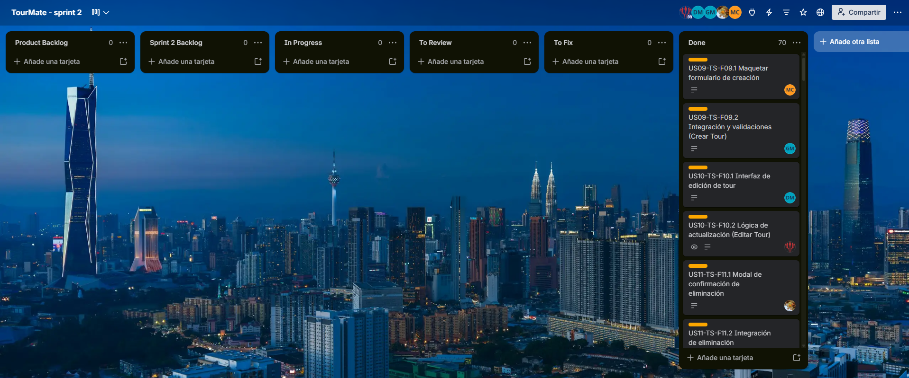
## Sprint 2
| User Story Id | User Story Title | Work-Item / Task Id | Work-Item / Task Title | Description | Estimation (Hours) | Assigned To | Status |
| --- | --- | --- | --- | --- | --- | --- | --- |
| US09 | Crear tour | TS-F09.1 | Maquetar formulario de creación | Desarrollar la interfaz (UI) del formulario con campos estructurados para crear un tour. | 4 | @lonybreux | To Do |
| US09 | Crear tour | TS-F09.2 | Integración y validaciones (Crear Tour) | Implementar validaciones en el cliente y enviar el payload al endpoint correspondiente. | 3 | @CaLoVM | To Do |
| US10 | Editar tour | TS-F10.1 | Interfaz de edición de tour | Reutilizar el componente de formulario y adaptarlo para pre-poblar los datos del tour existente. | 2 | @AleDusty | To Do |
| US10 | Editar tour | TS-F10.2 | Lógica de actualización (Editar Tour) | Capturar los cambios del formulario y enviarlos a la API para confirmar la actualización. | 2 | @Franz2308 | To Do |
| US11 | Eliminar tour | TS-F11.1 | Modal de confirmación de eliminación | Diseñar e implementar el cuadro de diálogo para evitar eliminaciones accidentales. | 1 | @GonzJunior18p | To Do |
| US11 | Eliminar tour | TS-F11.2 | Integración de eliminación | Conectar la acción del modal con el endpoint DELETE y actualizar el listado de la UI localmente. | 2 | @lonybreux | To Do |
| US12 | Duplicar tour | TS-F12.1 | Acción de duplicar en listado | Agregar la opción visual de duplicado en el menú de acciones de la tarjeta/tabla de tour. | 1 | @CaLoVM | To Do |
| US12 | Duplicar tour | TS-F12.2 | Lógica de duplicación | Consumir el endpoint de clonación y redirigir al usuario al nuevo tour en estado borrador. | 3 | @AleDusty | To Do |
| US13 | Asignar turistas a un tour | TS-F13.1 | Buscador y selector de turistas | Construir el componente UI que permite buscar turistas registrados y seleccionarlos. | 3 | @Franz2308 | To Do |
| US13 | Asignar turistas a un tour | TS-F13.2 | Envío de asignación a API | Vincular la lista seleccionada con la API de gestión para actualizar los participantes del tour. | 2 | @GonzJunior18p | To Do |
| US14 | Desasignar turista de un tour | TS-F14.1 | Botón de remoción en tabla de participantes | Añadir la opción gráfica para quitar a un turista de la lista del tour activo. | 1 | @lonybreux | To Do |
| US14 | Desasignar turista de un tour | TS-F14.2 | Lógica de desasignación | Enviar la solicitud de remoción a la API y refrescar la tabla de la interfaz. | 2 | @CaLoVM | To Do |
| US15 | Confirmar asistencia | TS-F15.1 | Vista de tours asignados al turista | Diseñar la pantalla donde el turista visualiza sus invitaciones pendientes con botones de acción. | 3 | @AleDusty | To Do |
| US15 | Confirmar asistencia | TS-F15.2 | Integración de confirmación/cancelación | Conectar las acciones de aceptar/rechazar con los estados en el backend. | 2 | @Franz2308 | To Do |
| US16 | Buscar y filtrar tours | TS-F16.1 | Barra de búsqueda y panel de filtros | Desarrollar los inputs reactivos (texto, selects, checkboxes) para la búsqueda de tours. | 4 | @GonzJunior18p | To Do |
| US16 | Buscar y filtrar tours | TS-F16.2 | Lógica de filtrado en cliente | Manejar el estado del filtro e integrar la llamada a la API con query params. | 4 | @lonybreux | To Do |
| US17 | Consultar detalle del tour | TS-F17.1 | Maquetación de página de detalles | Diseñar la estructura visual completa (ruta, checkpoints, descripción) del tour. | 3 | @CaLoVM | To Do |
| US17 | Consultar detalle del tour | TS-F17.2 | Carga dinámica de información | Consumir los datos del tour específico desde la API y renderizarlos en la vista de detalle. | 2 | @AleDusty | To Do |
| US18 | Consultar tours de la agencia | TS-F18.1 | Grid/Tabla de dashboard de agencia | Crear la vista estructurada para listar todos los tours propios con soporte de paginación UI. | 3 | @Franz2308 | To Do |
| US18 | Consultar tours de la agencia | TS-F18.2 | Integración del catálogo | Conectar el grid con el listado de la API y manejar estados de carga y error. | 3 | @GonzJunior18p | To Do |
| US19 | Iniciar expedición | TS-F19.1 | Vista previa a la expedición | Implementar la pantalla con los detalles y el botón principal "Iniciar Expedición". | 2 | @lonybreux | To Do |
| US19 | Iniciar expedición | TS-F19.2 | Controlador de inicio | Consumir el endpoint de inicio y redirigir automáticamente a la interfaz del mapa en vivo. | 2 | @CaLoVM | To Do |
| US20 | Visualizar ruta del tour | TS-F20.1 | Integración de motor de mapas | Añadir librería de mapas (ej. Leaflet/Mapbox) y configurar vista base en la interfaz. | 4 | @AleDusty | To Do |
| US20 | Visualizar ruta del tour | TS-F20.2 | Renderizado de ruta (Polylines) | Dibujar los trazados del tour sobre el mapa utilizando las coordenadas obtenidas del backend. | 3 | @Franz2308 | To Do |
| US21 | Descargar ruta offline | TS-F21.1 | Gestor de caché local | Configurar IndexedDB o Cache API para almacenar la información de rutas y mapas base. | 5 | @GonzJunior18p | To Do |
| US21 | Descargar ruta offline | TS-F21.2 | Interfaz de gestión de descargas | Crear un panel donde el turista pueda descargar, ver y borrar sus rutas offline. | 4 | @lonybreux | To Do |
| US22 | Visualizar checkpoints del recorrido | TS-F22.1 | Marcadores en mapa interactivo | Desarrollar componentes visuales para colocar los checkpoints sobre la interfaz de mapa. | 3 | @CaLoVM | To Do |
| US22 | Visualizar checkpoints del recorrido | TS-F22.2 | Estilizado dinámico de estado | Cambiar el color/icono del checkpoint en tiempo real según pase de pendiente a completado. | 2 | @AleDusty | To Do |
| US23 | Visualizar progreso del recorrido | TS-F23.1 | Componente de barra de progreso | Diseñar un indicador circular o lineal (progress bar) fijo en la interfaz de expedición. | 2 | @Franz2308 | To Do |
| US23 | Visualizar progreso del recorrido | TS-F23.2 | Cálculo reactivo de avance | Actualizar dinámicamente la barra de progreso a medida que el estado global de checkpoints avanza. | 2 | @GonzJunior18p | To Do |
| US24 | Registrar checkpoint manual | TS-F24.1 | Botón de check-in de guía | Añadir la acción de validación manual accesible desde la tarjeta de detalle de cada checkpoint. | 2 | @lonybreux | To Do |
| US24 | Registrar checkpoint manual | TS-F24.2 | Integración del registro manual | Ejecutar llamada a API y actualizar el estado visual para todo el grupo localmente. | 2 | @CaLoVM | To Do |
| US25 | Registrar experiencia del recorrido | TS-F25.1 | Formulario de notas flotante | Crear un modal de acceso rápido que permita ingresar texto/notas durante la expedición activa. | 2 | @AleDusty | To Do |
| US25 | Registrar experiencia del recorrido | TS-F25.2 | Envío e historial de experiencias | Conectar el formulario al backend y crear una lista UI para que el usuario visualice sus notas. | 2 | @Franz2308 | To Do |
| US26 | Consultar clima del recorrido | TS-F26.1 | Widget visual de clima | Maquetar el componente que mostrará iconos climáticos, temperaturas y advertencias. | 3 | @GonzJunior18p | To Do |
| US26 | Consultar clima del recorrido | TS-F26.2 | Integración de servicio climático | Consumir la API de clima y adaptar los datos para renderizarlos en el widget. | 3 | @lonybreux | To Do |
| US27 | Sincronización asincrónica de datos offline | TS-F27.1 | Listener de estado de red | Implementar lógica para detectar eventos 'online'/'offline' y mostrar alertas al usuario en UI. | 3 | @CaLoVM | To Do |
| US27 | Sincronización asincrónica de datos offline | TS-F27.2 | Cola de peticiones en background | Implementar sistema para encolar acciones localmente y procesarlas al recuperar la conexión. | 6 | @AleDusty | To Do |
| US28 | Finalizar expedición | TS-F28.1 | Componente de finalización | Diseñar botón de "Cerrar Expedición" con modal de doble confirmación para el guía. | 2 | @Franz2308 | To Do |
| US28 | Finalizar expedición | TS-F28.2 | Cierre y redirección | Llamar al endpoint de finalización y transicionar la vista a la pantalla de resumen del tour. | 2 | @GonzJunior18p | To Do |
| US29 | Monitorear ubicación de turistas | TS-F29.1 | Captura de geolocalización | Utilizar Geolocation API en el cliente para emitir coordenadas constantemente a la app. | 4 | @lonybreux | To Do |
| US29 | Monitorear ubicación de turistas | TS-F29.2 | Vista de rastreo en agencia | Mostrar avatares o marcadores de los turistas sobre el mapa del panel de administración en vivo. | 5 | @CaLoVM | To Do |
| US30 | Consultar estado general del grupo | TS-F30.1 | Dashboard de métricas del grupo | Crear un grid con tarjetas de estado simplificadas por cada turista asignado a la expedición. | 4 | @AleDusty | To Do |
| US30 | Consultar estado general del grupo | TS-F30.2 | Lógica de refresco (Polling/Sockets) | Implementar actualizaciones periódicas en el cliente para refrescar los datos del panel en vivo. | 4 | @Franz2308 | To Do |
| US31 | Recibir alertas por anomalías | TS-F31.1 | Componente visual de alerta crítica | Diseñar notificaciones intrusivas (banners rojos/modales) para advertir riesgos de seguridad. | 2 | @GonzJunior18p | To Do |
| US31 | Recibir alertas por anomalías | TS-F31.2 | Procesamiento de eventos anómalos | Escuchar los eventos de alerta generados por la telemetría y disparar el componente de alerta UI. | 4 | @lonybreux | To Do |
| US32 | Consultar estado de salud básico | TS-F32.1 | Tarjetas de biométricos en UI | Maquetar indicadores de frecuencia cardíaca/oxígeno dentro de la lista de turistas del guía. | 2 | @CaLoVM | To Do |
| US32 | Consultar estado de salud básico | TS-F32.2 | Binding de datos de salud | Enlazar el flujo de datos para actualizar los iconos y valores de salud dinámicamente. | 2 | @AleDusty | To Do |
| US33 | Reportar incidente | TS-F33.1 | UI de botón de pánico / SOS | Implementar un formulario de acceso súper rápido desde la vista de turista para emergencias. | 2 | @Franz2308 | To Do |
| US33 | Reportar incidente | TS-F33.2 | Envío de incidente y cache offline | Enviar el payload a la API, manejando fallos de red con almacenamiento temporal seguro. | 3 | @GonzJunior18p | To Do |
| US34 | Reportar incidente desde el rol guía | TS-F34.1 | Panel de gestión de incidentes | Construir la tabla visual para que el guía visualice, edite y cierre reportes en el terreno. | 2 | @lonybreux | To Do |
| US34 | Reportar incidente desde el rol guía | TS-F34.2 | Integración del workflow del incidente | Conectar las acciones (abrir, actualizar notas, marcar como resuelto) a la API REST. | 2 | @CaLoVM | To Do |
| US35 | Recibir datos biométricos del wearable | TS-F35.1 | Integración con Web Bluetooth API | Implementar la clase/servicio en el frontend capaz de descubrir y parear el wearable. | 5 | @AleDusty | To Do |
| US35 | Recibir datos biométricos del wearable | TS-F35.2 | Transmisión de telemetría | Capturar el flujo de datos (stream) del dispositivo, formatear JSON y enviarlo al backend. | 5 | @Franz2308 | To Do |
| US36 | Consultar estado del wearable | TS-F36.1 | Icono de batería y conectividad | Maquetar indicadores en la barra superior (navbar/status bar) para el hardware emparejado. | 2 | @GonzJunior18p | To Do |
| US36 | Consultar estado del wearable | TS-F36.2 | Lógica de refresco de hardware | Interpretar la data básica del reloj/pulsera para pintar dinámicamente su porcentaje y status. | 2 | @lonybreux | To Do |
| US37 | Exportar reportes de expedición | TS-F37.1 | Controles de exportación | Colocar menú con opciones (Descargar PDF, Exportar CSV) en expediciones finalizadas. | 2 | @CaLoVM | To Do |
| US37 | Exportar reportes de expedición | TS-F37.2 | Manejo de descarga de archivos Blob | Consumir el endpoint de exportación, convertir la respuesta y forzar la descarga en el navegador. | 3 | @AleDusty | To Do |
| US38 | Gestionar perfil personal | TS-F38.1 | Maquetación del formulario de perfil | Diseñar la página principal de configuración personal con validación de inputs gráficos. | 2 | @Franz2308 | To Do |
| US38 | Gestionar perfil personal | TS-F38.2 | Integración de actualización | Recuperar datos para precargar y enviar el payload del formulario a la API del usuario. | 2 | @GonzJunior18p | To Do |
| US39 | Actualizar foto de perfil | TS-F39.1 | Componente uploader con previsualización | Desarrollar un drag & drop/file input que renderice localmente la foto seleccionada. | 2 | @lonybreux | To Do |
| US39 | Actualizar foto de perfil | TS-F39.2 | Lógica de subida multipart | Manejar y procesar el envío del archivo como FormData hacia los servidores. | 1 | @CaLoVM | To Do |
| US40 | Configurar preferencias de notificaciones | TS-F40.1 | Vista de 'Switches' (Toggles) | Diseñar los selectores booleanos (on/off) para las distintas categorías de alertas de la cuenta. | 2 | @AleDusty | To Do |
| US40 | Configurar preferencias de notificaciones | TS-F40.2 | Sincronización de preferencias | Conectar los cambios de UI inmediatamente con el backend del usuario para guardado automático. | 2 | @Franz2308 | To Do |
| US41 | Recibir notificaciones de seguridad | TS-F41.1 | Layout de notificaciones críticas | Crear plantillas diferenciadas (colores llamativos, iconos de alerta) en el gestor de notificaciones UI. | 3 | @GonzJunior18p | To Do |
| US41 | Recibir notificaciones de seguridad | TS-F41.2 | Interceptor de sockets/alertas | Suscribir el cliente a los eventos críticos para desplegar el modal sin importar en qué vista esté. | 3 | @lonybreux | To Do |
| US42 | Recibir notificaciones de tour | TS-F42.1 | Dropdown de campana (Notificaciones) | Añadir la "campanita" y su respectiva lista desplegable rápida en la navegación del usuario. | 2 | @CaLoVM | To Do |
| US42 | Recibir notificaciones de tour | TS-F42.2 | Acciones 'Marcar leída' / Polling | Implementar la funcionalidad para descontar el contador rojo y leer desde la API. | 2 | @AleDusty | To Do |
| US43 | Consultar historial de notificaciones | TS-F43.1 | Página dedicada al historial | Maquetar una sección de lista extendida con filtros y ordenación por fecha. | 2 | @Franz2308 | To Do |
| US43 | Consultar historial de notificaciones | TS-F43.2 | Integración de listado completo | Consumir la API de notificaciones implementando infinite scroll o paginación estándar. | 2 | @GonzJunior18p | To Do |

#### *5.2.2.4. Development Evidence for Sprint Review*

En la siguiente tabla se resumen los principales commits realizados en los repositorios de Axiom correspondientes al alcance del primer Sprint 2, aplicando Conventional Commits.

#### *5.2.2.5. Execution Evidence for Sprint Review*

En este segundo Sprint, el equipo se enfocó de lleno en la construcción y desarrollo del Frontend core de TourMate, logrando consolidar la interfaz de usuario y la interactividad de los módulos principales de la plataforma. Se alcanzó satisfactoriamente el objetivo del Sprint al entregar componentes visuales funcionales, responsivos y estructurados, dejándolos listos para su futura integración con la API REST.

Entre los logros más destacados de este ciclo se encuentra el módulo de Gestión de Tours, donde se implementaron las vistas dinámicas para que las agencias puedan crear, editar, duplicar y administrar recorridos, además de gestionar la asignación de turistas. Asimismo, se avanzó significativamente en el módulo de Mapas y Monitoreo, integrando visores interactivos que permiten renderizar rutas (polylines), visualizar checkpoints y proyectar el progreso de la expedición en tiempo real.

*Figura  (Home)*
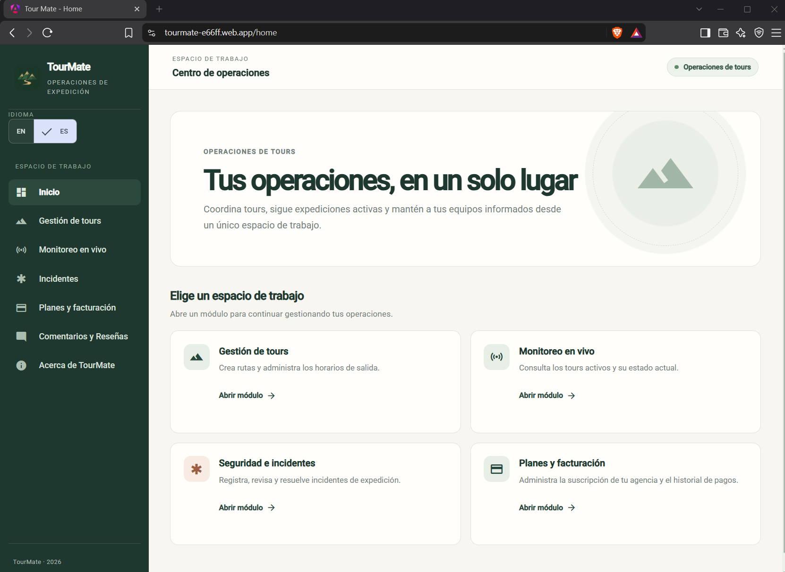

**Web Application Demonstration Video:** [https:]()

#### *5.2.2.6. Services Documentation Evidence for Sprint Review*

#### *5.2.2.7. Software Deployment Evidence for Sprint Review*

#### *5.2.2.8. Team Collaboration Insights during Sprint*

Todos los miembros del equipo han participado activamente en la implementación de los productos del Sprint 2, lo cual se evidencia mediante los reportes de actividad y contribución del repositorio de GitHub de la organización Axiom.

**Insights**

**Contributors**

**Network graph**

## Conclusiones

### Sprint 1 – Landing Page y documentación del proyecto

- **Sobre el análisis del problema y la investigación del usuario:** Se concluye que las entrevistas realizadas a dueños de agencias de tours y turistas de aventura permitieron identificar necesidades, expectativas y puntos de dolor relevantes para el desarrollo de SpotGo. La información recopilada fue fundamental para la definición de *User Personas*, *Empathy Maps* y *Journey Maps*, los cuales sirvieron como base para la priorización de funcionalidades y la elaboración del *Problem Statement*.

- **Sobre la propuesta de valor y validación inicial:** La elaboración de la *Landing Page* permitió comunicar de forma clara los objetivos, beneficios y funcionalidades principales de TourMate, funcionando como un medio de validación temprana de la idea de negocio. Se evidenció que presentar una interfaz informativa y accesible favorece la comprensión del problema y fortalece el interés de potenciales usuarios y clientes B2B.

- **Sobre la documentación y modelado del proyecto:** La construcción del reporte técnico permitió consolidar los hallazgos del *Problem Statement*, *Needfinding*, *User Personas*, *Empathy Maps*, *Journey Maps*, *Event Storming* y *Ubiquitous Language*, generando una visión integral del dominio del negocio. Asimismo, el uso de metodologías como *Domain-Driven Design (DDD)* facilitó la identificación de *Bounded Contexts* y responsabilidades del sistema desde etapas tempranas.

- **Sobre la definición de requerimientos:** La especificación inicial de *User Stories* y criterios de aceptación permitió transformar necesidades de usuarios en funcionalidades concretas, proporcionando una guía estructurada para el desarrollo de los siguientes sprints y reduciendo ambigüedades en la planificación técnica.

### Bibliografía

- Brown, S. (2020). *The C4 model for visualising software architecture*. C4Model.com. Recuperado de [https://c4model.com](https://c4model.com)
- Driessen, V. (2010). *A successful Git branching model*. Nvie. Recuperado de [https://nvie.com/posts/a-successful-git-branching-model](https://nvie.com/posts/a-successful-git-branching-model)
- Evans, E. (2003). *Domain-Driven Design: Tackling Complexity in the Heart of Software*. Addison-Wesley Professional. Recuperado de [https://www.domainlanguage.com/ddd](https://www.domainlanguage.com/ddd)
- Freeman, A. (2022). *Pro Angular 16*. Apress. Recuperado de [https://link.springer.com/book/10.1007/978-1-4842-8823-8](https://link.springer.com/book/10.1007/978-1-4842-8823-8)
- Newman, S. (2021). *Building Microservices: Designing Fine-Grained Systems* (2nd ed.). O'Reilly Media. Recuperado de [https://samnewman.io/books/building_microservices_2nd_edition](https://samnewman.io/books/building_microservices_2nd_edition)
- Walls, C. (2022). *Spring in Action* (6th ed.). Manning Publications. Recuperado de [https://www.manning.com/books/spring-in-action-sixth-edition](https://www.manning.com/books/spring-in-action-sixth-edition)

## Anexos

### Anexo A. Videos de exposiciones

- Exposición AV1: https://upcedupe-my.sharepoint.com/:v:/g/personal/u202419483_upc_edu_pe/IQDffa4P9uW3SqlkTMvmZIkDAdNuNWS0YpS-94osKLniRPY?nav=eyJyZWZlcnJhbEluZm8iOnsicmVmZXJyYWxBcHAiOiJPbmVEcml2ZUZvckJ1c2luZXNzIiwicmVmZXJyYWxBcHBQbGF0Zm9ybSI6IldlYiIsInJlZmVycmFsTW9kZSI6InZpZXciLCJyZWZlcnJhbFZpZXciOiJNeUZpbGVzTGlua0NvcHkifX0&e=gXbFhx

### Anexo B. Videos de entrevistas

- Entrevista 1 - Mateo Escudero, Agencia de Tour: https://upcedupe-my.sharepoint.com/:v:/g/personal/u20241f714_upc_edu_pe/IQCf3pj989dtRqsxlQP-cphyAdmHJbpSw14HLGTRks5qOyM?e=L98d2n&nav=eyJyZWZlcnJhbEluZm8iOnsicmVmZXJyYWxBcHAiOiJTdHJlYW1XZWJBcHAiLCJyZWZlcnJhbFZpZXciOiJTaGFyZURpYWxvZy1MaW5rIiwicmVmZXJyYWxBcHBQbGF0Zm9ybSI6IldlYiIsInJlZmVycmFsTW9kZSI6IldpZXcifX0%3D
- Entrevista 2 - Aarón Espinosa, Agencia de Tour: https://upcedupe-my.sharepoint.com/:v:/g/personal/u20221g231_upc_edu_pe/IQAofZYR8ATPSbWHvKq3vOSvAZ1mk5uCZxK_sr8rN9qoqI4?nav=eyJyZWZlcnJhbEluZm8iOnsicmVmZXJyYWxBcHAiOiJPbmVEcml2ZUZvckJ1c2luZXNzIiwicmVmZXJyYWxBcHBQbGF0Zm9ybSI6IldlYiIsInJlZmVycmFsTW9kZSI6IldpZXciLCJyZWZlcnJhbFZpZXciOiJNeUZpbGVzTGlua0NvcHkifX0&e=CzroE4
- Entrevista 3 - Carlos Gutierrez, Agencia de Tour: https://upcedupe-my.sharepoint.com/personal/u202319057_upc_edu_pe/_layouts/15/stream.aspx?id=/personal/u202319057_upc_edu_pe/Documents/Entrevista+DAOP.mp4&nav=eyJyZWZlcnJhbEluZm8iOnsicmVmZXJyYWxBcHAiOiJPbmVEcml2ZUZvckJ1c2luZXNzIiwicmVmZXJyYWxBcHBQbGF0Zm9ybSI6IldlYiIsInJlZmVycmFsTW9kZSI6InZpZXciLCJyZWZlcnJhbFZpZXciOiJNeUZpbGVzTGlua0NvcHkifX0&ga=1&referrer=StreamWebApp.Web&referrerScenario=AddressBarCopied.view.2461ff76-283b-41f2-bb72-df3bc61e4215&ClientRender=1
- Entrevista 4 - Sofia Mendoza, Turista de aventura: https://upcedupe-my.sharepoint.com/:v:/g/personal/u20241f714_upc_edu_pe/IQBPxk5ihQP7Qpk1EiObhUKMAcqE0PkmidpljYmgsKZhw60?e=y94DfE&nav=eyJyZWZlcnJhbEluZm8iOnsicmVmZXJyYWxBcHAiOiJTdHJlYW1XZWJBcHAiLCJyZWZlcnJhbFZpZXciOiJTaGFyZURpYWxvZy1MaW5rIiwicmVmZXJyYWxBcHBQbGF0Zm9ybSI6IldlYiIsInJlZmVycmFsTW9kZSI6IldpZXcifX0%3D
- Entrevista 5 - Romina Antonella Molina Vásquez, Turista de aventura: https://upcedupe-my.sharepoint.com/:v:/g/personal/u20221g231_upc_edu_pe/IQAQPNKuz_cKS4krk8KnLmoKAaAOQuWIL6WmZXL4T30cJJQ?nav=eyJyZWZlcnJhbEluZm8iOnsicmVmZXJyYWxBcHAiOiJPbmVEcml2ZUZvckJ1c2luZXNzIiwicmVmZXJyYWxBcHBQbGF0Zm9ybSI6IldlYiIsInJlZmVycmFsTW9kZSI6IldpZXciLCJyZWZlcnJhbFZpZXciOiJNeUZpbGVzTGlua0NvcHkifX0&e=B3HGgd
- Entrevista 6 - Miler Rodriguez, Turista de aventura: https://upcedupe-my.sharepoint.com/:v:/g/personal/u202419483_upc_edu_pe/IQDe0UWGvKUwRojgbs_XPIuJAclsUfNSUJK04_8jjCFOE7A?nav=eyJyZWZlcnJhbEluZm8iOnsicmVmZXJyYWxBcHAiOiJPbmVEcml2ZUZvckJ1c2luZXNzIiwicmVmZXJyYWxBcHBQbGF0Zm9ybSI6IldlYiIsInJlZmVycmFsTW9kZSI6InZpZXciLCJyZWZlcnJhbFZpZXciOiJNeUZpbGVzTGlua0NvcHkifX0&e=Szx6cw

### Anexo D. Materiales de ideación y diseño

- Lean UX Canvas del proyecto TourMate: 
- Big Picture EventStorming y Design-Level EventStorming: [https://miro.com/app/board/uXjVHl1uCrg=/?share_link_id=456387536744](https://miro.com/app/board/uXjVHl1uCrg=/?share_link_id=456387536744)
- Wireframe de la landing page: [https://www.figma.com/design/byMOHsD6I3IV3fdNwVPg3C/Tourmate-Landing-Page-Mockup?node-id=0-1&t=tADie7c5MlXe8uc4-1](https://www.figma.com/design/byMOHsD6I3IV3fdNwVPg3C/Tourmate-Landing-Page-Mockup?node-id=0-1&t=tADie7c5MlXe8uc4-1)
- Mock-up de la landing page: [https://www.figma.com/design/GVX1ocXvc77A9A24OnWhom/Tourmate-Mockup?node-id=0-1&t=5e7BZiJAVQvdoPjv-1](https://www.figma.com/design/GVX1ocXvc77A9A24OnWhom/Tourmate-Mockup?node-id=0-1&t=5e7BZiJAVQvdoPjv-1)
- Wireframes de la aplicación web: [https://www.figma.com/design/SKEFgPxKRE4cJmEnGjuAx3/DAOS_final?node-id=0-1&t=yXf7imx6mdAPUOiO-1](https://www.figma.com/design/SKEFgPxKRE4cJmEnGjuAx3/DAOS_final?node-id=0-1&t=yXf7imx6mdAPUOiO-1)
- Wireflows de la aplicación web:[https://www.figma.com/design/SKEFgPxKRE4cJmEnGjuAx3/DAOS_final?node-id=0-1&t=yXf7imx6mdAPUOiO-1](https://www.figma.com/design/SKEFgPxKRE4cJmEnGjuAx3/DAOS_final?node-id=0-1&t=yXf7imx6mdAPUOiO-1)
- Mock-ups de la aplicación web:[https://www.figma.com/design/SKEFgPxKRE4cJmEnGjuAx3/DAOS_final?node-id=0-1&t=yXf7imx6mdAPUOiO-1](https://www.figma.com/design/SKEFgPxKRE4cJmEnGjuAx3/DAOS_final?node-id=0-1&t=yXf7imx6mdAPUOiO-1)
- Prototipo de la aplicación web: [https://www.figma.com/design/SKEFgPxKRE4cJmEnGjuAx3/DAOS_final?node-id=0-1&t=yXf7imx6mdAPUOiO-1](https://www.figma.com/design/SKEFgPxKRE4cJmEnGjuAx3/DAOS_final?node-id=0-1&t=yXf7imx6mdAPUOiO-1)

### Anexo E. Repositorios y despliegues

- Repositorio del informe del proyecto: https://github.com/axiom-daos/tourmate-report
- Repositorio de la landing page: https://github.com/axiom-daos/tourmate-landing
- Repositorio del Web Application: https://github.com/axiom-daos/tourmate-web-application
- Repositorio del Backend: https://github.com/axiom-daos/tourmate-platform
- Despliegue de la landing page: https://axiom-daos.github.io/tourmate-landing/
- Tablero del Sprint Backlog 1: https://trello.com/b/gCKcMjVR/tourmate-sprint-1

### Anexo F. Herramientas utilizadas

- Trello, para gestión del backlog y tareas del proyecto: https://trello.com
- Gherkin, para criterios de aceptación en formato Given-When-Then: https://cucumber.io/docs/gherkin/
- Miro, para dinámicas de EventStorming: https://miro.com/
- Figma, para wireframes, mock-ups y prototipos: https://www.figma.com
- Canva, para recursos visuales del producto: https://www.canva.com
- UXPressia, para User Personas y Customer Journey Maps: https://uxpressia.com
- Lucidchart, para diagramas del sistema: https://www.lucidchart.com/ / https://lucidchart.com
- GitHub, para control de versiones y colaboración: https://github.com
- Visual Studio Code, para edición de código y archivos Markdown: https://code.visualstudio.com/
- GitHub Pages, para despliegue de la landing page y frontend web: https://pages.github.com
- Structurizr, para diagramas C4: https://structurizr.com
- Vertabelo, para diagramas de base de datos: https://vertabelo.com

### Anexo G. Referencias bibliográficas con enlace

- Guía para ejecutar Big Picture Event Storming: https://bit.ly/bpes-guide
- Guía práctica de EventStorming remoto: https://ddd-practitioners.com/2023/03/20/remote-eventstorming-workshop/
- Material sobre historias de usuario: https://www.scrummanager.com/files/scrum_manager_historias_usuario.pdf
- Libro de ingeniería de software usado como referencia: https://www.javier8a.com/itc/bd1/ld-Ingenieria.de.software.enfoque.practico.7ed.Pressman.PDF