

 

  

 
<h2 align="center"><strong>Universidad Peruana de Ciencias Aplicadas</strong></h2>
<h2 align="center"><strong>Carrera de Ingeniería de Software</strong></h2>

<h2 align="center"><strong>1ASI0729</strong></h2>
<h2 align="center"><strong>Desarrollo de Aplicaciones Open Source</strong></h2>
<h2 align="center">NRC</h2>
<h2 align="center"><strong>7760</strong></h2>
<h2 align="center"><strong>Informe del Trabajo Final</strong></h2>
<h2 align="center">Docente</h2>
<h2 align="center"><strong>Flores Moroco, Juan Antonio</strong></h2>
<h2 align="center">Equipo</h2>
<h2 align="center"><strong>Axiom</strong></h2>
<h2 align="center">Proyecto</h2>
<h2 align="center"><strong>TourMate</strong></h2>

<h2 align="center"><strong>Integrantes:</strong></h2>

<table align="center" style="width: auto; margin: 0 auto;">
<tr>
<td>

| Código      | Nombre                               |
|:-----------:|:-------------------------------------|
| U202323010  | Carrillo Acho, Matias Renato         |
| U202319057  | Huingo Tello, Frank Anthony          |
| U20241F714  | Quispe Palomino, Tony Jhunior        |
| U202419483  | Verastigue Martinez, Giancarlo Jose  |
| U20221G231  | Molina Vasquez, Manuel Alejandro     |

</td>
</tr>
</table>

<h2 align="center"><strong>Período 202620</strong></h2>
<h2 align="center"><strong>Setiembre 2026</strong></h2>

---
# Registro de versiones del informe

| Versión |   Fecha    |                Autor                | Descripción de modificación                                                           |
| :-----: | :--------: | :---------------------------------: | ------------------------------------------------------------------------------------- |
|   1.0   | 8/09/2026 |   Verastigue Martinez, Giancarlo Jose     | Creación y estructuración del documento de trabajo en formato markdown                                 |
|   1.0   | 10/09/2026 |   Quispe Palomino, Tony Jhunior     | Desarrollo de los capítulos I y II                               |
|   1.0   | 10/09/2026 |   Huingo Tello, Frank Anthony     | Desarrollo de los capítulo III y IV                               |
|   1.0   | 10/09/2026 |   Molina Vasquez, Manuel Alejandro     | Desarrollo del capítulo IV                               |
|   1.0   | 10/09/2026 |   Carrillo Acho, Matias Renato    | Desarrollo del capítulo IV                               |
|   1.0   | 10/09/2026 |   Verastigue Martinez, Giancarlo Jose   | Desarrollo del capítulo V                               |

# Project Report Collaboration Insights

- URL del repositorio para el reporte del proyecto: https://github.com/axiom-daos/tourmate-report
- URL del repositorio para la Landing Page: https://github.com/axiom-daos/tourmate-landing

**AV1**

Para el desarrollo del informe perteneciente a la entrega AV1, se dividió la implementación de secciones de la siguiente forma para cada integrante del equipo:

| Integrante       | Tareas Asignadas                                                                                                                                                                           |
| ---------------- | ------------------------------------------------------------------------------------------------------------------------------------------------------------------------------------------ |
| Quispe Palomino, Tony Jhunior | Desarrollo del Capítulo I y del Capítulo II en formato markdown.                                                             |
| Huingo Tello, Frank Anthony     | Desarrollo del Capítulo III, parte del capítulo IV en formato markdown.                                                  |
| Molina Vasquez, Manuel Alejandro      | Desarrollo del Capítulo IV enfocado en desarrollo de UX/UI Design.                                                                               |
| Carrillo Acho, Matias Renato  | Desarrollo del Capítulo IV enfocado en system design, así como colaboración en el capítulo V del documento en formato markdown.                                                                               |
| Verastigue Martinez, Giancarlo Jose  | Desarrollo del Capítulo V, despliegue de Landing Page |

El trabajo se desarrolló mediante commits continuos en el repositorio de la organización, asegurando trazabilidad y colaboración activa del equipo.

*Report Insights AV1*
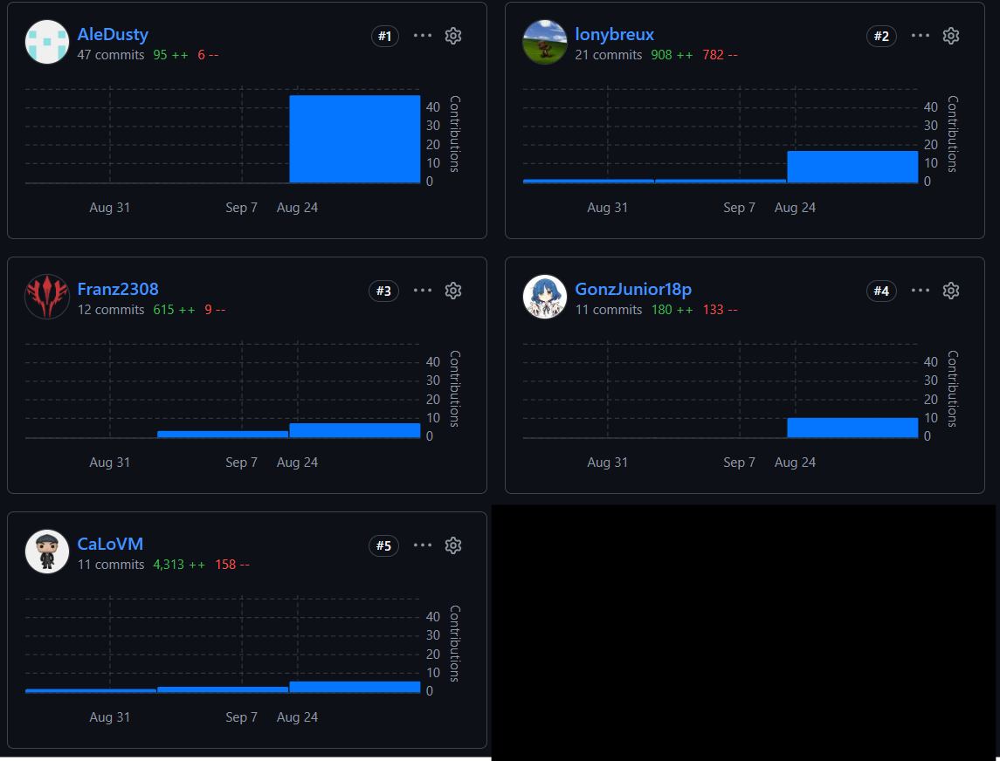

---

# Contenido
# Tabla de Contenido 
## Student Outcome

## Capítulo I: Introducción
### 1.1. Startup Profile
#### 1.1.1. Descripción de la Startup
#### 1.1.2. Perfiles de integrantes del equipo
### 1.2. Solution Profile
#### 1.2.1 Antecedentes y problemática
#### 1.2.2 Lean UX Process
##### 1.2.2.1. Lean UX Problem Statements
##### 1.2.2.2. Lean UX Assumptions
##### 1.2.2.3. Lean UX Hypothesis Statements
##### 1.2.2.4. Lean UX Canvas
### 1.3. Segmentos objetivo

## Capítulo II: Requirements Elicitation & Analysis
### 2.1. Competidores
#### 2.1.1. Análisis competitivo
#### 2.1.2. Estrategias y tácticas frente a competidores
### 2.2. Entrevistas
#### 2.2.1. Diseño de entrevistas
#### 2.2.2. Registro de entrevistas
#### 2.2.3. Análisis de entrevistas
### 2.3. Needfinding
#### 2.3.1. User Personas
#### 2.3.2. User Task Matrix
#### 2.3.3. User Journey Mapping
#### 2.3.4. Empathy Mapping
### 2.4. Big Picture EventStorming
### 2.5. Ubiquitous Language

## Capítulo III: Requirements Specification
### 3.1. User Stories
### 3.2. Impact Mapping
### 3.3. Product Backlog

## Capítulo IV: Product Design
### 4.1. Style Guidelines
#### 4.1.1. General Style Guidelines
#### 4.1.2. Web Style Guidelines
### 4.2. Information Architecture
#### 4.2.1. Organization Systems
#### 4.2.2. Labeling Systems
#### 4.2.3. SEO Tags and Meta Tags
#### 4.2.4. Searching Systems
#### 4.2.5. Navigation Systems
### 4.3. Landing Page UI Design
#### 4.3.1. Landing Page Wireframe
#### 4.3.2. Landing Page Mock-up
### 4.4. Web Applications UX/UI Design
#### 4.4.1. Web Applications Wireframes
#### 4.4.2. Web Applications Wireflow Diagrams
#### 4.4.3. Web Applications Mock-ups
#### 4.4.4. Web Applications User Flow Diagrams
### 4.5. Web Applications Prototyping
### 4.6. Domain-Driven Software Architecture
#### 4.6.1. Design-Level EventStorming
#### 4.6.2. Software Architecture Context Diagram
#### 4.6.3. Software Architecture Container Diagrams
#### 4.6.4. Software Architecture Components Diagrams
### 4.7. Software Object-Oriented Design
#### 4.7.1. Class Diagrams
### 4.8. Database Design
#### 4.8.1. Database Diagrams

## Capítulo V: Product Implementation, Validation & Deployment
### 5.1. Software Configuration Management
#### 5.1.1. Software Development Environment Configuration
#### 5.1.2. Source Code Management
#### 5.1.3. Source Code Style Guide & Conventions
#### 5.1.4. Software Deployment Configuration
### 5.2. Landing Page, Services & Applications Implementation
#### 5.2.1. Sprint n
##### 5.2.X.1. Sprint Planning n
##### 5.2.X.2. Aspect Leaders and Collaborators
##### 5.2.X.3. Sprint Backlog n
##### 5.2.X.4. Development Evidence for Sprint Review
##### 5.2.X.5. Execution Evidence for Sprint Review
##### 5.2.X.6. Services Documentation Evidence for Sprint Review
##### 5.2.X.7. Software Deployment Evidence for Sprint Review
##### 5.2.X.8. Team Collaboration Insights during Sprint
### 5.3. Validation Interviews
#### 5.3.1. Diseño de Entrevistas
#### 5.3.2. Registro de Entrevistas
#### 5.3.3. Evaluaciones según heurísticas

## Conclusiones
### Conclusiones y recomendaciones

### Bibliografía
### Anexos

# Student Outcome

El curso contribuye al cumplimiento del Student Outcome ABET - EAC - Student Outcome 3,  capacidad de comunicarse efectivamente con un
rango de audiencias. .

| Criterio específico | Acciones realizadas | Conclusiones | 
| --- | --- | --- |
| Comunica oralmente con efectividad a diferentes rangos de audiencia. | **Carrillo Acho, Matias Renato (U202323010)** **AV1:** Práctica de modulación de voz y control de tiempos durante ensayos grupales, lo que permitió desarrollar la habilidad de exponer la problemática del negocio de manera persuasiva ante una audiencia evaluadora.  **Huingo Tello, Frank Anthony (U202319057)** **AV1:** Organización y esquematización de las ideas clave mediante mapas mentales antes de la exposición, mejorando la articulación verbal para explicar decisiones de diseño a un público no técnico.  **Quispe Palomino, Tony Jhunior (U20241F714)** **AV1:** Recepción y aplicación de feedback de los compañeros sobre claridad del discurso, mejorando su capacidad asertiva en la comunicación oral de los resultados de las entrevistas y el Needfinding.  **Verastigue Martinez, Giancarlo Jose (U202419483)** **AV1:** Ejercicios de adaptación de terminología técnica para lograr explicar conceptos complejos de la arquitectura de software (DDD, C4) a diferentes tipos de stakeholders sin perder el rigor técnico en el discurso oral.  **Molina Vasquez, Manuel Alejandro (U20221G231)** **AV1:** Simulaciones de presentación frente al grupo, desarrollando la capacidad de comunicar oralmente decisiones visuales o de UX mediante argumentos estructurados orientados a las necesidades del usuario. | **AV1:** El equipo ejerció liderazgo conjunto al coordinar responsabilidades y tomar decisiones colaborativas, permitiendo organizar el primer entregable y alinear TourMate con las necesidades de los usuarios. |
| Comunica por escrito con efectividad a diferentes rangos de audiencia. | **Carrillo Acho, Matias Renato (U202323010)** **AV1:** Aplicación de iteraciones de revisión de textos para depurar inconsistencias, desarrollando así la capacidad de redactar de forma estructurada, técnica y sin ambigüedades en la sección introductoria.  **Huingo Tello, Frank Anthony (U202319057)** **AV1:** Estudio y aplicación de buenas prácticas de redacción técnica para documentar artefactos (como modelos de datos), afinando la habilidad de escribir descripciones exactas y claras para públicos técnicos.  **Quispe Palomino, Tony Jhunior (U20241F714)** **AV1:** Ejercicio de síntesis de la vasta información cualitativa obtenida de las entrevistas, perfeccionando la habilidad de transformar datos complejos en reportes ejecutivos escritos y de fácil comprensión.  **Verastigue Martinez, Giancarlo Jose (U202419483)** **AV1:** Construcción y documentación en equipo del Lenguaje Ubicuo (EventStorming), lo que consolidó su capacidad para plasmar de forma escrita un lenguaje de negocio compartido entre perfiles técnicos y no técnicos.  **Molina Vasquez, Manuel Alejandro (U20221G231)** **AV1:** Participación como revisor (proofreader) de la gramática y jerarquía de la información, practicando habilidades de control de calidad para garantizar que el entregable escrito cumpla con altos estándares formales. | **AV1:** La planificación y el trabajo colaborativo permitieron cumplir los objetivos dentro del plazo establecido, manteniendo comunicación constante y orientació. |

# Capítulo I: Introducción

## 1.1. Startup Profile

### 1.1.1. Descripción de la Startup

Axiom es una startup tecnológica enfocada en el desarrollo de soluciones para el turismo de aventura en el Perú, orientada a mejorar la seguridad, trazabilidad y gestión operativa en entornos de baja conectividad. Surge para cubrir la falta de sistemas que permitan el monitoreo en tiempo real de turistas en zonas remotas.

Su producto principal, TourMate, es una plataforma web y móvil que centraliza la gestión de tours, permitiendo a las agencias supervisar la ubicación, estado y progreso de sus grupos mediante dashboards y alertas ante anomalías. A su vez, los turistas acceden a herramientas de navegación offline, registro de su experiencia y visualización de información contextual del recorrido.

A nivel técnico, TourMate integra un ecosistema IoT con dispositivos wearables y checkpoints Bluetooth que capturan datos de geolocalización y signos vitales. Estos se sincronizan de forma asincrónica, asegurando operatividad incluso sin conexión continua, lo que permite un sistema escalable, resiliente y orientado a la prevención de riesgos.

### 1.1.2 Perfiles de integrantes del equipo 

|||
|------|-------------|
|  | **Huingo Tello, Frank Anthony**   Código de Estudiante: U202319057   Mi nombre es Frank Anthony Huingo Tello, estudiante de Ingeniería de Software. Me considero una persona paciente y perseverante en mis proyectos y metas, a nivel académico cuento con conocimientos en programación en el lenguaje de C++, Python y JS, tengo experiencia trabajando en equipo y bajo presión. Considero que organizandonos bien puedo usar mis conocimientos para aportar mucho a este grupo  .  |
|  | **Verastigue Martinez, Giancarlo Jose**   Código de Estudiante: U202419483   Mi nombre es Giancarlo Jose Verastigue Martinez, estudiante de Ingeniería de Software. Soy una persona responsable y enfocada en sus proyectos y metas, a nivel académico cuento con conocimientos en programación en el lenguaje de C++, con experiencia trabajando en equipo y bajo presión. Considero que soy organizado y detallista en mis proyectos. La experiencia laboral y la universidad me han hecho desarrollar habilidades para afrontar problemas o dificultades de manera exitosa, habilidades que aportaré a este grupo de trabajo y de esta manera sacar adelante nuestro proyecto.  |
|  | **Quispe Palomino, Tony Jhunior**   Código de Estudiante: u20241f714   Mi nombre es Tony Jhunior Quispe Palomino, soy estudiante de la carrera de Ingeniería de Software y actualmente me encuentro cursando el quinto ciclo. Tengo 20 años y me considero una persona amable, empática, perseverante y capaz de adaptarme a los cambios. En cuanto a mis conocimientos de programación, tengo una base sólida en C++, Python y conceptos básicos en HTML, CSS y un poco de JavaScript. En este proyecto, espero poder contribuir con mis conocimientos y habilidades, al mismo tiempo que fortalezco mis competencias en trabajo en equipo.  |
| |Manuel Alejandro Molina Vasquez   Código de Estudiante: U202323010   Mi nombre es Manuel Alejandro Molina Vasquez, estudiante de Ingeniería de Software. Me considero una persona responsable y comprometida con mis proyectos y metas. A nivel académico, cuento con conocimientos en programación en los lenguajes de C++, Python y JavaScript, así como experiencia trabajando en equipo y bajo presión. Considero que mi capacidad de organización y mi enfoque en los detalles me permiten aportar significativamente a este grupo de trabajo.  |
|  | **Carrillo Acho, Matias Renato**   Código de Estudiante: u202323010   Me llamo Matias Renato Carrillo Acho, estudiante de ingeniería de Software. Gracias a la formación dentro de la carrera adquirí conocimientos sólidos en la programación en lenguajes de programación como C++, Python, Java y JavaScript, además tengo conocimientos básicos de HTML5, CCS3. Considero que tengo desarrollado el pensamiento crítico lo que me permite analizar y diseñar proyectos grandes en equipo. Ser alguien responsable y sobre todo ser empático son habilidades que me identifican y que aportaré al equipo.  |
---

## 1.2. Solution Profile

### 1.2.1. Antecedentes y problemática

En los últimos años, el turismo de aventura en el Perú ha presentado un crecimiento constante debido al interés de turistas nacionales e internacionales por actividades como trekking, montañismo y exploración en zonas naturales. El Ministerio de Comercio Exterior y Turismo ([MINCETUR](https://www.gob.pe/institucion/mincetur/noticias/563063-se-aprueban-veintidos-modalidades-de-turismo-de-aventura)) reconoce al turismo de aventura como un segmento importante dentro de la actividad turística nacional y ha aprobado diversas modalidades para fortalecer su desarrollo y regulación.

Muchas de estas actividades se desarrollan en áreas alejadas de centros urbanos, donde la cobertura de red móvil es limitada o inexistente debido a las condiciones geográficas del territorio peruano. Según reportes del Organismo Supervisor de Inversión Privada en Telecomunicaciones ([OSIPTEL](https://www.osiptel.gob.pe/portal-del-usuario/noticias/checa-tu-senal-asi-puedes-verificar-la-cobertura-movil-en-tu-distrito/)), todavía existen zonas del país con limitaciones de cobertura móvil y variaciones en la calidad del servicio, especialmente en áreas rurales y de difícil acceso.

Actualmente, las agencias de turismo y los guías dependen principalmente de teléfonos móviles y aplicaciones convencionales de comunicación y geolocalización para coordinar recorridos y mantener contacto con los grupos. Sin embargo, estas herramientas presentan limitaciones en zonas sin señal, generando dificultades para el monitoreo continuo de los turistas y la atención oportuna ante situaciones de emergencia. Esta problemática evidencia la necesidad de implementar soluciones tecnológicas adaptadas al contexto geográfico y operativo del turismo de aventura en el país.

| Pregunta | Formulación | Respuesta |
|----------|-------------|-----------|
| **Who?** | ¿Quiénes son los afectados? | Las agencias de turismo de aventura, los guías turísticos y los turistas nacionales e internacionales que realizan expediciones en zonas remotas del Perú, donde la limitada cobertura móvil dificulta el monitoreo y la comunicación durante el recorrido. |
| **What?** | ¿Cuál es el problema? | La falta de un sistema integrado de monitoreo en tiempo real de ubicación y signos vitales limita la capacidad de respuesta ante emergencias y reduce la seguridad de los turistas durante actividades de aventura en zonas sin cobertura de red. |
| **Where?** | ¿Dónde ocurre? | El problema se presenta en rutas de turismo de aventura ubicadas en zonas remotas del Perú, especialmente en circuitos de trekking de los Andes, selva alta y áreas naturales con geografía compleja y cobertura móvil limitada o inexistente. |
| **When?** | ¿Cuándo se hace más evidente? | Durante el desarrollo de las expediciones, principalmente en situaciones de separación de grupos, cambios climáticos bruscos, recorridos de alta dificultad o ante emergencias médicas como fatiga extrema, deshidratación o mal de altura. |
| **Why?** | ¿Por qué ocurre? | Debido a que las herramientas de comunicación y geolocalización utilizadas actualmente dependen de conexión móvil o internet para funcionar correctamente. En zonas remotas del Perú, la cobertura es limitada o inexistente, lo que genera pérdida de comunicación y dificultades para el monitoreo en tiempo real. |
| **How?** | ¿Cómo se manifiesta? | Se manifiesta mediante pérdida de comunicación entre integrantes del grupo, dificultades para ubicar turistas en tiempo real, retrasos en la atención de emergencias y dependencia de aplicaciones móviles que dejan de funcionar correctamente en zonas sin cobertura. |
| **How Much?** | ¿Cuánta es la magnitud? | El crecimiento sostenido del turismo de aventura en el Perú ha incrementado la cantidad de expediciones realizadas en zonas de difícil acceso. Sin embargo, gran parte de estas áreas presenta limitaciones de conectividad, lo que incrementa los riesgos de accidentes, extravíos y retrasos en la respuesta ante emergencias, afectando tanto la seguridad de los turistas como la capacidad operativa de las agencias. |

---

### 1.2.2. Lean UX Process

#### 1.2.2.1. Lean UX Problem Statements

*Domain*

Tourmate opera en la intersección de la gestión logística turística, la seguridad preventiva y la telemetría IoT. El entorno de acción se ubica en el turismo de aventura y expediciones al aire libre, específicamente en geografías caracterizadas por la ausencia o intermitencia de infraestructura de telecomunicaciones tradicionales.

*Customer Segments*

El modelo de servicio atiende a dos actores fundamentales en el ecosistema turístico:

- *Segmento B2B (Operativo):* Agencias de turismo de aventura, operadores logísticos, directores de ruta y guías de montaña que gestionan expediciones en zonas remotas del Perú.
- *Segmento B2C (Usuario Final):* Turistas, senderistas y exploradores, nacionales e internacionales, que contratan estos servicios y transitan por rutas de baja o nula conectividad.

*Pain Points*

- *Para las agencias:* La supervisión actual depende de reportes manuales o radiocomunicaciones inestables, generando una ceguera operativa. Desconocen la ubicación exacta y el estado fisiológico de sus clientes en tiempo real, lo que provoca tiempos de reacción lentos ante emergencias, elevando los costos de rescate y exponiendo a la empresa a riesgos legales y reputacionales.
- *Para los turistas:* La desconexión total en zonas remotas genera ansiedad e inseguridad. La incapacidad de acceder a mapas interactivos o información del entorno sin conexión disminuye la autonomía y empobrece la experiencia general del recorrido.

*Gap*

Existe una clara desconexión entre la necesidad de seguridad continua y las herramientas disponibles. Las soluciones satelitales actuales son financieramente prohibitivas para equipar a cada turista de forma individual. Las aplicaciones móviles estándar quedan completamente inoperativas al perder la señal celular. No existe actualmente un sistema híbrido y accesible que integre monitoreo biométrico y geolocalización de forma autónoma, sin depender de redes 4G/5G en tiempo real.

*Vision / Strategy*

Nuestra visión es establecer a Tourmate como el estándar tecnológico para la gestión de riesgo en el turismo de aventura en el Perú. La estrategia se basa en desplegar una arquitectura de hardware y software resiliente: un ecosistema IoT asincrónico mediante wearables de bajo costo y checkpoints Bluetooth estratégicamente ubicados, que capturen signos vitales y datos de ubicación sincronizados en ráfagas. Esto permitirá transformar la gestión de las agencias de un modelo reactivo a uno predictivo, mediante dashboards centralizados y alertas automatizadas, mientras se dota al turista de herramientas robustas de navegación offline.

*Initial Segment*

El despliegue inicial apuntará a agencias de turismo de aventura de tamaño mediano a grande que operan rutas de trekking de alta exigencia, como circuitos de alta montaña o selva densa. Estas agencias manejan volúmenes considerables de turistas, enfrentan los mayores riesgos operativos por la nula conectividad de sus zonas de trabajo y tienen urgencia por elevar sus estándares internacionales de seguridad.

¿Cómo podemos mejorar la capacidad de respuesta y supervisión en rutas de aventura, logrando que las agencias actúen de manera preventiva y los turistas se sientan seguros incluso sin conexión?

#### 1.2.2.2. Lean UX Assumptions

*Assumptions Worksheet*

*Business Assumptions*

- *Creo que mis clientes tienen la necesidad de* mantener una supervisión constante sobre la ubicación y el estado de salud de los grupos de turistas en zonas remotas, reduciendo la incertidumbre y los tiempos de respuesta ante emergencias, sin depender de redes de telecomunicaciones tradicionales.

- *Estas necesidades pueden resolverse con* Tourmate, una plataforma web integrada con un ecosistema IoT (wearables y checkpoints Bluetooth) que captura y sincroniza de forma asincrónica datos biométricos y de geolocalización, dotando a las agencias de dashboards de control y a los turistas de herramientas de navegación offline.

- *Mis clientes iniciales son:*
    - *Segmento B2B:* Agencias de turismo de aventura y guías de alta montaña que gestionan rutas en zonas de baja o nula conectividad.
    - *Segmento B2C:* Turistas y senderistas que buscan experiencias al aire libre seguras y desean registrar su progreso.

- *El principal valor que un cliente quiere obtener de mi servicio es* seguridad preventiva y visibilidad operativa en tiempo real de toda la expedición, con autonomía total frente a la falta de cobertura celular.

- *También pueden obtener estos beneficios adicionales:*
    - Para las agencias: reducción de costos en misiones de búsqueda y rescate, y mejora en certificaciones de seguridad internacionales.
    - Para los turistas: acceso a mapas interactivos offline, información contextual del recorrido y registro digital de su experiencia.

- *Adquiriré la mayoría de mis clientes a través de* venta directa B2B a agencias consolidadas, alianzas con asociaciones de guías de montaña y federaciones de andinismo, y presencia en ferias de turismo de aventura.

- *Ganaré dinero mediante* un modelo híbrido HaaS/SaaS: venta o alquiler de infraestructura física (wearables y checkpoints Bluetooth) combinado con suscripción mensual o anual por el uso de la plataforma, almacenamiento en la nube y gestión de alertas.

- *Mi principal competencia en el mercado será* sistemas de comunicación por radio (VHF/UHF), dispositivos de mensajería satelital como Garmin inReach, y la gestión logística puramente manual.

- *Superaremos a la competencia debido a* nuestro enfoque escalable y preventivo: a diferencia de los dispositivos satelitales costosos por usuario, Tourmate permite monitorear automáticamente a decenas de turistas simultáneamente, detectando anomalías fisiológicas antes de que se conviertan en emergencias críticas.

- *El mayor riesgo de mi producto es* que la latencia en la sincronización asincrónica sea demasiado alta para ser útil en una emergencia médica aguda, o que el hardware sufra averías en condiciones climáticas extremas.

- *Lo resolveremos mediante* un diseño de arquitectura de red que priorice la transmisión de alertas críticas en ráfagas cortas de datos, y certificaciones de resistencia industrial para todo el hardware IoT.

- *Otras suposiciones que, si se demuestran falsas, harán que nuestro negocio fracase:*
    - Que las agencias de turismo estén dispuestas a invertir en infraestructura tecnológica preventiva.
    - Que los turistas acepten utilizar wearables de la agencia sin percibir invasión a su privacidad.

*User Assumptions*

- *¿Quién es el usuario?*
    - El operador (B2B): directores de agencias y guías líderes que necesitan herramientas logísticas para garantizar el retorno seguro de sus grupos.
    - El turista (B2C): personas apasionadas por el trekking que valoran la seguridad y exigen herramientas digitales modernas para enriquecer su viaje.

- *¿Dónde encaja nuestro producto en su vida?* En la fase de ejecución operativa del turismo. Para el guía y la agencia, es su centro de comando durante las expediciones. Para el turista, es su herramienta de navegación y seguridad mientras recorre la ruta.

- *¿Qué problemas soluciona nuestro producto?*
    - La ceguera operativa de las agencias sobre la ubicación exacta de sus grupos.
    - La incapacidad de detectar a tiempo problemas de salud como hipotermia, mal de altura o taquicardia.
    - La desorientación del turista por la inutilidad de aplicaciones tradicionales sin señal.

- *¿Cuándo y cómo se utiliza nuestro producto?*
    - En campo (continuo): los turistas llevan el wearable que recopila datos automáticamente y consultan la app para navegación offline.
    - En base (monitoreo): el personal de la agencia visualiza el dashboard web recibiendo actualizaciones asincrónicas conforme los grupos pasan por los checkpoints.

- *¿Qué características son importantes?* Robustez y tolerancia a fallos de red (offline-first), alertas automatizadas configurables por rangos de signos vitales, sincronización Bluetooth de baja energía transparente, y mapas topográficos descargables optimizados para dispositivos móviles.

- *¿Cómo debe verse y comportarse nuestro producto?* Diseño minimalista, profesional y funcional, con interfaces de alto contraste para facilitar la lectura en exteriores, priorizando la claridad de datos de salud, ubicación y cartografía sin elementos visuales superfluos.

*Feature Assumptions*

- Creemos que nuestros clientes necesitan una plataforma que opere sin conexión continua a internet, sincronizando datos de forma asincrónica mediante checkpoints Bluetooth, para garantizar la trazabilidad logística en zonas de nula o baja conectividad.

- Estas necesidades se pueden resolver con una arquitectura offline-first que capture signos vitales y geolocalización mediante wearables IoT, los almacene localmente y los sincronice en ráfagas cuando el turista pase por un checkpoint BLE.

- El valor principal que un cliente quiere de nuestro servicio es la capacidad de monitorear en tiempo cuasi-real la ubicación y el estado de salud de múltiples grupos simultáneos desde un dashboard centralizado, sin depender de cobertura celular.

- El cliente también puede obtener estos beneficios adicionales: generación automática de reportes de expedición, registro digital de la experiencia del turista compartible en redes sociales, y alertas tempranas configurables por umbrales de signos vitales que permiten intervención preventiva antes de que ocurra una emergencia.

- Vamos a adquirir la mayoría de nuestros clientes a través de pilotos gratuitos de tres meses con agencias de turismo de aventura en Cusco y Áncash, demostraciones en campo y alianzas con DIRCETUR y asociaciones gremiales del sector.

- Haremos dinero a través de un modelo híbrido: suscripción mensual o anual por el uso de la plataforma según el volumen de turistas gestionados, combinado con alquiler o venta de la infraestructura física de wearables y checkpoints Bluetooth.

- Nuestra competencia principal en el mercado serán TrekkSoft, AllTrails y Garmin inReach, además de métodos tradicionales como radiocomunicación VHF/UHF, coordinación por WhatsApp y seguimiento manual por parte de los guías.

- Los venceremos debido a que Tourmate es la única plataforma que integra gestión operativa para agencias, navegación offline para turistas e IoT biométrico en un solo ecosistema diseñado específicamente para el contexto peruano de baja conectividad.

- Nuestro mayor riesgo de producto es que la latencia entre checkpoints sea demasiado alta para responder oportunamente ante una emergencia médica aguda, o que las agencias rechacen la inversión inicial en hardware por considerarla elevada.

- Resolveremos esto a través de una arquitectura de red que priorice la transmisión de alertas críticas, un modelo de alquiler de hardware que elimine la barrera de inversión inicial, y validaciones tempranas en campo con usuarios reales de los segmentos objetivo.

- Otra suposición es que los turistas estarán dispuestos a utilizar los wearables proporcionados por la agencia durante todo el recorrido. Si esto resulta falso, el sistema de monitoreo biométrico no podrá operar, lo que afectaría la propuesta de valor central de la plataforma.

*Business Outcomes*

- Reducción del 40% en evacuaciones médicas de emergencia durante los primeros seis meses de uso en campo.
- Registro exitoso del paso del 95% de los turistas por los puntos de control con una pérdida de paquetes de datos inferior al 5%.
- Tasa de conversión del 25% de agencias que pasan de piloto gratuito a suscripción anual pagada dentro de los primeros 3 meses.
- Calificación de sensación de seguridad como "Alta" o "Muy Alta" por al menos el 85% de los turistas en encuestas post-tour.

#### 1.2.2.3. Lean UX Hypothesis Statements

#### Hypothesis Statement 01

**Creemos que** lograremos incrementar la adopción de Tourmate por parte de las agencias de turismo de aventura.

**Si** las agencias de turismo de aventura

**Obtienen** una solución que les permita ofrecer expediciones más seguras mediante el monitoreo continuo de sus turistas.

**Con** una plataforma integrada con wearables IoT para el seguimiento de signos vitales y ubicación en tiempo real.

---

#### Hypothesis Statement 02

**Creemos que** lograremos aumentar la confianza de las agencias de turismo en nuestra solución tecnológica.

**Si** las agencias de turismo de aventura

**Obtienen** la posibilidad de supervisar expediciones incluso en zonas sin cobertura de Internet.

**Con** una infraestructura basada en checkpoints Bluetooth Low Energy (BLE) que sincroniza automáticamente la información recolectada.

---

#### Hypothesis Statement 03

**Creemos que** lograremos incrementar la preferencia de los turistas por las agencias que utilicen Tourmate.

**Si** los turistas

**Obtienen** una experiencia de navegación segura y continua durante toda la expedición.

**Con** una aplicación móvil con mapas topográficos completamente disponibles en modo offline.

---

#### Hypothesis Statement 04

**Creemos que** lograremos mejorar la eficiencia operativa de las agencias de turismo, permitiéndoles administrar un mayor número de expediciones de manera simultánea.

**Si** los operadores y guías de turismo

**Obtienen** una visualización centralizada del estado, ubicación y alertas de todos los grupos.

**Con** un dashboard web de monitoreo en tiempo casi real.

---

#### Hypothesis Statement 05

**Creemos que** lograremos fortalecer la reputación y competitividad de las agencias de turismo que utilicen Tourmate.

**Si** las agencias de turismo de aventura

**Obtienen** notificaciones automáticas que les permitan responder oportunamente ante posibles incidentes durante las expediciones.

**Con** un sistema inteligente de alertas basado en parámetros biométricos.

---

#### Hypothesis Statement 06

**Creemos que** lograremos incrementar la fidelización de los turistas y generar una mayor recomendación de los servicios ofrecidos por las agencias.

**Si** los turistas

**Obtienen** un registro digital de sus expediciones con estadísticas, logros y recorridos realizados.

**Con** un resumen interactivo generado automáticamente al finalizar cada experiencia.

---

#### Hypothesis Statement 07

**Creemos que** lograremos aumentar la comercialización y escalabilidad de Tourmate como solución tecnológica para el turismo de aventura.

**Si** las agencias de turismo de aventura

**Obtienen** acceso a una plataforma con un modelo de pago flexible, sin necesidad de realizar una elevada inversión inicial en infraestructura.

**Con** un modelo de negocio basado en suscripción SaaS complementado con el alquiler de wearables IoT y checkpoints Bluetooth Low Energy (BLE).

#### 1.2.2.4. Lean UX Canvas

El Lean UX Canvas es una herramienta utilizada en el marco del diseño centrado en el usuario (UX) y la metodología Lean, cuyo objetivo es apoyar la creación y mejora de productos de manera ágil y eficiente. Su propósito principal es proporcionar una estructura organizada que fomente la colaboración entre equipos multidisciplinarios. A continuación, se presenta el Lean UX Canvas elaborado por el equipo utilizando la plataforma digital Mural.

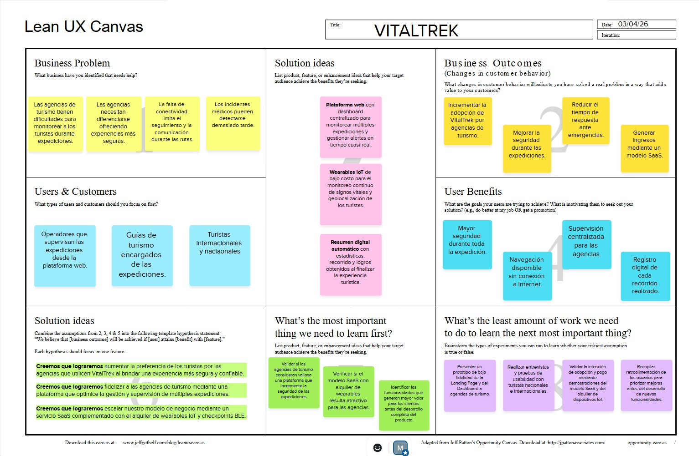

Enlace para acceder al Lean UX Canvas en Mural: [https://l1nq.com/oa73grw](https://l1nq.com/oa73grw)

---

## 1.3 Segmentos Objetivo
 
A partir del análisis del dominio del problema, la falta de sistemas de monitoreo en tiempo real para turismo de aventura en zonas remotas del Perú, se han identificado dos segmentos objetivo claramente diferenciados a los que Tourmate dirige su propuesta de valor. El primero corresponde a las agencias y operadores turísticos de aventura que requieren herramientas de gestión, supervisión y trazabilidad operativa de sus tours; el segundo corresponde a los turistas de aventura nacionales y extranjeros que demandan experiencias seguras, guiadas y enriquecidas en entornos naturales del país. A continuación se describen ambos segmentos junto con sus características demográficas y la información estadística que sustenta su relevancia.
 
*Segmento 1: Agencias y Operadores de Turismo de Aventura*
 
**Descripción**
 
Empresas formalmente constituidas, registradas en el Directorio Nacional de Prestadores de Servicios Turísticos del MINCETUR, dedicadas a la organización y operación de tours de aventura: trekking, montañismo, canotaje, ciclismo de montaña, escalada y actividades de ecoturismo. Su operación se concentra principalmente en regiones con alto potencial de turismo de aventura como Cusco, Áncash, Arequipa, Puno, Madre de Dios y San Martín, donde la conectividad celular es intermitente o inexistente. Estas agencias enfrentan limitaciones operativas para supervisar el estado y la ubicación de sus grupos durante los recorridos, así como para responder de forma oportuna ante anomalías o emergencias.
 
**Características demográficas y de negocio**
 
- Tipo de empresa: Micro y pequeñas empresas (MYPEs) en su mayoría, con entre 5 y 50 colaboradores entre guías, choferes y personal administrativo.
- Ubicación geográfica: Cusco, Áncash (Huaraz), Arequipa, Puno, Madre de Dios, Lima y San Martín.
- Antigüedad operativa: Mayoritariamente con más de 3 años en el mercado y registradas en DIRCETUR/GERCETUR.
- Capacidad operativa: Atienden grupos de entre 4 y 20 turistas por tour, con frecuencia diaria o semanal según temporada.
- Perfil tecnológico: Adopción digital baja a media, con uso predominante de WhatsApp y radios para comunicación, y escaso uso de plataformas integradas de gestión.

**Información estadística de sustento**
 
- Solo en Cusco, la Asociación de Agencias de Turismo del Cusco (AATC) representa a más de 190 agencias activas dedicadas a turismo de aventura, místico, ecológico y tradicional, lo que evidencia la concentración del mercado objetivo en regiones específicas.
- Según MINCETUR, en el 2025 se registraron 14.1 millones de visitas a sitios turísticos del país, un crecimiento del 33.2% frente al 2024, con una recuperación del 95.4% respecto al nivel prepandemia, lo que se traduce en una mayor demanda de servicios para los operadores.
- El 83% de los operadores turísticos del segmento aventura reportó incremento de ingresos en 2025, y un 46% indicó que estos crecieron por encima del 26% según el estudio anual de la Adventure Travel Trade Association (ATTA), lo que demuestra capacidad de inversión en herramientas tecnológicas.
- El sector turismo aportó aproximadamente el 2.9% del PBI nacional en 2025, según estimaciones del MINCETUR a partir de las Cuentas Satélite del Turismo, consolidando a las agencias como un mercado de alto valor económico.

*Segmento 2: Turistas de Aventura*
 
**Descripción**
 
Personas que viajan al Perú, ya sea desde el extranjero o desde otras regiones del país, motivadas por experiencias de naturaleza, deporte y exploración en entornos remotos. Buscan vivir recorridos como el Camino Inca, Salkantay, Choquequirao, Huayhuash, Colca o la Amazonía, contratando agencias formales que les brinden seguridad, organización y guías especializados. Demandan herramientas digitales que les permitan navegar offline, registrar su experiencia y acceder a información contextual del recorrido sin depender de conectividad continua.
 
**Características demográficas**
 
- Edad: El 49% de los viajeros de aventura a nivel mundial se ubica entre los 41 y 60 años; en Sudamérica esta franja sube al 54%, mientras que un 26% tiene menos de 40 años.
- Género: Predominio femenino, con 53% de mujeres frente a 46% de hombres realizando viajes de aventura, según ATTA 2024.
- Composición del grupo de viaje: El 36% viaja en pareja, 24% en grupo y 21% en familia. En Sudamérica, la familia (26%) supera a los grupos como segunda modalidad más popular.
- Procedencia: Mayoritariamente turistas extranjeros provenientes de Sudamérica (51.7%), Norteamérica (23.8%) y Europa (16.8%), complementados por turistas nacionales que viajan dentro del territorio peruano.
- Nivel socioeconómico: Medio-alto y alto, con capacidad de pagar paquetes turísticos completos y seguros de viaje con cobertura para deportes de riesgo.

**Información estadística de sustento**
 
- En el 2025, el Perú recibió 3.2 millones de turistas internacionales, un crecimiento del 29% frente al 2024, con proyecciones de alcanzar las cifras prepandemia de 4.4 millones en los próximos años.
- Se estima que el país alcanzará 43.5 millones de viajes por turismo interno al cierre de 2025, un 16.9% más que en 2024, ampliando significativamente la base potencial de turistas nacionales que demandan experiencias de aventura.
- El segmento global de turismo de aventura registró un crecimiento del 65% en número de viajeros atendidos respecto al 2019, y un 54% adicional respecto al 2022, consolidándose como uno de los nichos de mayor expansión a nivel mundial.
- El 51.5% de las visitas registradas en sitios turísticos peruanos en 2025 corresponde a turistas internacionales y el 48.5% a nacionales, lo que confirma que la propuesta de Tourmate debe atender a ambos perfiles bajo experiencias multilingües y adaptadas culturalmente.
- Regiones clave para el turismo de aventura como Cusco e Ica ya están a solo 2.6% y 3.6% de alcanzar sus cifras prepandemia, evidenciando la consolidación de los destinos donde opera el segmento.

---

# Capítulo II: Requirements Elicitation & Analysis

## 2.1. Competidores

En esta sección se identifican y describen los principales competidores directos que operan en el dominio del problema que Tourmate aborda: la gestión, monitoreo y trazabilidad de tours de aventura mediante productos digitales similares. Los tres competidores seleccionados comparten con Tourmate el modelo de negocio basado en plataformas digitales orientadas al turismo de aventura, con funcionalidades superpuestas en gestión de tours, navegación, seguimiento en tiempo real y experiencia del turista.

**TrekkSoft:** Empresa suiza fundada en 2010 en Interlaken, conocida como la capital europea de la aventura. Ofrece una plataforma de reservas y gestión operativa orientada a operadores turísticos de aventura, con módulos de pago, sincronización con OTAs, gestión de inventario y panel administrativo. Su enfoque comercial está dirigido a agencias pequeñas y medianas en mercados europeos y latinoamericanos.

**Wayward:** Plataforma estadounidense especializada en software para operadores de turismo de aventura, rallies y experiencias outdoor. Combina en una sola solución gestión de reservas, seguimiento de viaje en vivo (Live Trip Tracking), chat en tiempo real entre guías y turistas, waivers digitales, itinerarios personalizados y comunicación con contactos de emergencia. Es uno de los competidores directos más cercanos a Tourmate por su enfoque integral en seguridad y trazabilidad durante el recorrido.

**AllTrails:** Aplicación móvil desarrollada en Estados Unidos, líder mundial en navegación para senderismo y trekking. Posee un catálogo superior a 500,000 rutas en todo el mundo, navegación GPS giro a giro, mapas offline para suscriptores premium y una comunidad activa de senderistas. Se posiciona como la herramienta de referencia para turistas que realizan rutas de aventura por su cuenta o con agencias.

### 2.1.1. Análisis Competitivo

**Competitive Analysis Landscape**

A continuación se presenta el cuadro Competitive Analysis Landscape, en el cual se contrasta el perfil de Nexum Devs y su producto Tourmate frente a los tres competidores directos identificados, considerando dimensiones de perfil, marketing, producto y análisis SWOT.

<html>
<body>
    <table>
        <tr>
           <td colspan="6" class="sub">  <h1>Competitive Analysis Landscape</h1></td>
        </tr>
        <tr>
            <td colspan="2" rowspan="2" class="sub">¿Por qué llevar a cabo este análisis?</td>
            <td colspan="4" class="sub"><h3>¿Quiénes son nuestros principales competidores?</h3></td>
        </tr>
        <tr>
            <td colspan="4">El objetivo es comprender el posicionamiento real de los competidores en el mercado de gestión y monitoreo de turismo de aventura, identificar brechas en sus propuestas de valor y validar los espacios de oportunidad que Tourmate puede ocupar en el mercado peruano.</td>
        </tr>
        <tr>
            <td rowspan="3" class="sub">PERFIL</td>
            <td rowspan="2" class="sub">Overview</td>
            <td> Tourmate </td>
            <td> TrekkSoft </td>
            <td> Wayward </td>
            <td> AllTrails 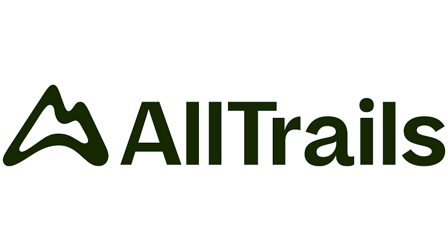</td> 
        </tr>
        <tr>
            <td>Plataforma web y móvil peruana que centraliza la gestión de tours de aventura para agencias y ofrece a turistas navegación offline, registro de experiencia e información contextual del recorrido, integrando un ecosistema IoT con wearables y checkpoints Bluetooth.</td>
            <td>Plataforma suiza de software como servicio para reservas y gestión operativa de operadores turísticos, con foco en pagos online y conexión con OTAs.</td>
            <td>Plataforma estadounidense todo en uno para operadores de aventura, con énfasis en seguimiento de viaje en vivo, chat en tiempo real entre guías y viajeros, waivers digitales e itinerarios personalizados.</td>
            <td>Aplicación móvil estadounidense con el mayor catálogo mundial de rutas de senderismo, navegación GPS y comunidad de usuarios.</td>      
        </tr>
        <tr>
            <td class="sub">Ventaja Competitiva ¿Qué valor ofrece a los clientes?</td>
            <td>Solución integral con sincronización asincrónica que opera sin conexión continua, dashboards de monitoreo en tiempo real para agencias, alertas ante anomalías y captura de signos vitales mediante wearables. Diseñada específicamente para el contexto peruano.</td>
            <td>Reduce la fricción del proceso de reserva y centraliza pagos. Permite a agencias vender sus tours en múltiples canales desde una sola plataforma.</td>
            <td>Unifica reservas, comunicación, seguridad y experiencia del viajero en una sola interfaz. Permite a las agencias mostrar la marca propia sin que aparezca el branding de Wayward, y comparte la ubicación con contactos de emergencia.</td>
            <td>Acceso instantáneo a más de 500,000 rutas verificadas con reseñas, fotografías y mapas offline en versión premium.</td>      
        </tr>
        <tr>
            <td rowspan="2" class="sub">PERFIL DEL MARKETING</td>
            <td class="sub" >Mercado Objetivo</td>
            <td>Agencias formales de turismo de aventura y turistas nacionales y extranjeros que realizan rutas en regiones del Perú con baja conectividad como Cusco, Áncash, Arequipa, Puno y Madre de Dios.</td>
            <td>Operadores turísticos de actividades y tours en Europa y Latinoamérica, principalmente pequeñas y medianas empresas con foco en ventas online.</td>
            <td>Operadores de turismo de aventura, organizadores de rallies, retiros outdoor y organizaciones turísticas regionales (DMOs) en Norteamérica y Europa.</td>
            <td>Senderistas, ciclistas, corredores y turistas de aventura individuales a nivel global, mayoritariamente en Norteamérica y Europa.</td>
        </tr>
        <tr>
            <td class="sub">Estrategias de Marketing</td>
            <td>Marketing digital orientado a segmentos B2B mediante alianzas con DIRCETUR, asociaciones de agencias como AATC y participación en ferias de turismo. Estrategia B2C centrada en redes sociales, contenido de valor sobre rutas peruanas y posicionamiento SEO local.</td>
            <td>Marketing de contenidos en blog corporativo, webinars para operadores, presencia en plataformas de reseñas como Capterra y participación en eventos de la industria turística europea.</td>
            <td>Marketing basado en casos de éxito de operadores reales, alianzas con DMOs regionales, contenido educativo para gestores de turismo y enfoque en testimonios sobre seguridad y conexión con viajeros.</td>
            <td>Modelo freemium con conversión a suscripción AllTrails Plus. Crecimiento basado en comunidad de usuarios, contenido generado por usuarios y posicionamiento orgánico en buscadores.</td>
        </tr>
        <tr>
            <td rowspan="3" class="sub">PERFIL DEL PRODUCTO</td>
            <td class="sub">Productos & Servicios</td>
            <td>Plataforma web para agencias con dashboard de monitoreo, gestión de tours y alertas. Aplicación móvil para turistas con mapas offline y registro de experiencia. Wearables IoT y checkpoints Bluetooth para captura de geolocalización y signos vitales.</td>
            <td>Software de reservas, gestión de pagos, sincronización con OTAs como Viator y GetYourGuide, panel de control y aplicación para guías.</td>
            <td>Plataforma con seguimiento de ubicación en vivo, chat instantáneo entre guías y viajeros, waivers digitales, encuestas posteriores al viaje, mapas con itinerarios destacados y módulo de reservas con marca personalizada.</td>
            <td>Aplicación móvil con búsqueda de rutas, navegación GPS giro a giro, mapas offline en plan Plus, registro de actividad y comunidad social.</td>
        </tr>
        <tr>
            <td class="sub">Precios & Costos</td>
            <td>Modelo de suscripción mensual diferenciado para agencias según tamaño y volumen de tours. Aplicación móvil gratuita para turistas con funciones premium opcionales. Costo adicional por hardware de wearables y checkpoints.</td>
            <td>Planes mensuales para operadores turísticos con comisión sobre reservas. Tarifas variables según volumen y módulos contratados.</td>
            <td>Precios bajo cotización personalizada según tamaño del operador y módulos contratados. Modelo SaaS sin comisión por reserva.</td>
            <td>Versión gratuita con funciones básicas. Suscripción AllTrails Plus alrededor de 35.99 dólares anuales para mapas offline y funcionalidades avanzadas.</td>
        </tr>
        <tr>
            <td class="sub">Canales de distribución (web/móvil)</td>
            <td>Plataforma web responsive para agencias y aplicación móvil nativa Android e iOS para turistas. Distribución directa a través del sitio web corporativo y alianzas con asociaciones de agencias.</td>
            <td>Aplicación web SaaS y aplicación móvil para guías. Distribución mediante sitio corporativo, comparadores de software y partnerships.</td>
            <td>Plataforma web SaaS y experiencia móvil para viajeros sin necesidad de descargar aplicación adicional, accesible vía enlace directo. Distribución a través del sitio web corporativo.</td>
            <td>Aplicación móvil Android e iOS, sitio web complementario. Distribución a través de App Store, Google Play y posicionamiento orgánico.</td>        
        </tr>
        <tr>
            <td rowspan="4" class="sub">ANÁLISIS SWOT</td>
            <td class="sub">Fortalezas</td>
            <td>Solución integral única en el mercado peruano que combina gestión para agencias, experiencia para turistas e integración IoT. Funcionamiento offline mediante sincronización asincrónica. Conocimiento profundo del contexto local y rutas peruanas. Captura de signos vitales para prevención de riesgos.</td>
            <td>Plataforma robusta y madura con más de quince años en el mercado. Integración consolidada con OTAs líderes. Reconocimiento en el sector europeo de actividades de aventura.</td>
            <td>Propuesta integral que une seguridad, comunicación y reservas. Live Tracking validado por operadores de rallies y aventuras de varios días. Experiencia móvil sin fricción, sin login para el viajero.</td>
            <td>Comunidad masiva de usuarios y volumen de rutas inigualable. Marca reconocida globalmente. Interfaz intuitiva y experiencia de usuario altamente pulida.</td>
        </tr>
        <tr>
            <td class="sub">Debilidades</td>
            <td>Marca nueva sin reconocimiento en el mercado. Necesidad de inversión inicial en desarrollo y despliegue de hardware. Curva de adopción tecnológica en agencias con baja madurez digital.</td>
            <td>Plataforma orientada principalmente a reservas, sin capacidades de monitoreo en tiempo real ni integración con dispositivos de tracking en campo. Interfaz no diseñada para uso en zonas sin conectividad.</td>
            <td>Su tracking depende de la conectividad celular del dispositivo del viajero, lo que limita su utilidad en zonas remotas sin señal. No incorpora hardware IoT propio ni captura de signos vitales. Presencia inexistente en el mercado peruano.</td>
            <td>No ofrece herramientas de gestión para agencias ni dashboards de supervisión. Cobertura limitada de rutas peruanas. Mapas offline restringidos a la versión de pago. Sin integración con dispositivos IoT.</td>  
        </tr>
        <tr>
            <td class="sub">Oportunidades</td>
            <td>Crecimiento sostenido del turismo de aventura en el Perú con 14.1 millones de visitas a sitios turísticos en 2025 y aumento del 33.2 por ciento respecto a 2024. Alta demanda de soluciones de seguridad por parte de turistas y agencias. Bajo nivel de digitalización del sector permite posicionarse como referente.</td>
            <td>Expansión hacia mercados latinoamericanos donde su presencia es limitada. Demanda creciente de digitalización en operadores turísticos.</td>
            <td>Expansión hacia mercados emergentes de turismo de aventura como Sudamérica y Asia. Integración futura con dispositivos satelitales o IoT podría ampliar su propuesta de valor.</td>
            <td>Incorporación de funcionalidades para agencias podría ampliar su mercado. Crecimiento del turismo experiencial a nivel global.</td> 
        </tr>
        <tr>
            <td class="sub">Amenazas</td>
            <td>Llegada de competidores internacionales con mayor capital al mercado peruano. Adopción masiva de tecnologías satelitales como Starlink Direct to Cell que reduzcan la barrera de la conectividad. Competencia con plataformas globales con mayor presupuesto de marketing.</td>
            <td>Aparición de competidores locales con propuestas adaptadas culturalmente. Posible canibalización por parte de plataformas como Bokun o FareHarbor en mercados emergentes.</td>
            <td>Competidores con soluciones más completas que integren hardware propio. Saturación del mercado norteamericano de software para turismo.</td>
            <td>Competidores especializados en navegación offline regional con mejor cobertura local. Apps de mapas gratuitos como Google Maps incorporando funciones similares.</td>          
        </tr>
    </table>
</body>
</html>

### 2.1.2. Estrategias y Tácticas frente a Competidores

A partir del análisis competitivo realizado, hemos definido un conjunto de estrategias y tácticas preliminares orientadas a afrontar las fortalezas de los competidores, aprovechar sus debilidades y posicionar a Tourmate como la solución de referencia para turismo de aventura en el Perú.

**Estrategia de diferenciación por integralidad:** Mientras los competidores actuales atacan únicamente uno de los frentes del problema, ya sea reservas, navegación o seguimiento dependiente de conectividad celular, Tourmate se posiciona como la única plataforma que integra los tres componentes en un solo ecosistema con respaldo de hardware IoT propio. La táctica asociada consiste en comunicar de forma clara este diferencial mediante demostraciones en vivo durante visitas comerciales a agencias, casos de uso documentados y material audiovisual que muestre el flujo completo desde la gestión del tour hasta la finalización del recorrido por parte del turista.

**Estrategia de penetración local con conocimiento del contexto:** Frente a la presencia internacional de TrekkSoft, Wayward y AllTrails, la ventaja competitiva más relevante de Nexum Devs es el conocimiento profundo del mercado peruano y de sus rutas específicas. La táctica consiste en establecer alianzas estratégicas con asociaciones gremiales como la AATC en Cusco y entidades regionales de DIRCETUR, validar el producto con agencias piloto en Áncash y Cusco, y construir un repositorio de rutas peruanas verificadas con información contextual cultural e histórica que ningún competidor global ofrece.

**Estrategia de precios accesible para MYPEs:** Considerando que el mercado objetivo está compuesto principalmente por micro y pequeñas empresas con capacidad limitada de inversión tecnológica, Tourmate aplicará un modelo de precios escalonado y accesible. La táctica consiste en ofrecer planes diferenciados según tamaño de la agencia y volumen de tours, periodos de prueba gratuita de tres meses para agencias pioneras y financiamiento del hardware IoT mediante esquemas de leasing o suscripción combinada.

**Estrategia de funcionamiento offline como ventaja estructural:** Mientras AllTrails restringe los mapas offline a su plan de pago, TrekkSoft no opera sin conexión y Wayward depende de la cobertura celular del dispositivo del viajero, la sincronización asincrónica de Tourmate se convierte en su mayor fortaleza estructural. La táctica consiste en posicionar la operatividad sin internet como mensaje principal de la propuesta de valor en todo el material comercial, demostrando funcionalidad real en zonas remotas durante demos comerciales y certificando el desempeño en escenarios de baja conectividad mediante pruebas en campo.

**Estrategia de mitigación frente a la amenaza satelital emergente:** Ante el avance de tecnologías como Starlink Direct to Cell que podrían reducir la dependencia de hardware satelital costoso, Tourmate prevé mantener una arquitectura modular que permita integrar futuras tecnologías de conectividad sin rediseñar la plataforma. La táctica consiste en diseñar la capa de comunicaciones bajo principios de abstracción que permitan reemplazar o complementar wearables Bluetooth con módulos satelitales económicos cuando estos estén disponibles en el mercado peruano, manteniendo la propuesta de valor centrada en software y datos más que en el dispositivo.

**Estrategia de captación de turistas mediante experiencia enriquecida:** Frente a AllTrails, cuya propuesta es funcional pero impersonal, y a Wayward, que se concentra en la dimensión operativa, Tourmate apunta a ofrecer una experiencia turística enriquecida con información cultural, registro fotográfico contextualizado y narrativa del recorrido. La táctica consiste en colaborar con guías locales certificados para construir contenido auténtico, integrar elementos de gamificación que motiven al turista a completar la ruta y generar memorias digitales compartibles que sirvan también como herramienta de marketing orgánico para las agencias asociadas.

## 2.2. Entrevistas

#### 2.2.1. Diseño de Entrevistas

Las entrevistas constituyen la principal técnica de investigación cualitativa para la validación del problema y la propuesta de valor de Tourmate. El objetivo es comprender en profundidad las necesidades, frustraciones, comportamientos actuales y expectativas de los dos segmentos de usuario identificados: los **dueños o responsables de agencias de turismo de aventura** y los **turistas de aventura**.

---

##### Objetivos Generales del Proceso de Entrevistas

1. Validar la existencia y criticidad del problema de monitoreo y seguridad en tours de aventura en zonas remotas del Perú.
2. Comprender cómo gestionan actualmente sus operaciones las agencias de turismo de aventura, identificando herramientas utilizadas, brechas y puntos de dolor.
3. Explorar la disposición de las agencias a adoptar una solución tecnológica integrada y su sensibilidad al precio.
4. Entender la experiencia del turista durante el tour: qué información desearía tener, qué situaciones de riesgo ha vivido y qué herramientas digitales ya usa.
5. Identificar funcionalidades prioritarias y posibles fricciones en la adopción del producto desde la perspectiva de ambos segmentos.

---

##### Segmento 1: Dueños o Responsables de Agencias de Turismo de Aventura

**Perfil del entrevistado:** propietarios, directores de operaciones o guías principales de agencias que operen rutas de trekking, montañismo, expediciones o turismo de naturaleza en zonas remotas del Perú. Preferiblemente agencias medianas o pequeñas con operaciones activas en sierra, selva alta o circuitos andinos.

---

**Preguntas de apertura y contexto**

1. ¿Podría contarme brevemente cómo funciona su agencia? ¿Qué tipo de tours opera y en qué zonas del país?
2. ¿Cuántos guías y turistas maneja típicamente en una temporada alta? ¿Cuántos grupos simultáneos puede llegar a tener activos?

**Preguntas sobre gestión operativa actual**

3. ¿Cómo realiza actualmente el seguimiento de sus grupos de turistas cuando están en campo? ¿Qué herramientas o medios utiliza (radio, celular, reportes manuales, apps)?
4. ¿Con qué frecuencia sus guías o grupos se quedan sin señal durante el recorrido? ¿Cómo manejan esa situación actualmente?
5. ¿Cómo coordina internamente a su equipo (guías, base de operaciones, contactos de emergencia) durante el desarrollo de un tour?
6. ¿Lleva algún registro de los recorridos realizados, incidentes ocurridos o datos de los turistas durante el tour? ¿De qué forma?

**Preguntas sobre seguridad y gestión de emergencias**

7. ¿Ha vivido alguna situación de emergencia o incidente grave durante algún tour? ¿Cómo fue la respuesta? ¿Qué falló o qué hubiera necesitado tener disponible en ese momento?
8. ¿Cómo determina si un turista está en una condición de riesgo (fatiga extrema, mal de altura, extravío) cuando no está físicamente con el guía?
9. ¿Qué protocolos de seguridad tiene establecidos actualmente? ¿Los considera suficientes?
10. ¿Ha recibido alguna vez una queja, reclamo o acción legal relacionada con un incidente de seguridad? ¿Cómo afectó eso a su operación?

**Preguntas sobre tecnología y adopción**

11. ¿Utiliza actualmente alguna herramienta digital o software para gestionar sus operaciones (reservas, logística, comunicación con guías)? ¿Cuál es su experiencia con ella?
12. ¿Ha intentado implementar alguna solución tecnológica para el monitoreo en campo? ¿Qué resultó y qué no?
13. ¿Qué barreras considera que existen para que agencias como la suya adopten soluciones tecnológicas de monitoreo?

**Preguntas sobre disposición y expectativas**

14. Si existiera una plataforma que le permitiera ver en tiempo real la ubicación y estado de todos sus grupos activos desde un panel centralizado, ¿qué tan valiosa sería para usted? ¿Qué condiciones necesitaría para adoptarla?
15. ¿Estaría dispuesto a pagar una suscripción mensual por una solución así? ¿Qué rango de precio consideraría razonable?
16. ¿Qué funcionalidades consideraría indispensables y cuáles serían un plus? ¿Qué debería tener sí o sí desde el primer día?

---

##### Segmento 2: Turistas de Aventura

**Perfil del entrevistado:** personas que hayan realizado al menos una actividad de turismo de aventura en el Perú en los últimos dos años (trekking, montañismo, expedición en selva o ruta de naturaleza en zonas remotas), ya sean nacionales o extranjeros residentes en el país.

---

**Preguntas de apertura y contexto**

1. ¿Podría contarme sobre la última actividad de aventura que realizó en el Perú? ¿A dónde fue, qué ruta hizo y con quién?
2. ¿Con qué frecuencia realiza este tipo de actividades? ¿Suele contratar agencias o prefiere organizar sus propias expediciones?

**Preguntas sobre seguridad y experiencias previas**

3. Durante ese recorrido, ¿hubo momentos en los que se sintió inseguro o sin saber bien dónde estaba o cómo pedir ayuda? ¿Puede contarme ese momento?
4. ¿Alguna vez ha vivido o presenciado una emergencia o incidente durante un tour de aventura? ¿Cómo respondió la agencia o el guía?
5. ¿Siente que las agencias con las que ha viajado tienen mecanismos adecuados para garantizar su seguridad en caso de emergencia? ¿Por qué?
6. ¿Le preocupa la falta de conectividad o la dificultad para pedir ayuda cuando está en zonas remotas? ¿Cómo lo maneja actualmente?

**Preguntas sobre herramientas y tecnología usada**

7. ¿Qué aplicaciones o dispositivos utiliza durante sus actividades de aventura? (GPS, mapas offline, reloj deportivo, etc.) ¿Cuál es su experiencia con ellas?
8. ¿Comparte su ubicación con alguien (familiar, contacto de emergencia) durante el recorrido? ¿Cómo lo hace?
9. ¿Ha usado alguna aplicación que le permita ver su recorrido, registrar datos de salud (ritmo cardíaco, altitud) o documentar su experiencia durante el tour?

**Preguntas sobre expectativas e información durante el tour**

10. Durante un tour, ¿qué información le gustaría tener disponible en todo momento? (su posición en el mapa, distancia recorrida, signos vitales, clima, información sobre el lugar, etc.)
11. ¿Le resultaría útil poder ver en su teléfono información contextual del recorrido, como datos históricos del lugar, puntos de interés o alertas de riesgo específicas de la ruta?
12. ¿Cómo le gustaría registrar su experiencia durante el tour? ¿Fotos georreferenciadas, registros automáticos, notas de voz?

**Preguntas sobre confianza y adopción**

13. Si la agencia que contrató le ofreciera un dispositivo wearable que monitoree su ubicación y signos vitales durante el tour, ¿lo usaría? ¿Qué preguntas o dudas tendría al respecto?
14. ¿Tiene alguna preocupación sobre la privacidad de sus datos si una agencia monitorea su ubicación y salud en tiempo real?
15. ¿Cuánto influiría en su decisión de contratar una agencia el hecho de que esta cuente con tecnología de monitoreo en tiempo real y protocolos de emergencia avanzados?

---

##### Consideraciones Metodológicas

**Cantidad de entrevistas:** mínimo 3 y máximo 5 entrevistas por segmento (total: entre 6 y 10 entrevistas) para alcanzar saturación temática en una etapa de descubrimiento.

**Registro:** Las entrevistas deben ser grabadas con consentimiento del entrevistado para su posterior análisis. Se recomienda el uso de una guía de toma de notas que permita capturar citas textuales relevantes.

**Análisis:** Los resultados serán procesados mediante agrupamiento de respuestas por temática, identificando patrones comunes, necesidades no cubiertas y citas representativas para validar o refutar las hipótesis de problema y solución.

**Ética:** Antes de cada entrevista se informará al participante sobre el propósito de la investigación, la confidencialidad de sus respuestas y su derecho a retirarse en cualquier momento. No se recopilará información personal identificable más allá de la necesaria para el reclutamiento.

---

### 2.2.2. Registro de Entrevistas

##### Segmento 1: Dueños o responsables de agencia de turismo de aventura

**Entrevista 1:**

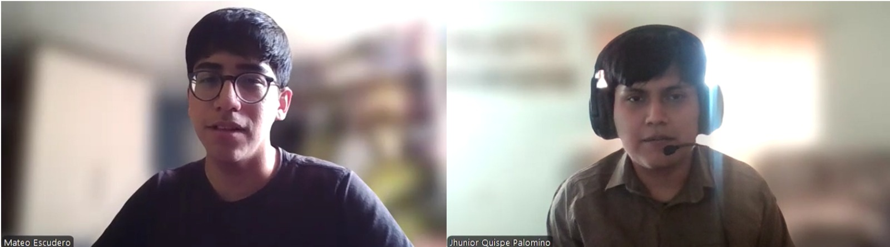

| | |
| :--- | :--- |
| **Entrevistador:** | Tony Jhunior Quispe Palomino |
| **Entrevistado:** | Mateo Escudero |
| **Edad:** | 22 años |
| **Segmento:** | Dueño o responsable de agencia de turismo de aventura |
| **Inicio de la entrevista:** | 0:00 |
| **Duración:** | 11:05 min |
| **Enlace:** | https://upcedupe-my.sharepoint.com/:v:/g/personal/u20241f714_upc_edu_pe/IQCf3pj989dtRqsxlQP-cphyAdmHJbpSw14HLGTRks5qOyM?e=L98d2n&nav=eyJyZWZlcnJhbEluZm8iOnsicmVmZXJyYWxBcHAiOiJTdHJlYW1XZWJBcHAiLCJyZWZlcnJhbFZpZXciOiJTaGFyZURpYWxvZy1MaW5rIiwicmVmZXJyYWxBcHBQbGF0Zm9ybSI6IldlYiIsInJlZmVycmFsTW9kZSI6IldpZXcifX0%3D |

**Resumen:** Mateo Escudero, de 22 años y guía en Adventure Perú, apoya en la gestión de expediciones de turismo de aventura (principalmente trekking, montañismo y campamentos) en zonas como Cusco, Áncash y Madre de Dios. Nos comenta que la agencia maneja un equipo de 10 guías y atiende de 40 a 70 turistas en temporada alta, operando entre 4 y 7 grupos simultáneos. Actualmente, coordinan la operación mediante radios, llamadas, WhatsApp y hojas de cálculo o formularios básicos. Esto les genera dolores de cabeza importantes: la falta de señal de internet en las rutas de montaña dificulta la comunicación en tiempo real y la actualización oportuna de la ubicación de los grupos, además de provocar retrasos en la sincronización de datos y reportes dispersos. Asimismo, mencionó que se han enfrentado a situaciones críticas por mal de altura y fallas en la comunicación en zonas alejadas. Finalmente, muestra un gran interés en una solución tecnológica, señalando que se valoraría contar con mapas offline funcionales, un panel centralizado de monitoreo de grupos y un botón de pánico accesible incluso sin internet, considerando un rango de precio razonable de suscripción de 100 a 150 soles mensuales. Como principal barrera, destaca los costos, la necesidad de capacitación del personal y la falta de dispositivos avanzados en algunos guías.

---

**Entrevista 2:**

| |                                                                                                                                                                                                                                                                                                                                                                                                                                                                                                                                                                                                                                                                          |
| :--- |:-------------------------------------------------------------------------------------------------------------------------------------------------------------------------------------------------------------------------------------------------------------------------------------------------------------------------------------------------------------------------------------------------------------------------------------------------------------------------------------------------------------------------------------------------------------------------------------------------------------------------------------------------------------------------|
| **Entrevistador:** | Molina Vásquez Manuel Alejandro                                                                                                                                                                                                                                                                                                                                                                                                                                                                                                                                                                                                                                          |
| **Entrevistado:** | Aarón Espinosa                                                                                                                                                                                                                                                                                                                                                                                                                                                                                                                                                                                                                                                           |
| **Edad:** | 21 años                                                                                                                                                                                                                                                                                                                                                                                                                                                                                                                                                                                                                                                                  |
| **Segmento:** | Dueño o responsable de agencia de turismo de aventura                                                                                                                                                                                                                                                                                                                                                                                                                                                                                                                                                                                                                    |
| **Inicio de la entrevista:** | 0:00                                                                                                                                                                                                                                                                                                                                                                                                                                                                                                                                                                                                                                                                     |
| **Duración:** | 9:22 min                                                                                                                                                                                                                                                                                                                                                                                                                                                                                                                                                                                                                                                                 |
| **Enlace:** | [Entrevista](https://upcedupe-my.sharepoint.com/:v:/g/personal/u20221g231_upc_edu_pe/IQAofZYR8ATPSbWHvKq3vOSvAZ1mk5uCZxK_sr8rN9qoqI4?nav=eyJyZWZlcnJhbEluZm8iOnsicmVmZXJyYWxBcHAiOiJPbmVEcml2ZUZvckJ1c2luZXNzIiwicmVmZXJyYWxBcHBQbGF0Zm9ybSI6IldlYiIsInJlZmVycmFsTW9kZSI6IldpZXciLCJyZWZlcnJhbFZpZXciOiJNeUZpbGVzTGlua0NvcHkifX0&e=CzroE4) https://upcedupe-my.sharepoint.com/:v:/g/personal/u20221g231_upc_edu_pe/IQAofZYR8ATPSbWHvKq3vOSvAZ1mk5uCZxK_sr8rN9qoqI4?nav=eyJyZWZlcnJhbEluZm8iOnsicmVmZXJyYWxBcHAiOiJPbmVEcml2ZUZvckJ1c2luZXNzIiwicmVmZXJyYWxBcHBQbGF0Zm9ybSI6IldlYiIsInJlZmVycmFsTW9kZSI6IldpZXciLCJyZWZlcnJhbFZpZXciOiJNeUZpbGVzTGlua0NvcHkifX0&e=CzroE4  |

**Resumen:** Aarón Espinosa representa a una agencia pequeña enfocada en turismo de aventura, caminatas, trekking y visitas culturales en la sierra peruana (principalmente Cusco, Arequipa y alrededores). En temporadas altas llegan a coordinar entre 10 y 15 guías simultáneamente, atendiendo de 50 a 100 turistas al día distribuidos en 5 a 8 grupos en ruta. Actualmente, el monitoreo lo realizan mediante llamadas telefónicas, la función de ubicación compartida y grupos de WhatsApp, mientras que la información operativa la manejan de forma dispersa en hojas de Microsoft Excel y chats. Manifiesta que la pérdida total de señal móvil en zonas de altura y senderos aislados es sumamente frecuente; ante ello, no cuentan con contingencias técnicas y se limitan a esperar a que el guía recupere cobertura para reportar. Toda la supervisión de la condición física de los turistas recae exclusivamente en la observación presencial del guía. Entre los incidentes habituales reporta casos de descompensación por mal de altura y agotamiento físico extremo. Señala que la falta de conectividad dificulta actuar con rapidez desde la base, lo que deriva en reclamos de clientes y deteriora la reputación de la empresa. Aarón considera indispensable una solución que funcione sin señal móvil (almacenando datos localmente hasta reconectar), que centralice la ubicación y ofrezca comunicación directa con alertas tempranas. Como funcionalidades de valor agregado destaca los reportes de recorridos y el historial de incidentes. Estaría dispuesto a adoptar un modelo de suscripción mensual con un rango de pago estimado entre S/. 150 y S/. 300.

**Entrevista 3:**

| |                                                                                                                                                                                                                                                                                                                                              |
| :--- |:---------------------------------------------------------------------------------------------------------------------------------------------------------------------------------------------------------------------------------------------------------------------------------------------------------------------------------------------|
| **Entrevistador:** | Frank Anthony Huingo Tello                                                                                                                                                                                                                                                                                                             |
| **Entrevistado:** | Carlos Gutierrez                                                                                                                                                                                                                                                                                                                      |
| **Edad:** | 20 años                                                                                                                                                                                                                                                                                                                                      |
| **Segmento:** | Dueño o responsable de agencia de turismo de aventura                                                                                                                                                                                                                                                                                                                      |
| **Inicio de la entrevista:** | 0:00                                                                                                                                                                                                                                                                                                                                         |
| **Duración:** | 5:05 min                                                                                                                                                                                                                                                                                                                                    |
| **Enlace:** | [Entrevista-7](https://upcedupe-my.sharepoint.com/:v:/g/personal/u202319057_upc_edu_pe/IQBoi_IK-HcUQI1SdenjhHQkAbMGfRPdITIGilUq4MH0xug?nav=eyJyZWZlcnJhbEluZm8iOnsicmVmZXJyYWxBcHAiOiJPbmVEcml2ZUZvckJ1c2luZXNzIiwicmVmZXJyYWxBcHBQbGF0Zm9ybSI6IldlYiIsInJlZmVycmFsTW9kZSI6InZpZXciLCJyZWZlcnJhbFZpZXciOiJNeUZpbGVzTGlua0NvcHkifX0&e=RhDf3F)|

**Resumen:** Carlos Gutiérrez representa a una agencia enfocada en tours de trekking y naturaleza, principalmente en los circuitos andinos del sur, como Cusco y Huaraz, trabajando con guías locales especializados. Durante temporada alta manejan entre 5 y 10 guías, aproximadamente 100 turistas al mes y hasta 3 grupos simultáneos activos en ruta. Actualmente, el seguimiento en campo se realiza mediante radios VHF en zonas sin señal y llamadas o WhatsApp cuando existe cobertura celular, mientras que los recorridos e incidentes se registran manualmente en bitácoras de papel y posteriormente se trasladan a hojas de Excel. Señala que la pérdida de señal es muy frecuente en quebradas y zonas de alta montaña, por lo que utilizan puntos de reporte obligatorios en campamentos o cumbres y dependen de los reportes del guía para conocer el estado de los pasajeros. Entre los principales problemas identifica la demora en la comunicación durante emergencias, especialmente ante casos de soroche y fatiga, así como las dificultades para actuar rápidamente cuando el guía se encuentra sin cobertura. Aunque cuentan con protocolos básicos de evacuación, considera que la falta de comunicación en tiempo real los vuelve lentos y puede generar reclamos por retrasos en la atención. Actualmente utilizan Excel para reservas y WhatsApp para la coordinación, pero no cuentan con software especializado debido principalmente al costo, la resistencia del personal a aplicaciones complejas y la falta de conectividad. Carlos considera que una plataforma de monitoreo en tiempo real sería sumamente valiosa para mejorar la tranquilidad y capacidad de respuesta de la agencia. Estaría dispuesto a pagar una suscripción mensual de entre $30 y $80, siempre que el costo sea adecuado para una agencia pequeña o mediana. Entre las funcionalidades indispensables desde el primer día destaca un botón SOS de emergencia, mapas offline y visualización básica de la ubicación de los grupos.

---

##### Segmento 2: Turistas de Aventura

**Entrevista 4:**

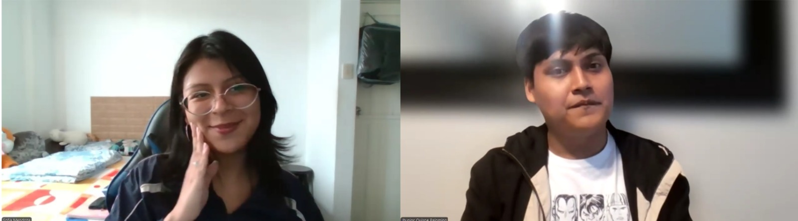

| | |
| :--- | :--- |
| **Entrevistador:** | Tony Jhunior Quispe Palomino |
| **Entrevistado:** | Sofia Mendoza |
| **Edad:** | 20 años |
| **Segmento:** | Turista de Aventura |
| **Inicio de la entrevista:** | 0:00 |
| **Duración:** | 11:48 min |
| **Enlace:** | https://upcedupe-my.sharepoint.com/:v:/g/personal/u20241f714_upc_edu_pe/IQBPxk5ihQP7Qpk1EiObhUKMAcqE0PkmidpljYmgsKZhw60?e=y94DfE&nav=eyJyZWZlcnJhbEluZm8iOnsicmVmZXJyYWxBcHAiOiJTdHJlYW1XZWJBcHAiLCJyZWZlcnJhbFZpZXciOiJTaGFyZURpYWxvZy1MaW5rIiwicmVmZXJyYWxBcHBQbGF0Zm9ybSI6IldlYiIsInJlZmVycmFsTW9kZSI6IldpZXcifX0%3D |

**Resumen:** Sofía Mendoza, de 20 años y aficionada a las actividades de aventura, nos comparte su experiencia participando en excursiones y viajes en el Perú, como sus recorridos en bicicleta en Lambayeque o sus visitas a la reserva de Paracas. Nos comenta que suele realizar estas actividades unas tres veces al año durante sus vacaciones y que prefiere organizarlas por cuenta propia o guiada cuando no tiene conocimiento previo del lugar. Respecto a sus principales preocupaciones y dolores de cabeza, destaca la falta de conectividad e internet en zonas remotas de montaña o rutas peligrosas, la dificultad para pedir ayuda o ubicarse ante imprevistos, y el mal estado de las carreteras debido a lluvias o bloqueos, recordando un incidente crítico por el clima cuando viajaba hacia la selva y las agencias no ofrecieron protocolos o advertencias de seguridad adecuados. Finalmente, muestra un gran interés en una solución tecnológica o dispositivo que le permita ver información contextual en tiempo real —como mapas, clima, historia del lugar y puntos de interés—, valorando positivamente que cuente con monitoreo o protocolos de emergencia avanzados, siempre y cuando sea accesible y no exceda su presupuesto.

---

**Entrevista 5:**

| |                                                                                                                                                                                                                                                                                                                                              |
| :--- |:---------------------------------------------------------------------------------------------------------------------------------------------------------------------------------------------------------------------------------------------------------------------------------------------------------------------------------------------|
| **Entrevistador:** | Manuel Alejandro Molina Vásquez                                                                                                                                                                                                                                                                                                              |
| **Entrevistado:** | Romina Antonella Molina Vásquez                                                                                                                                                                                                                                                                                                              |
| **Edad:** | 18 años                                                                                                                                                                                                                                                                                                                                      |
| **Segmento:** | Turista de Aventura                                                                                                                                                                                                                                                                                                                          |
| **Inicio de la entrevista:** | 0:00                                                                                                                                                                                                                                                                                                                                         |
| **Duración:** | min                                                                                                                                                                                                                                                                                                                                          |
| **Enlace:** | [Entrevista5](https://upcedupe-my.sharepoint.com/:v:/g/personal/u20221g231_upc_edu_pe/IQAQPNKuz_cKS4krk8KnLmoKAaAOQuWIL6WmZXL4T30cJJQ?nav=eyJyZWZlcnJhbEluZm8iOnsicmVmZXJyYWxBcHAiOiJPbmVEcml2ZUZvckJ1c2luZXNzIiwicmVmZXJyYWxBcHBQbGF0Zm9ybSI6IldlYiIsInJlZmVycmFsTW9kZSI6IldpZXciLCJyZWZlcnJhbFZpZXciOiJNeUZpbGVzTGlua0NvcHkifX0&e=B3HGgd) https://upcedupe-my.sharepoint.com/:v:/g/personal/u20221g231_upc_edu_pe/IQAQPNKuz_cKS4krk8KnLmoKAaAOQuWIL6WmZXL4T30cJJQ?nav=eyJyZWZlcnJhbEluZm8iOnsicmVmZXJyYWxBcHAiOiJPbmVEcml2ZUZvckJ1c2luZXNzIiwicmVmZXJyYWxBcHBQbGF0Zm9ybSI6IldlYiIsInJlZmVycmFsTW9kZSI6IldpZXciLCJyZWZlcnJhbFZpZXciOiJNeUZpbGVzTGlua0NvcHkifX0&e=B3HGgd |

**Resumen:** Romina Antonella es una usuaria joven que realiza actividades de aventura y trekking durante sus periodos vacacionales (aproximadamente una vez cada dos semanas). Suelen ser salidas en grupos de amigos de forma independiente en expediciones cortas (como caminatas hacia lagunas en Caraz), o mediante agencias turísticas cuando visita destinos tradicionales como Cusco y Machu Picchu. Durante sus recorridos no lleva equipamiento especializado; suele portar únicamente su teléfono móvil y audífonos, empleando la función nativa de ubicación compartida en tiempo real de WhatsApp para reportarse con sus padres. Manifiesta preocupación frente a la pérdida total de cobertura celular en zonas remotas, reconociendo la incertidumbre de no saber cómo comunicarse con sus familiares o pedir ayuda si ocurriese un accidente grave; ante ello, actualmente solo depende de la confianza en sus acompañantes. Si bien no ha presenciado emergencias extremas (solo incidentes médicos menores resueltos por guías locales), expresa que la información más valiosa que desearía tener disponible en todo momento son las alertas de riesgo y la identificación de zonas seguras ante peligros naturales (terremotos o avalanchas). Asimismo, documenta activamente sus recorridos tomando fotos, grabando videos y generando contenido para redes sociales en el trayecto. Respecto al uso de dispositivos wearables y tecnología de monitoreo biométrico y de geolocalización provista por una agencia, afirma que estaría totalmente dispuesta a usarlos si se le explican claramente su funcionamiento y propósitos. No le genera inconvenientes la privacidad de sus datos de salud o ubicación mientras este rastreo se limite estrictamente a la duración de la excursión. Aunque actualmente la adopción de tecnología avanzada no determina de forma crítica su elección de agencia (dada la escasa oferta tecnológica en el mercado local), considera que implementar estos sistemas sería una adición positiva y valiosa para modernizar el sector.

**Entrevista 6:**

| |                                                                                                                                                                                                                                                                                                                                              |
| :--- |:---------------------------------------------------------------------------------------------------------------------------------------------------------------------------------------------------------------------------------------------------------------------------------------------------------------------------------------------|
| **Entrevistador:** | Giancarlo Verastigue Martinez                                                                                                                                                                                                                                                                                                                |
| **Entrevistado:** | Miler Rodriguez                                                                                                                                                                                                                                                                                                                              |
| **Edad:** | 22 años                                                                                                                                                                                                                                                                                                                                      |
| **Segmento:** | Turista de Aventura                                                                                                                                                                                                                                                                                                                          |
| **Inicio de la entrevista:** | 0:00                                                                                                                                                                                                                                                                                                                                         |
| **Duración:** | 10:05 min                                                                                                                                                                                                                                                                                                                                    |
| **Enlace:** | [Entrevista-6](https://upcedupe-my.sharepoint.com/:v:/g/personal/u202419483_upc_edu_pe/IQDe0UWGvKUwRojgbs_XPIuJAclsUfNSUJK04_8jjCFOE7A?nav=eyJyZWZlcnJhbEluZm8iOnsicmVmZXJyYWxBcHAiOiJPbmVEcml2ZUZvckJ1c2luZXNzIiwicmVmZXJyYWxBcHBQbGF0Zm9ybSI6IldlYiIsInJlZmVycmFsTW9kZSI6InZpZXciLCJyZWZlcnJhbFZpZXciOiJNeUZpbGVzTGlua0NvcHkifX0&e=Szx6cw) https://upcedupe-my.sharepoint.com/:v:/g/personal/u202419483_upc_edu_pe/IQDe0UWGvKUwRojgbs_XPIuJAclsUfNSUJK04_8jjCFOE7A?nav=eyJyZWZlcnJhbEluZm8iOnsicmVmZXJyYWxBcHAiOiJPbmVEcml2ZUZvckJ1c2luZXNzIiwicmVmZXJyYWxBcHBQbGF0Zm9ybSI6IldlYiIsInJlZmVycmFsTW9kZSI6InZpZXciLCJyZWZlcnJhbFZpZXciOiJNeUZpbGVzTGlua0NvcHkifX0&e=Szx6cw|

**Resumen:**

El análisis de la entrevista con Miller, un viajero que realiza trekking de manera ocasional, revela información clave sobre el comportamiento y las necesidades urgentes de los aventureros en zonas remotas. Aunque suele organizarse de forma independiente con amigos para rutas conocidas, Miller prefiere contratar agencias y guías para trayectos más complejos. Durante estas expediciones, su principal punto de dolor es la pérdida de señal celular, lo cual genera una gran incertidumbre sobre la ubicación exacta y la ruta a seguir. A esto se suma la percepción de que las agencias a menudo carecen de protocolos de emergencia claros frente a problemas de salud o fatiga extrema del grupo. Si bien actualmente intenta mitigar estos riesgos compartiendo su ubicación y descargando mapas sin conexión, estas herramientas terminan perdiendo su utilidad principal al no contar con cobertura de red.

**Entrevista 7:**

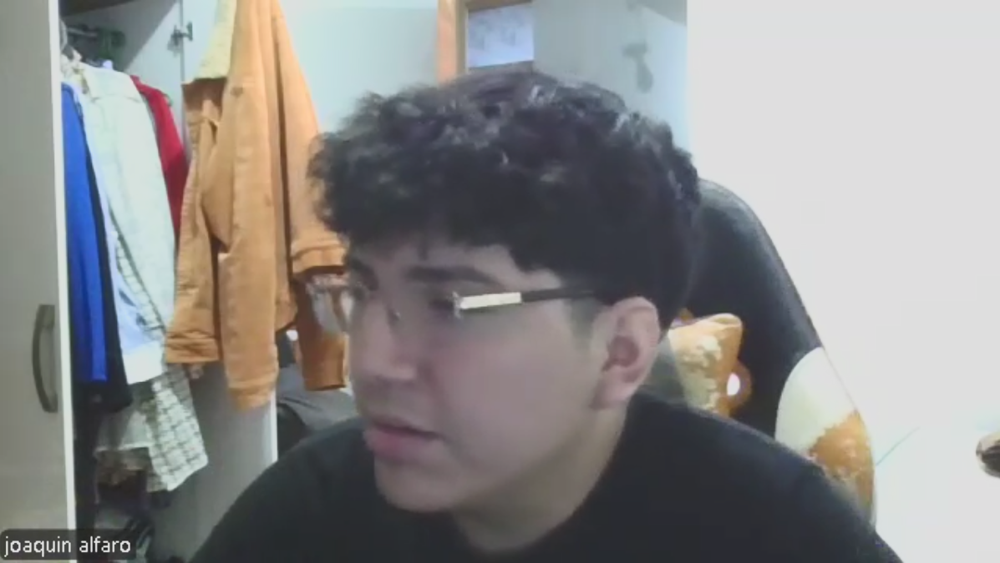

| |                                                                                                                                                                                                                                                                                                                                              |
| :--- |:---------------------------------------------------------------------------------------------------------------------------------------------------------------------------------------------------------------------------------------------------------------------------------------------------------------------------------------------|
| **Entrevistador:** | Matias Renato Carrillo Acho                                                                                                                                                                                                                                                                  |
| **Entrevistado:** | Alberto Joaquin Alfaro Mallma                                                                                                                                                                                                                                                                                                                              |
| **Edad:** | 25 años                                                                                                                                                                                                                                                                                                                                      |
| **Segmento:** | Turista de Aventura                                                                                                                                                                                                                                                                                                                          |
| **Inicio de la entrevista:** | 0:00                                                                                                                                                                                                                                                                                                                                         |
| **Duración:** | 06:25 min                                                                                                                                                                                                                                                                                                                                    |
| **Enlace:** | [Entrevista-7](https://upcedupe-my.sharepoint.com/:v:/g/personal/u202323010_upc_edu_pe/IQAUJbSUxGQ-RrATzxOjZawRAVmvkpuEsfg7qOf-p29IYXk?e=BFlFkq&nav=eyJyZWZlcnJhbEluZm8iOnsicmVmZXJyYWxBcHAiOiJTdHJlYW1XZWJBcHAiLCJyZWZlcnJhbFZpZXciOiJTaGFyZURpYWxvZy1MaW5rIiwicmVmZXJyYWxBcHBQbGF0Zm9ybSI6IldlYiIsInJlZmVycmFsTW9kZSI6InZpZXcifX0%3D)|

**Resumen:** Alberto Joaquin Alfaro Mallma, 25 años. Su ultimo viaje fue hacia la laguna 69 en la cordillera blanca, además señala que contrato a una agencia con guía incluido. Frecuentemente prefiere contratar a una agencia turistica para realizar viajes o tours, tambien señala que ha vivido percances durante el tour siendo uno de estos la falta de señal y comunicación. Menciona que la seguridad en tours depende exclusivamente de la agencia y de la preparación de los guías designados, además señala que utiliza mapas offlines, gps y relojes inteligentes como herramientas durante el tour.

---

## 2.3. Needfinding
 
En esta sección se presentan los artefactos resultantes del proceso de análisis de la información recolectada durante la fase de Needfinding. A partir de las entrevistas realizadas a los segmentos objetivo y del análisis competitivo desarrollado en el capítulo anterior, el equipo ha sintetizado los hallazgos en artefactos que permiten visualizar de forma estructurada las características, comportamientos, motivaciones y necesidades de los usuarios potenciales de Tourmate. Estos artefactos servirán como base para la definición de requerimientos funcionales y de diseño de la solución, asegurando que cada decisión esté centrada en el usuario y respaldada por evidencia recolectada en campo.
 
### 2.3.1. User Personas
 
A continuación se presentan las fichas de User Persona elaboradas para cada uno de los dos segmentos objetivo de Tourmate, identificados previamente en la sección de Segmentos Objetivo del capítulo anterior. La elaboración de estos arquetipos se sustenta en el análisis cualitativo de las entrevistas realizadas a representantes de cada segmento, así como en los hallazgos obtenidos del análisis competitivo, donde se evidenciaron brechas en la oferta actual de productos digitales para turismo de aventura en zonas de baja conectividad.
 
Las principales características consideradas para la construcción de los User Personas incluyen los datos demográficos, ocupación, comportamiento digital, motivaciones, frustraciones, objetivos personales y profesionales, así como el nivel de adopción tecnológica de cada segmento. Esta información fue contrastada con las debilidades detectadas en competidores como TrekkSoft, Wayward y AllTrails, especialmente en lo referente a la operatividad sin conectividad, la captura de signos vitales y la falta de personalización para el contexto peruano. De esta manera, los arquetipos no solo representan a los usuarios, sino que también encapsulan las oportunidades de diferenciación que Tourmate puede capitalizar.
 
Se ha elaborado una ficha de User Persona por cada segmento objetivo, utilizando la herramienta UXPressia siguiendo las mejores prácticas de la industria. El primer User Persona, Ana Lucía Quispe, representa al segmento de agencias y operadores de turismo de aventura, mientras que el segundo, Marco Rodriguez, representa al segmento de turistas de aventura nacionales y extranjeros que contratan los servicios de estas agencias.
 
**User Persona 1: Ana Lucía Quispe - Segmento de Dueños o Responsables de Agencias de Turismo de Aventura**
 
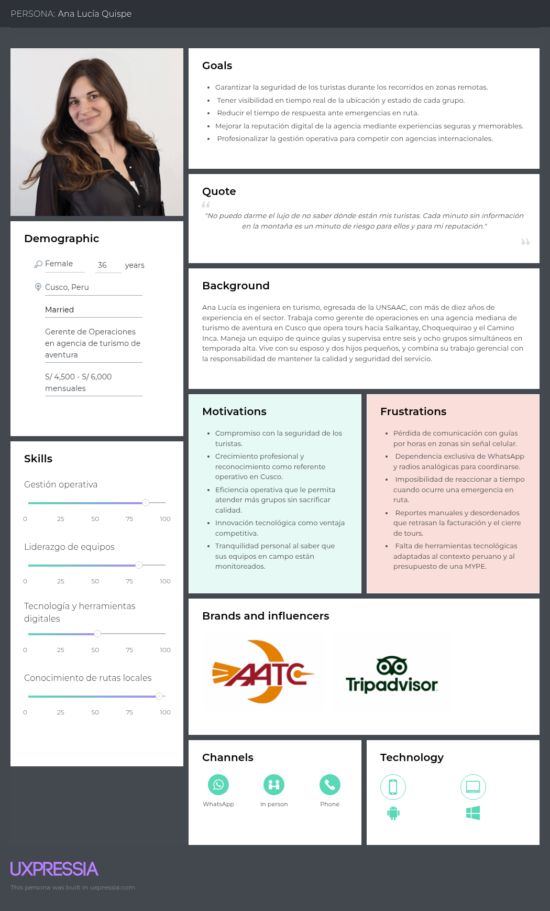

Representa al segmento de agencias y operadores de turismo de aventura. Este arquetipo encarna a la gerente de operaciones de una agencia mediana en Cusco, responsable de coordinar guías, supervisar tours simultáneos y garantizar la seguridad de los grupos en zonas remotas. Sus motivaciones giran en torno a la profesionalización operativa, la reducción del tiempo de respuesta ante emergencias y la diferenciación competitiva mediante el uso de tecnología. Sus principales frustraciones se relacionan con la pérdida de comunicación con los guías por horas, la dependencia de WhatsApp y radios analógicas, y la ausencia de herramientas digitales adaptadas al contexto y al presupuesto de una micro o pequeña empresa peruana.

**User Persona 2: Marco Rodriguez - Segmento de Turistas de Aventura**
 
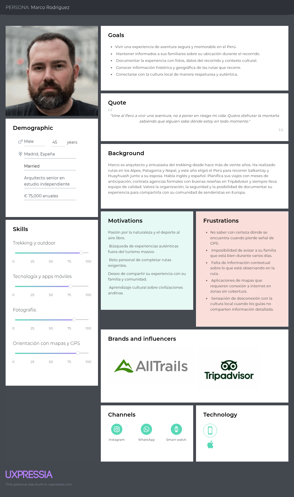

Representa al segmento de turistas de aventura nacionales y extranjeros. Este arquetipo encarna al viajero europeo experimentado, con alto poder adquisitivo, dominio tecnológico y pasión por las experiencias outdoor auténticas. Sus motivaciones se centran en vivir aventuras seguras y memorables, mantener informados a sus familiares durante el recorrido y enriquecer su experiencia con información cultural e histórica del entorno. Sus frustraciones más relevantes son la incertidumbre sobre su ubicación al perder señal GPS, la imposibilidad de avisar a su familia durante varios días, y la carencia de aplicaciones móviles que funcionen sin conectividad continua en zonas remotas del Perú.

### 2.3.2. User Task Matrix

A continuación se presenta el User Task Matrix, artefacto que concentra las principales tareas que los User Personas realizan para cumplir sus objetivos en el dominio del turismo de aventura. Es importante precisar que las tareas listadas corresponden a actividades que ambos segmentos llevan a cabo de manera independiente a la existencia de Tourmate, ya que reflejan el comportamiento natural y las responsabilidades inherentes a cada rol dentro del ecosistema del turismo de aventura. Los segmentos considerados en esta matriz son las agencias y operadores de turismo de aventura, representados por Ana Lucía Quispe, y los turistas de aventura nacionales y extranjeros, representados por Marco Rodriguez.

Para cada User Persona se evalúan dos dimensiones por tarea. La frecuencia indica con qué regularidad realiza la tarea, expresada en una escala cualitativa de Muy Alta, Alta, Media, Baja o Muy Baja. La importancia indica el grado en que la tarea es crítica para el cumplimiento de los objetivos del User Persona, expresada en la misma escala. Cuando una tarea no aplica para un User Persona específico, se indica con la abreviatura N/A.

| **User Task**                                                         | **Ana Lucía Quispe (Frecuencia)** | **Ana Lucía Quispe (Importancia)** | **Marco Rodríguez (Frecuencia)** | **Marco Rodríguez (Importancia)** |
|-----------------------------------------------------------------------|-----------------------------------|------------------------------------|----------------------------------|-----------------------------------|
| Planificar el itinerario y la logística del recorrido                 | Always                            | Very High                          | Often                            | High                              |
| Coordinar con guías y personal operativo en campo                     | Always                            | Very High                          | N/A                              | N/A                               |
| Supervisar la ubicación y el estado de los grupos durante el tour     | Always                            | Very High                          | N/A                              | N/A                               |
| Comunicarse con familiares para informar el estado durante el viaje   | Rarely                            | Medium                             | Always                           | Very High                         |
| Reaccionar ante emergencias o anomalías en ruta                       | Sometimes                         | Very High                          | Rarely                           | Very High                         |
| Registrar la asistencia y datos personales de los turistas            | Often                             | High                               | Often                            | Medium                            |
| Investigar y comparar agencias o servicios turísticos                 | Sometimes                         | High                               | Always                           | Very High                         |
| Reservar y pagar los servicios de tours de aventura                   | Often                             | High                               | Often                            | Very High                         |
| Orientarse y navegar durante el recorrido en zonas remotas            | Sometimes                         | High                               | Always                           | Very High                         |
| Documentar la experiencia mediante fotografías y notas                | Rarely                            | Medium                             | Always                           | High                              |
| Acceder a información cultural e histórica del recorrido              | Rarely                            | Medium                             | Often                            | Very High                         |
| Monitorear los signos vitales y el estado físico durante la actividad | Rarely                            | High                               | Often                            | High                              |
| Generar reportes operativos y financieros del tour                    | Always                            | Very High                          | N/A                              | N/A                               |
| Recopilar feedback y reseñas posteriores al servicio                  | Often                             | High                               | Sometimes                        | Medium                            |
| Compartir la experiencia en redes sociales y comunidades de viajeros  | Sometimes                         | Medium                             | Often                            | High                              |
| Gestionar la facturación y los pagos a guías o proveedores            | Always                            | Very High                          | N/A                              | N/A                               |
| Capacitarse en protocolos de seguridad y rutas nuevas                 | Sometimes                         | High                               | Rarely                           | Medium                            |

**Análisis de los resultados de la matriz**

A partir del análisis de la matriz se identifican patrones claros que evidencian las prioridades y comportamientos de cada User Persona, así como los puntos de convergencia y divergencia entre ambos segmentos:

En el caso de Ana Lucía Quispe, las tareas con mayor frecuencia e importancia se concentran en la dimensión operativa y de supervisión. La planificación del itinerario, la coordinación con guías, la supervisión de la ubicación y estado de los grupos, la generación de reportes operativos y la gestión de la facturación constituyen el núcleo de su actividad diaria. Estas tareas reflejan su rol como gerente de operaciones y subrayan la criticidad de contar con herramientas que faciliten la trazabilidad y la comunicación con los equipos en campo. Adicionalmente, la reacción ante emergencias, aunque presenta una frecuencia media, mantiene una importancia muy alta debido al impacto que tiene sobre la seguridad de los turistas y la reputación de la agencia.

En el caso de Marco Rodriguez, las tareas con mayor frecuencia e importancia se orientan hacia la dimensión experiencial y de seguridad personal. La investigación y comparación de agencias previa al viaje, la reserva y pago de servicios, la orientación y navegación en zonas remotas, la comunicación con familiares y el acceso a información cultural e histórica constituyen las actividades centrales de su comportamiento como turista de aventura. La documentación de la experiencia mediante fotografías y notas también ocupa un lugar relevante, lo que refleja el perfil del viajero contemporáneo que busca compartir y conservar memorias de sus aventuras.

Entre las principales coincidencias entre ambos User Personas destaca la relevancia que ambos otorgan a la planificación del itinerario y a la reserva de servicios, aunque desde perspectivas distintas. Mientras Ana Lucía planifica la logística operativa del lado de la oferta, Marco planifica su experiencia desde el lado de la demanda. Otra coincidencia importante es la criticidad de la reacción ante emergencias, que aunque ocurre con baja frecuencia, ambos consideran muy importante por sus implicancias en seguridad y bienestar. Finalmente, ambos User Personas comparten la necesidad de orientarse y navegar en zonas remotas, lo cual refuerza la importancia de contar con herramientas digitales que operen sin conectividad continua.

Entre las principales diferencias se observa que las tareas relacionadas con la supervisión de grupos, la generación de reportes operativos, la gestión de facturación y la coordinación con guías son exclusivas del User Persona de la agencia, mientras que las tareas vinculadas a la documentación de la experiencia, el acceso a información cultural y el compartir contenido en redes sociales son predominantes en el User Persona del turista. Esta diferenciación valida el enfoque dual de la propuesta de valor de Tourmate, donde la plataforma debe atender tanto las necesidades operativas y de control de las agencias como las expectativas experienciales y de seguridad personal de los turistas.

#### 2.3.3. User Journey Mapping

El User Journey Mapping es una herramienta que permite visualizar de forma estructurada la experiencia del usuario a lo largo de su interacción con un producto o servicio. Realizamos los User Journey Maps en su versión As-Is para los tres segmentos objetivos.

<b>User Journey Map del 1er segmento objetivo – agencias y operadores de turismo</b>

<b>User Journey Map del 2do segmento objetivo - turistas de aventura </b>
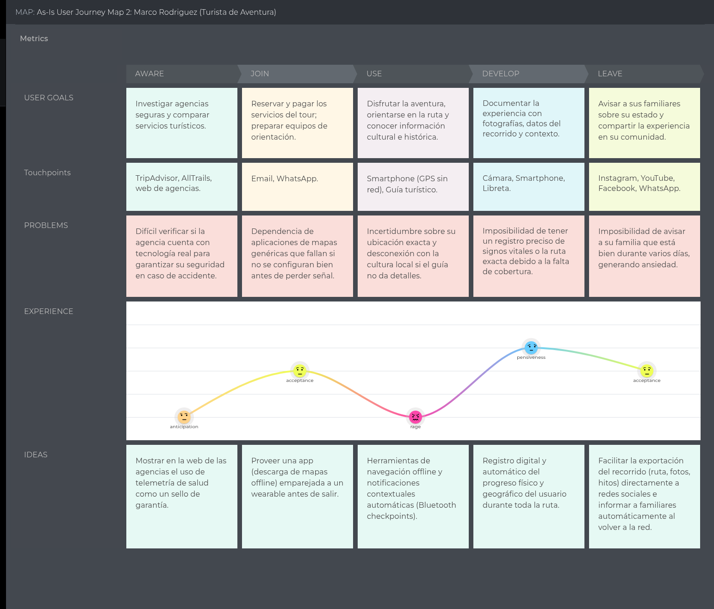

### 2.3.4. Empathy Mapping

El Empathy Mapping es una herramienta que nos permite profundizar en la experiencia emocional y cognitiva del usuario. A través de categorías como lo que el usuario piensa, siente, dice y hace, se busca comprender su contexto, así como sus principales miedos, frustraciones y motivaciones.

Para Tourmate, elaborar un Empathy Mapping para cada segmento objetivo fue clave para entender no solo cómo las agencias planifican la logística y cómo los turistas viven la experiencia outdoor, sino también cómo enfrentan la incertidumbre de la desconexión en zonas remotas, los retos de seguridad y la respuesta ante posibles emergencias. Esta comprensión más empática nos permite diseñar un ecosistema tecnológico que responda a sus necesidades reales, brindando tranquilidad y reduciendo los puntos de dolor presentes en la gestión actual de las rutas de aventura.

<b>Empathy Mapping del 1er segmento objetivo – agencias y operadores de turismo</b>
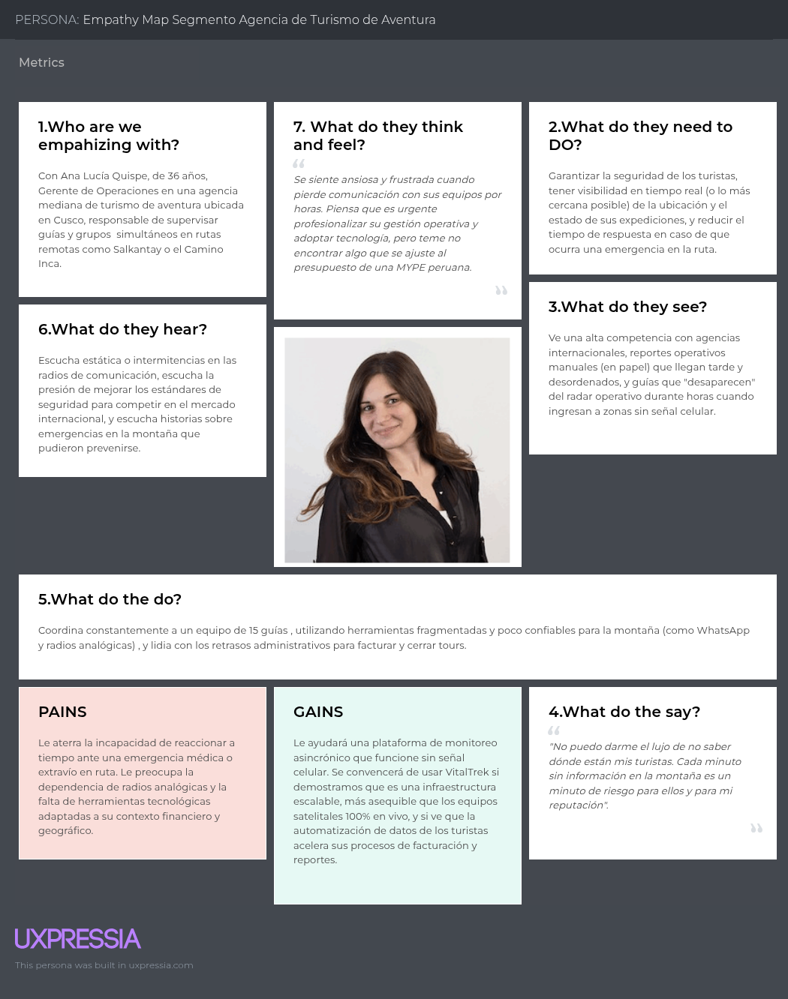

<b>Empathy Mapping del 2do segmento objetivo – turistas de aventura </b>

### 2.3.5. As-is Scenario Mapping.

El As-is Scenario Mapping permite representar cómo los usuarios realizan actualmente sus actividades antes de utilizar Tourmate. Este análisis se construye a partir de las entrevistas, los User Personas, el User Task Matrix, los User Journey Maps y los Empathy Maps. Su objetivo es identificar acciones, pensamientos, emociones y oportunidades de mejora dentro del flujo actual de trabajo de cada segmento.

### As-is Scenario Mapping: Agencia y Operador de Turismo de Aventura

**User Persona:** Ana Lucía Quispe  
**Escenario:** Coordinación y supervisión manual de tours en zonas remotas sin herramientas digitales de monitoreo.

| Etapa | Actividades actuales | Pensamientos del usuario | Emociones | Pain points | Oportunidades para Tourmate |
|-------|----------------------|--------------------------|-----------|-------------|-------------------------------|
| Planificación del tour | Organiza el itinerario, asigna guías y coordina la logística mediante hojas de cálculo y conversaciones directas con su equipo. | "Espero no haber olvidado coordinar algo con los guías." | Concentración y responsabilidad. | La planificación depende de múltiples canales dispersos, sin un sistema único de gestión. | Centralizar la creación y gestión de tours, guías y rutas en un solo panel operativo. |
| Salida del grupo a campo | Envía a los guías con instrucciones verbales o por WhatsApp y radios analógicas, sin visibilidad continua de su ubicación. | "Una vez que salen a la ruta, ya no sé mucho de ellos hasta que regresan o me escriben." | Incertidumbre y confianza forzada. | La ausencia de monitoreo en tiempo real genera una desconexión total durante horas. | Ofrecer un dashboard con ubicación y estado de los grupos en tiempo real, incluso en zonas sin señal continua. |
| Seguimiento durante el recorrido | Espera mensajes intermitentes de los guías cuando logran obtener señal, sin poder anticipar problemas de salud o seguridad. | "Si algo pasa y no tengo señal, no me voy a enterar a tiempo." | Ansiedad y sensación de vulnerabilidad. | La dependencia de la señal celular expone a la agencia a horas de comunicación perdida. | Habilitar sincronización asincrónica y alertas automáticas ante anomalías en signos vitales o ubicación. |
| Reacción ante una emergencia | Recibe la noticia del incidente tarde, muchas veces horas después, y debe improvisar una respuesta sin protocolo definido. | "Necesito saber de inmediato si algo sale mal, no cuando ya sea demasiado tarde." | Urgencia y estrés. | La falta de un botón de emergencia y protocolos claros retrasa la respuesta y pone en riesgo a los turistas. | Implementar alertas críticas con protocolo de respuesta sugerido y contacto inmediato con el guía en campo. |
| Cierre del tour y reportes | Reconstruye manualmente lo ocurrido durante el tour a partir de mensajes, notas y el relato de los guías para generar reportes y facturación. | "Ojalá pueda armar el reporte con la información que tengo, aunque esté incompleta." | Cansancio y falta de respaldo documentado. | La información dispersa dificulta la elaboración de reportes confiables y la trazabilidad del servicio. | Generar reportes operativos y financieros automáticos a partir de los datos registrados durante el tour. |

### As-is Scenario Mapping: Turista de Aventura

**User Persona:** Marco Rodriguez  
**Escenario:** Exploración de rutas remotas dependiendo de aplicaciones sin funcionamiento offline y sin monitoreo de salud.

| Etapa | Actividades actuales | Pensamientos del usuario | Emociones | Pain points | Oportunidades para Tourmate |
|-------|----------------------|--------------------------|-----------|-------------|-------------------------------|
| Investigación previa al viaje | Compara agencias y servicios turísticos en internet y redes sociales antes de reservar su tour de aventura. | "Quiero elegir una agencia que realmente me garantice seguridad en la ruta." | Expectativa y cautela. | La información sobre seguridad y protocolos de las agencias suele ser limitada o poco verificable. | Mostrar de forma transparente las capacidades de monitoreo y seguridad que ofrece la agencia asociada a Tourmate. |
| Inicio del recorrido | Utiliza aplicaciones de mapas convencionales para orientarse y comparte su ubicación con familiares antes de perder señal. | "Espero que la señal aguante un poco más antes de entrar a la zona sin cobertura." | Entusiasmo mezclado con preocupación. | Las aplicaciones dependen de conexión continua, lo que genera vacíos de información apenas se pierde la señal. | Ofrecer navegación y registro de ubicación con funcionamiento offline mediante sincronización asincrónica. |
| Pérdida de señal en zona remota | Continúa el recorrido sin poder confirmar su ubicación exacta ni informar a su familia sobre su estado. | "No sé si mi familia sabe que sigo bien, y yo tampoco puedo confirmarlo." | Incertidumbre y aislamiento. | La imposibilidad de comunicarse durante varios días genera ansiedad tanto en el turista como en sus familiares. | Registrar y sincronizar automáticamente la ubicación y el estado del turista apenas se recupera la conectividad. |
| Actividad física exigente | Realiza la actividad de aventura sin ningún dispositivo que monitoree su estado físico o signos vitales. | "Si algo me pasara aquí, nadie lo sabría hasta que sea muy tarde." | Vulnerabilidad y autoexigencia. | La falta de monitoreo de signos vitales limita la capacidad de reacción ante una emergencia médica. | Capturar signos vitales mediante wearables IoT y generar alertas ante anomalías detectadas durante la actividad. |
| Cierre del recorrido | Documenta su experiencia con fotografías y notas personales, sin registro contextual automático del recorrido realizado. | "Me hubiera gustado tener más información histórica y cultural mientras avanzaba en la ruta." | Satisfacción parcial y nostalgia. | La experiencia carece de información contextual enriquecida y de un registro digital estructurado del recorrido. | Ofrecer información contextual del recorrido y registro automático de experiencia, fotos y ruta completada. |

---

## 2.3.6. To-be Scenario Mapping.

El To-be Scenario Mapping representa cómo los usuarios realizarán sus actividades una vez implementada la plataforma Tourmate, contrastando directamente con el As-is Scenario Mapping presentado anteriormente. Este análisis muestra cómo las funcionalidades del ecosistema (monitoreo en tiempo real, sincronización asincrónica, wearables IoT y alertas automáticas) transforman las etapas identificadas, reduciendo la incertidumbre, el tiempo de reacción y la dependencia de procesos manuales.

### To-be Scenario Mapping: Agencia y Operador de Turismo de Aventura

**User Persona:** Ana Lucía Quispe  
**Escenario:** Coordinación y supervisión de tours en zonas remotas mediante el dashboard en tiempo real de Tourmate.

| Etapa | Actividades con Tourmate | Pensamientos del usuario | Emociones | Mejora respecto al As-is | Valor entregado por Tourmate |
|-------|----------------------------|---------------------------|-----------|---------------------------|-------------------------------|
| Planificación del tour | Crea el tour desde el panel web, define checkpoints, asigna guías y turistas, y publica el itinerario en un solo flujo. | "Todo el tour queda armado y visible para mi equipo desde el primer momento." | Organización y control. | Reemplaza hojas de cálculo y coordinación dispersa por un flujo único de creación de tour. | Centraliza la planificación en el módulo de Tour Management. |
| Salida del grupo a campo | Verifica el estado de los wearables y del grupo antes de iniciar la expedición, con confirmación automática en el sistema. | "Puedo confirmar que todos los dispositivos están activos antes de que salgan a ruta." | Confianza y tranquilidad. | Elimina la incertidumbre de enviar al grupo sin visibilidad; ahora hay una verificación previa registrada. | El flujo de inicio de expedición asegura que el monitoreo esté activo desde el primer checkpoint. |
| Seguimiento durante el recorrido | Supervisa la ubicación y signos vitales de cada turista en el dashboard Live Monitoring, incluso con datos sincronizados de forma asincrónica. | "Aunque no haya señal continua, sé que la información llegará apenas se recupere la conexión." | Seguridad y control continuo. | Sustituye la espera pasiva de mensajes por un panel activo con datos estructurados por participante. | La sincronización asincrónica y el dashboard matricial permiten monitoreo sin depender de señal constante. |
| Reacción ante una emergencia | Recibe una alerta automática generada por anomalías en signos vitales o ubicación, y responde siguiendo el protocolo sugerido por el sistema. | "En cuanto algo se sale de lo normal, el sistema me avisa antes de que se convierta en una emergencia mayor." | Rapidez y seguridad operativa. | Reduce el tiempo de reacción de horas a minutos, reemplazando la espera de un mensaje de auxilio. | Las alertas automáticas y el módulo de Incidents agilizan la respuesta y dejan registro trazable del evento. |
| Cierre del tour y reportes | Genera automáticamente el reporte operativo del tour a partir de los datos registrados durante la expedición. | "El reporte ya está armado con toda la información real del recorrido." | Satisfacción y respaldo documentado. | Elimina la reconstrucción manual de lo ocurrido a partir de mensajes y notas sueltas. | Los reportes post-tour se generan a partir de la telemetría y los checkpoints registrados en el sistema. |

### To-be Scenario Mapping: Turista de Aventura

**User Persona:** Marco Rodriguez  
**Escenario:** Exploración de rutas remotas utilizando la aplicación móvil de Tourmate con navegación offline y monitoreo de salud.

| Etapa | Actividades con Tourmate | Pensamientos del usuario | Emociones | Mejora respecto al As-is | Valor entregado por Tourmate |
|-------|----------------------------|---------------------------|-----------|---------------------------|-------------------------------|
| Investigación previa al viaje | Revisa el perfil de la agencia y confirma que utiliza Tourmate para monitoreo y seguridad antes de reservar. | "Esta agencia sí muestra cómo cuidan a sus turistas en ruta." | Confianza y expectativa positiva. | Sustituye la incertidumbre sobre la seguridad de la agencia por información verificable. | La integración con Tourmate se convierte en un diferenciador visible para el turista al elegir agencia. |
| Inicio del recorrido | Descarga el mapa y la ruta desde la app antes de salir, y su wearable comienza a sincronizarse con el sistema. | "Ya tengo todo descargado, no dependo de que haya señal." | Preparación y tranquilidad. | Reemplaza la dependencia de aplicaciones de mapas online por navegación 100% offline. | El módulo de Navigation & Exploration permite descargar rutas y operar sin conexión continua. |
| Pérdida de señal en zona remota | Continúa el recorrido con normalidad; la app sigue registrando ubicación y signos vitales localmente para sincronizarlos después. | "No tengo señal, pero sé que mi información se está guardando y se enviará apenas se pueda." | Calma y confianza en el sistema. | Elimina la ansiedad y el aislamiento comunicativo que antes generaba la pérdida de señal. | La sincronización asincrónica asegura continuidad de datos sin necesidad de conexión constante. |
| Actividad física exigente | Su wearable monitorea continuamente su frecuencia cardíaca y SpO₂, enviando una alerta automática si detecta una anomalía. | "Si algo me pasara, mi guía y la agencia lo sabrían de inmediato." | Seguridad y confianza en su propio cuerpo. | Sustituye la ausencia total de monitoreo por vigilancia constante de signos vitales con alertas activas. | El ecosistema de wearables IoT y las alertas automáticas habilitan una respuesta médica más rápida. |
| Cierre del recorrido | Recibe automáticamente su diario de viaje generado con fotos georreferenciadas, ruta completada y datos de salud del recorrido. | "Tengo un registro completo de mi experiencia sin haber tenido que armarlo yo mismo." | Satisfacción y sensación de logro. | Reemplaza la documentación manual y dispersa por un registro automático y enriquecido de la experiencia. | El módulo de registro automático (auto-generated journal) entrega contexto, fotos y datos de salud sin intervención manual. |

En conjunto, el To-be Scenario Mapping evidencia que Tourmate no elimina la naturaleza riesgosa del turismo de aventura, pero sí transforma la forma en que agencias y turistas se preparan, se comunican y reaccionan ante ella: la incertidumbre pasiva del escenario As-is es reemplazada por visibilidad activa, respuesta automatizada y registro trazable en cada etapa del recorrido.

---

## 2.4. Big Picture Event Storming

En esta sección se presenta el Big Picture Event Storming del proyecto TourMate, elaborado como una visión general del dominio del turismo de aventura (Adventure Tourism) en zonas de baja conectividad. Mediante una sesión colaborativa, el equipo identificó y ordenó los eventos más importantes que ocurren durante un tour, desde la planificación hasta el cierre.

Ahora, aquí se va a explicar a paso a paso como se desarrollo el Big Picture Event Storming:

* Para empezar, antes de poner los Post-its, dividimos todo este Event Storming en Etapas, basandonos en el As-is Scenario Mapping:

* Luego, ubicamos todos los Post-its, que representan los Eventos de Dominio (Domain Events) en sus respectivas etapas:

* Después de esto, creamos la sección de "Problems", donde identificamos todos los problemas que se pueden presentar en las etapas del turismo:

* Finalmente, en la sección de "Opportunities" identificamos todas las oportunidades de mejora:

Mediante este proceso, al identificar las oportunidades de mejora, logramos definir mejor el cómo vamos a desarrollar nuestra plataforma.

---

## 2.5 Ubiquitous Language

### Introducción

El siguiente glosario define los términos clave del dominio de turismo de aventura en zonas de baja conectividad. Su propósito es establecer un lenguaje común entre todos los stakeholders, evitando ambigüedades y facilitando la comunicación dentro del proyecto.

### Glosario

| Term (English)              | Término (Español)                | Definition (Definición)                                                                                                                                  |
| :--------------------------- | :-------------------------------- | :---------------------------------------------------------------------------------------------------------------------------------------------------------------------------------------------------------------------------------------------------------------------------------------------------------------------------------------------------------------------------------------------------------- |
| **Adventure Tour**            | Tour de Aventura                  | Actividad organizada que involucra recorridos en entornos naturales, generalmente con cierto nivel de riesgo y condiciones variables. |
| **Tour Operator**             | Operador de Turismo / Agencia     | Entidad responsable de planificar, organizar y supervisar tours de aventura, asegurando la logística y seguridad del grupo. |
| **Tour Guide**                | Guía de Turismo                   | Persona encargada de liderar al grupo durante el recorrido, brindando orientación, asistencia y apoyo en situaciones de riesgo. |
| **Traveler**                  | Turista / Viajero                 | Persona que participa en el tour de aventura y busca experiencias recreativas en entornos naturales. |
| **Route**                     | Ruta                              | Camino o trayecto definido que los participantes siguen durante el recorrido, el cual puede incluir distintos niveles de dificultad y riesgo. |
| **Remote Area**               | Zona Remota                       | Entorno geográfico con acceso limitado a infraestructura, caracterizado por baja o nula conectividad y dificultad para recibir asistencia inmediata. |
| **Low Connectivity**          | Baja Conectividad                 | Condición en la que la comunicación digital es limitada o inexistente, afectando la transmisión de información en tiempo real. |
| **Checkpoint**                | Punto de Control                  | Ubicación dentro de la ruta donde se registra el paso de los participantes o se valida su progreso durante el recorrido. |
| **Group Tracking**            | Seguimiento de Grupo              | Proceso de supervisar la ubicación y el estado general de los participantes durante el desarrollo del tour. |
| **Health Monitoring**         | Monitoreo de Salud                | Seguimiento de las condiciones físicas del turista durante la actividad, especialmente en entornos exigentes como altura o esfuerzo físico prolongado. |
| **Vital Signs**               | Signos Vitales                    | Indicadores básicos del estado de salud de una persona, como frecuencia cardíaca o nivel de oxígeno, relevantes en contextos de riesgo. |
| **Incident**                  | Incidente                         | Evento inesperado que afecta la seguridad o el bienestar de los participantes durante el recorrido. |
| **Emergency Response**        | Respuesta a Emergencias           | Acciones tomadas para atender un incidente, incluyendo comunicación, asistencia y evacuación si es necesario. |
| **Situational Awareness**     | Conciencia Situacional            | Capacidad de comprender lo que ocurre en el entorno del tour en un momento determinado, incluyendo ubicación, condiciones y riesgos. |
| **Risk Level**                | Nivel de Riesgo                   | Grado de peligro asociado a una ruta o actividad, determinado por factores como terreno, clima y dificultad. |
| **Safety Protocol**           | Protocolo de Seguridad            | Conjunto de medidas y procedimientos establecidos para prevenir y responder a incidentes durante el recorrido. |
| **Offline Navigation**        | Navegación sin Conexión           | Capacidad de orientarse y seguir una ruta sin depender de conexión a internet. |
| **Tour Completion**           | Finalización del Tour             | Momento en el que el grupo completa la ruta y concluye la actividad planificada. |
| **Post-Tour Evaluation**      | Evaluación Post-Tour              | Proceso de revisión de la experiencia, incluyendo desempeño, incidentes y oportunidades de mejora. |
| **Tour Experience**           | Experiencia del Tour              | Percepción general del usuario respecto a la calidad, seguridad y disfrute del recorrido. |

---

# Capítulo III: Requirements Specification

## 3.1. User Stories

La presente sección consolida el conjunto completo de Epics, User Stories, 
Landing Page Stories y Technical Stories que definen los requerimientos 
funcionales del sistema Tourmate. Los requerimientos han sido identificados 
a partir del análisis realizado en los capítulos previos, considerando los 
hallazgos del Needfinding, las características de los segmentos objetivo, el 
resultado del análisis competitivo y las brechas detectadas en las soluciones 
existentes del mercado.

Para garantizar la coherencia del lenguaje a lo largo del documento, se 
establecen dos términos clave del dominio. El término **tour** se refiere a 
la configuración comercial del recorrido tal como es ofrecido por la agencia, 
incluyendo su ruta, checkpoints, información asociada y participantes. El 
término **expedición** se refiere a la instancia activa de un tour, es decir, 
al recorrido en ejecución durante el cual se generan datos de ubicación, 
telemetría e incidentes. Esta distinción se mantiene de forma consistente en 
todas las historias de la presente sección.

El cuadro presentado a continuación incluye historias agrupadas en tres 
categorías. La primera corresponde a las User Stories de la aplicación web y 
móvil, organizadas en Epics funcionales que reflejan los cinco bounded 
contexts del sistema: **Identity & Access**, **Tour Management**, 
**Navigation & Exploration**, **Safety & Monitoring** y **Notification & 
Profile**. Estas historias están redactadas desde la perspectiva de los roles 
definidos en el dominio del problema: turista, administrador de agencia, guía 
de tour y usuario registrado. La segunda categoría corresponde a las Landing 
Page Stories, redactadas desde el rol visitante o subconjuntos por segmento 
objetivo, que recogen los requerimientos del sitio web estático orientado a 
comunicar la propuesta de valor de la plataforma. La tercera categoría 
corresponde a las Technical Stories, redactadas desde el rol developer, que 
documentan los requerimientos técnicos asociados a los endpoints del RESTful 
API que sustentan la operación del sistema.

Cada historia incluye su descripción en formato estándar y un conjunto de 
criterios de aceptación redactados siguiendo la estructura Gherkin 
(Given-When-Then). Los criterios de aceptación se han redactado en tiempo 
presente, tercera persona, sin referencia a detalles de interfaz de usuario, 
garantizando que sean comprobables mediante pruebas funcionales. Las únicas 
excepciones a esta estructura corresponden a reglas de negocio o restricciones 
que no dependen de condiciones específicas, las cuales se declaran de forma 
directa cuando aplican.

| Epic / Story ID | Título | Descripción | Criterios de Aceptación                                                                                                                                                                                                                                                                                                                                                                                                                                                                                                                                                                                                                                                                                                                                                                                                                                                                                                                     | Relacionado con (Epic ID) |
|---|---|---|---------------------------------------------------------------------------------------------------------------------------------------------------------------------------------------------------------------------------------------------------------------------------------------------------------------------------------------------------------------------------------------------------------------------------------------------------------------------------------------------------------------------------------------------------------------------------------------------------------------------------------------------------------------------------------------------------------------------------------------------------------------------------------------------------------------------------------------------------------------------------------------------------------------------------------------------|---|
| **EP01** | **Identidad y Acceso** | Agrupa las funcionalidades relacionadas con el registro, autenticación, verificación, recuperación de credenciales, gestión de sesiones y ciclo de vida de la cuenta de los usuarios de la plataforma. | —                                                                                                                                                                                                                                                                                                                                                                                                                                                                                                                                                                                                                                                                                                                                                                                                                                                                                                                                           | — |
| US01 | Registro de turista | Como turista, quiero registrarme en la plataforma para acceder a los tours y funcionalidades disponibles del sistema. | **Escenario 1: Registro exitoso** Dado que el turista proporciona información válida y completa Cuando envía la solicitud de registro Entonces el sistema crea la cuenta correctamente y retorna confirmación de registro  **Escenario 2: Registro mediante autenticación externa** Dado que el turista opta por registrarse mediante una cuenta de Google válida Cuando autoriza el acceso a sus datos Entonces el sistema crea la cuenta automáticamente con la información obtenida del proveedor externo y autentica al turista  **Escenario 3: Correo ya registrado** Dado que el correo proporcionado ya existe en el sistema Cuando el turista envía la solicitud de registro Entonces el sistema retorna un error indicando que el correo ya se encuentra registrado                                                                                                                         | EP01 |
| US02 | Registro de administrador de agencia | Como administrador de agencia, quiero registrar mi agencia en la plataforma para gestionar tours y monitorear a los turistas asignados. | **Escenario 1: Registro exitoso** Dado que el administrador de agencia proporciona información válida de la empresa Cuando envía la solicitud de registro Entonces el sistema crea la cuenta con el rol correspondiente y retorna confirmación  **Escenario 2: Correo duplicado** Dado que el correo proporcionado ya está asociado a una cuenta existente Cuando el administrador de agencia envía la solicitud de registro Entonces el sistema retorna un error indicando que el correo ya está registrado  **Escenario 3: Datos inválidos** Dado que el administrador de agencia ingresa datos con formato incorrecto Cuando envía la solicitud de registro Entonces el sistema retorna un error indicando los campos con formato inválido                                                                                                                                                        | EP01 |
| US03 | Inicio de sesión | Como usuario registrado, quiero iniciar sesión de forma segura para acceder a las funcionalidades de la plataforma según mi rol. | **Escenario 1: Credenciales válidas** Dado que el usuario registrado proporciona credenciales correctas Cuando envía la solicitud de autenticación Entonces el sistema valida las credenciales y retorna un token de acceso con el rol asociado  **Escenario 2: Credenciales inválidas** Dado que el usuario registrado proporciona credenciales incorrectas Cuando envía la solicitud de autenticación Entonces el sistema retorna un error sin revelar cuál de los campos es incorrecto  **Escenario 3: Cuenta inactiva** Dado que la cuenta del usuario se encuentra deshabilitada Cuando el usuario envía la solicitud de autenticación Entonces el sistema retorna un error indicando que la cuenta no está activa                                                                                                                                                                              | EP01 |
| US04 | Recuperación de contraseña | Como usuario registrado, quiero recuperar mi contraseña para no perder el acceso a mi cuenta en la plataforma. | **Escenario 1: Solicitud exitosa** Dado que el usuario registrado proporciona un correo válido y registrado Cuando envía la solicitud de recuperación Entonces el sistema genera un enlace de recuperación con vigencia limitada y lo envía al correo indicado  **Escenario 2: Enlace expirado** Dado que el enlace de recuperación ha superado su tiempo de validez Cuando el usuario intenta utilizarlo Entonces el sistema retorna un error indicando que el enlace ya no es válido  **Escenario 3: Correo no registrado** Dado que el correo proporcionado no existe en el sistema Cuando el usuario envía la solicitud de recuperación Entonces el sistema retorna un error indicando que el correo no está registrado                                                                                                                                                                          | EP01 |
| US05 | Verificación de correo electrónico | Como turista, quiero verificar mi correo electrónico tras el registro para confirmar la validez de mi cuenta. | **Escenario 1: Verificación exitosa** Dado que el turista recibe el enlace de verificación tras el registro Cuando confirma la verificación mediante el enlace Entonces el sistema activa la cuenta del turista y retorna confirmación  **Escenario 2: Enlace expirado** Dado que el enlace de verificación ha superado su tiempo de validez Cuando el turista intenta utilizarlo Entonces el sistema retorna un error e indica al turista que puede solicitar un nuevo enlace de verificación  **Escenario 3: Reenvío de correo de verificación** Dado que el turista solicita el reenvío del correo de verificación Cuando el sistema procesa la solicitud Entonces el sistema genera un nuevo enlace de verificación y lo envía al correo registrado                                                                                                                                              | EP01 |
| US06 | Cambio de contraseña | Como usuario registrado, quiero cambiar mi contraseña para mantener la seguridad de mi cuenta. | **Escenario 1: Cambio exitoso** Dado que el usuario registrado proporciona la contraseña actual correcta y una nueva contraseña válida Cuando envía la solicitud de cambio Entonces el sistema actualiza la contraseña correctamente e invalida las sesiones activas distintas a la actual  **Escenario 2: Contraseña actual incorrecta** Dado que el usuario registrado proporciona una contraseña actual incorrecta Cuando envía la solicitud de cambio Entonces el sistema retorna un error indicando que la contraseña actual es incorrecta  **Escenario 3: Nueva contraseña no cumple requisitos** Dado que la nueva contraseña no cumple los requisitos de seguridad definidos Cuando el usuario envía la solicitud de cambio Entonces el sistema retorna un error indicando los requisitos no cumplidos                                                                                       | EP01 |
| US07 | Cierre de sesiones activas | Como usuario registrado, quiero cerrar todas mis sesiones activas en otros dispositivos para proteger mi cuenta. | **Escenario 1: Cierre exitoso** Dado que el usuario registrado tiene sesiones activas en otros dispositivos Cuando solicita el cierre de sesiones Entonces el sistema invalida todos los tokens de sesión activos distintos al actual  **Escenario 2: Sin sesiones adicionales** Dado que el usuario registrado no tiene otras sesiones activas Cuando solicita el cierre de sesiones Entonces el sistema retorna una respuesta indicando que no existen sesiones adicionales que cerrar  **Escenario 3: Desactivación de cuenta** Dado que el usuario registrado confirma la desactivación de su cuenta Cuando envía la solicitud de desactivación Entonces el sistema marca la cuenta como inactiva, invalida todas las sesiones activas y retorna confirmación                                                                                                                                    | EP01 |
| US08 | Vincular dispositivo wearable | Como turista, quiero vincular un dispositivo wearable a mi cuenta para que el sistema capture mis signos vitales durante la expedición. | **Escenario 1: Vinculación exitosa** Dado que el turista dispone de un wearable compatible y proporciona el identificador del dispositivo Cuando envía la solicitud de vinculación Entonces el sistema asocia el dispositivo a la cuenta del turista y retorna confirmación  **Escenario 2: Dispositivo ya vinculado** Dado que el identificador del dispositivo ya está asociado a otra cuenta Cuando el turista envía la solicitud de vinculación Entonces el sistema retorna un error indicando que el dispositivo ya está vinculado  **Escenario 3: Desvinculación durante expedición activa** Dado que el dispositivo está transmitiendo datos durante una expedición activa Cuando el turista envía la solicitud de desvinculación Entonces el sistema retorna un error indicando que no es posible desvincular un dispositivo activo durante una expedición                                   | EP01 |
| **EP02** | **Gestión de Tours** | Agrupa las funcionalidades de creación, edición, eliminación, duplicación, asignación y consulta de tours por parte del administrador de agencia, así como la búsqueda, filtrado y confirmación de asistencia por parte del turista. | —                                                                                                                                                                                                                                                                                                                                                                                                                                                                                                                                                                                                                                                                                                                                                                                                                                                                                                                                           | — |
| US09 | Crear tour | Como administrador de agencia, quiero crear un tour para organizar rutas y ponerlas a disposición de los turistas. | **Escenario 1: Creación exitosa** Dado que el administrador de agencia proporciona información válida y completa del tour Cuando envía la solicitud de creación Entonces el sistema registra el tour correctamente y retorna confirmación  **Escenario 2: Campos obligatorios incompletos** Dado que el administrador de agencia omite campos obligatorios Cuando envía la solicitud de creación Entonces el sistema retorna un error indicando los campos requeridos faltantes  **Escenario 3: Datos con formato inválido** Dado que el administrador de agencia ingresa datos con formato incorrecto Cuando envía la solicitud de creación Entonces el sistema retorna un error indicando los campos con formato inválido                                                                                                                                                                          | EP02 |
| US10 | Editar tour | Como administrador de agencia, quiero editar la información de un tour para mantener actualizados los datos del recorrido. | **Escenario 1: Edición exitosa** Dado que el administrador de agencia modifica información válida de un tour existente Cuando envía la solicitud de actualización Entonces el sistema aplica los cambios correctamente y retorna confirmación  **Escenario 2: Datos inválidos** Dado que el administrador de agencia ingresa datos con formato incorrecto Cuando envía la solicitud de actualización Entonces el sistema retorna un error indicando los campos con formato inválido  **Escenario 3: Tour no encontrado** Dado que el administrador de agencia intenta modificar un tour inexistente Cuando envía la solicitud de actualización Entonces el sistema retorna un error indicando que el recurso no existe                                                                                                                                                                               | EP02 |
| US11 | Eliminar tour | Como administrador de agencia, quiero eliminar un tour para mantener actualizado el catálogo de la agencia. | **Escenario 1: Eliminación exitosa** Dado que el administrador de agencia confirma la eliminación de un tour existente Cuando envía la solicitud de eliminación Entonces el sistema elimina el tour de forma permanente y retorna confirmación  **Escenario 2: Tour con expedición en curso** Dado que el administrador de agencia intenta eliminar un tour cuya expedición se encuentra activa Cuando envía la solicitud de eliminación Entonces el sistema retorna un error indicando que no es posible eliminar un tour con expedición activa  **Escenario 3: Tour no encontrado** Dado que el administrador de agencia intenta eliminar un tour inexistente Cuando envía la solicitud de eliminación Entonces el sistema retorna un error indicando que el recurso no existe                                                                                                                     | EP02 |
| US12 | Duplicar tour | Como administrador de agencia, quiero duplicar un tour existente para crear uno nuevo basado en una configuración previamente validada. | **Escenario 1: Duplicación exitosa** Dado que el administrador de agencia selecciona un tour existente Cuando envía la solicitud de duplicación Entonces el sistema crea una copia del tour con estado borrador y retorna confirmación  **Escenario 2: Tour origen no disponible** Dado que el administrador de agencia intenta duplicar un tour eliminado o inaccesible Cuando envía la solicitud de duplicación Entonces el sistema retorna un error indicando que el tour origen no existe  **Escenario 3: Error durante la duplicación** Dado que ocurre un fallo interno al procesar la duplicación Cuando el administrador de agencia envía la solicitud Entonces el sistema retorna un error indicando que la operación no pudo completarse                                                                                                                                                   | EP02 |
| US13 | Asignar turistas a un tour | Como administrador de agencia, quiero asignar turistas a un tour para conformar el grupo de participantes del recorrido. | **Escenario 1: Asignación exitosa** Dado que el administrador de agencia selecciona turistas registrados para un tour disponible Cuando envía la solicitud de asignación Entonces el sistema registra la asignación correctamente y retorna confirmación  **Escenario 2: Turista ya asignado** Dado que el turista seleccionado ya pertenece al tour Cuando el administrador de agencia envía la solicitud de asignación Entonces el sistema retorna un error indicando que el turista ya está asignado  **Escenario 3: Tour cerrado o cancelado** Dado que el tour se encuentra cerrado o cancelado Cuando el administrador de agencia intenta asignar turistas Entonces el sistema retorna un error indicando que el tour no acepta nuevas asignaciones                                                                                                                                            | EP02 |
| US14 | Desasignar turista de un tour | Como administrador de agencia, quiero desasignar a un turista de un tour para actualizar la composición del grupo. | **Escenario 1: Desasignación exitosa** Dado que el administrador de agencia selecciona un turista asignado a un tour Cuando envía la solicitud de desasignación Entonces el sistema retira al turista del tour y retorna confirmación  **Escenario 2: Expedición ya iniciada** Dado que el administrador de agencia intenta desasignar a un turista de un tour cuya expedición se encuentra en curso Cuando envía la solicitud de desasignación Entonces el sistema requiere confirmación adicional antes de procesar la solicitud  **Escenario 3: Turista no asignado al tour** Dado que el turista seleccionado no pertenece al tour indicado Cuando el administrador de agencia envía la solicitud de desasignación Entonces el sistema retorna un error indicando que el turista no está asignado a ese tour                                                                                     | EP02 |
| US15 | Confirmar asistencia | Como turista, quiero confirmar mi asistencia a un tour para asegurar mi participación en el recorrido. | **Escenario 1: Confirmación exitosa** Dado que el turista está asignado a un tour disponible Cuando envía la solicitud de confirmación de asistencia Entonces el sistema actualiza el estado de participación correctamente  **Escenario 2: Cancelación de participación** Dado que el turista ha confirmado previamente su asistencia Cuando envía la solicitud de cancelación Entonces el sistema actualiza el estado de participación y notifica al administrador de agencia  **Escenario 3: Expedición ya iniciada** Dado que la expedición del tour al que pertenece el turista ya ha comenzado Cuando el turista envía la solicitud de cancelación Entonces el sistema retorna un error indicando que no es posible modificar la participación                                                                                                                                                 | EP02 |
| US16 | Buscar y filtrar tours | Como turista, quiero buscar y filtrar los tours disponibles para encontrar opciones acordes a mis intereses y preferencias. | **Escenario 1: Búsqueda con resultados** Dado que el turista proporciona un término de búsqueda válido Cuando el sistema procesa la consulta Entonces el sistema retorna los tours cuya información coincide con el término ingresado  **Escenario 2: Filtro con resultados** Dado que el turista aplica criterios de filtrado válidos Cuando el sistema procesa la consulta Entonces el sistema retorna los tours que cumplen los criterios indicados  **Escenario 3: Búsqueda sin coincidencias** Dado que el término o criterios proporcionados no coinciden con ningún tour disponible Cuando el sistema procesa la consulta Entonces el sistema retorna una respuesta vacía indicando que no hay coincidencias                                                                                                                                                                                  | EP02 |
| US17 | Consultar detalle del tour | Como turista, quiero acceder a la información completa de un tour para tomar una decisión informada antes de participar. | **Escenario 1: Consulta exitosa** Dado que el tour solicitado existe en el sistema Cuando el turista solicita el detalle Entonces el sistema retorna la información completa del recorrido incluyendo ruta, checkpoints y dificultad  **Escenario 2: Tour no encontrado** Dado que el tour solicitado no existe en el sistema Cuando el turista solicita el detalle Entonces el sistema retorna un error indicando que el recurso no existe  **Escenario 3: Consulta de turistas asignados** Dado que el administrador de agencia solicita la lista de turistas de un tour existente Cuando el sistema procesa la solicitud Entonces el sistema retorna los datos relevantes de cada turista asignado junto con su estado de confirmación                                                                                                                                                            | EP02 |
| US18 | Consultar tours de la agencia | Como administrador de agencia, quiero consultar todos los tours registrados por mi agencia para gestionarlos de forma centralizada. | **Escenario 1: Consulta con resultados** Dado que la agencia tiene tours registrados en el sistema Cuando el administrador de agencia solicita la consulta Entonces el sistema retorna el listado completo de tours con su estado actual  **Escenario 2: Filtro por estado** Dado que el administrador de agencia aplica un filtro por estado del tour Cuando el sistema procesa la consulta Entonces el sistema retorna únicamente los tours que coinciden con el estado indicado  **Escenario 3: Sin tours registrados** Dado que la agencia no tiene tours registrados Cuando el administrador de agencia solicita la consulta Entonces el sistema retorna una respuesta vacía indicando la ausencia de tours                                                                                                                                                                                     | EP02 |
| **EP03** | **Navegación y Exploración** | Agrupa las funcionalidades relacionadas con la ejecución de expediciones, navegación de ruta, visualización de checkpoints, progreso del recorrido, registro de experiencias, consulta de clima y operación en campo por parte del guía de tour. | —                                                                                                                                                                                                                                                                                                                                                                                                                                                                                                                                                                                                                                                                                                                                                                                                                                                                                                                                           | — |
| US19 | Iniciar expedición | Como guía de tour, quiero marcar el inicio de la expedición para activar el monitoreo y registro del recorrido. | **Escenario 1: Inicio exitoso** Dado que el guía de tour está asignado a un tour pendiente de iniciar Cuando envía la solicitud de inicio Entonces el sistema activa la expedición y retorna confirmación  **Escenario 2: Expedición ya iniciada** Dado que la expedición del tour seleccionado ya se encuentra activa Cuando el guía de tour envía la solicitud de inicio Entonces el sistema retorna un error indicando que la expedición ya se encuentra en curso  **Escenario 3: Guía no asignado al tour** Dado que el guía de tour no está asignado al tour que intenta iniciar Cuando envía la solicitud de inicio Entonces el sistema retorna un error indicando que no tiene permisos para iniciar esa expedición                                                                                                                                                                           | EP03 |
| US20 | Visualizar ruta del tour | Como turista, quiero acceder a la ruta del tour para orientarme durante el recorrido. | **Escenario 1: Acceso con conexión** Dado que el turista tiene una expedición activa asignada y conexión disponible Cuando solicita la información de la ruta Entonces el sistema retorna los datos completos del recorrido  **Escenario 2: Acceso sin conexión** Dado que el turista descargó previamente la ruta y no tiene conexión Cuando solicita la información de la ruta Entonces el sistema retorna los datos desde el almacenamiento local  **Escenario 3: Ruta no disponible** Dado que el turista no tiene una expedición activa y no ha descargado ninguna ruta Cuando solicita la información Entonces el sistema retorna un error indicando que no hay rutas disponibles                                                                                                                                                                                                              | EP03 |
| US21 | Descargar ruta offline | Como turista, quiero descargar la información de la ruta de un tour para utilizarla sin conexión durante el recorrido. | **Escenario 1: Descarga exitosa** Dado que el turista solicita la descarga de una ruta disponible Cuando el sistema procesa la solicitud Entonces el sistema almacena la información localmente y retorna confirmación  **Escenario 2: Acceso posterior sin conexión** Dado que el turista descargó previamente la información y no tiene conexión Cuando solicita acceso a la ruta Entonces el sistema retorna la información desde el almacenamiento local sin requerir conexión  **Escenario 3: Ruta no disponible para descarga** Dado que el turista intenta descargar una ruta que no existe en el sistema Cuando el sistema procesa la solicitud Entonces el sistema retorna un error indicando que la ruta no está disponible                                                                                                                                                                | EP03 |
| US22 | Visualizar checkpoints del recorrido | Como turista, quiero conocer los checkpoints del tour para identificar mi progreso durante el recorrido. | **Escenario 1: Consulta de checkpoints** Dado que el turista tiene una expedición activa Cuando solicita la información de checkpoints Entonces el sistema retorna los checkpoints diferenciando los completados de los pendientes  **Escenario 2: Checkpoint detectado automáticamente** Dado que el turista se aproxima a un checkpoint registrado Cuando el sistema procesa la proximidad Entonces el sistema marca el checkpoint como completado y actualiza el progreso del turista  **Escenario 3: Sin expedición activa** Dado que el turista no tiene una expedición activa Cuando solicita la información de checkpoints Entonces el sistema retorna un error indicando que no existe una expedición activa asociada                                                                                                                                                                        | EP03 |
| US23 | Visualizar progreso del recorrido | Como turista, quiero consultar mi avance en el tour para conocer cuánto resta por completar. | **Escenario 1: Consulta de progreso** Dado que el turista tiene una expedición activa Cuando solicita la información de progreso Entonces el sistema retorna el porcentaje completado y los checkpoints restantes  **Escenario 2: Actualización automática** Dado que el turista completa un tramo o checkpoint del recorrido Cuando el sistema procesa el evento Entonces el sistema actualiza el porcentaje de avance del turista  **Escenario 3: Recorrido completado** Dado que el turista ha completado todos los checkpoints de la expedición Cuando el sistema procesa el último evento de progreso Entonces el sistema retorna un porcentaje de avance del cien por ciento y notifica la finalización del recorrido                                                                                                                                                                          | EP03 |
| US24 | Registrar checkpoint manual | Como guía de tour, quiero registrar manualmente el paso del grupo por un checkpoint para garantizar la trazabilidad cuando la detección automática no es posible. | **Escenario 1: Registro exitoso** Dado que el guía de tour confirma el paso del grupo por un checkpoint válido Cuando envía la solicitud de registro Entonces el sistema marca el checkpoint como completado para el grupo y retorna confirmación  **Escenario 2: Checkpoint ya registrado** Dado que el checkpoint seleccionado ya está marcado como completado Cuando el guía de tour envía la solicitud de registro Entonces el sistema retorna un error indicando que el checkpoint ya fue registrado  **Escenario 3: Checkpoint no pertenece a la expedición activa** Dado que el checkpoint seleccionado no pertenece a la expedición que el guía tiene activa Cuando envía la solicitud de registro Entonces el sistema retorna un error indicando que el checkpoint no corresponde a la expedición en curso                                                                                  | EP03 |
| US25 | Registrar experiencia del recorrido | Como turista, quiero registrar notas durante el tour para documentar mi experiencia. | **Escenario 1: Registro exitoso** Dado que el turista proporciona contenido válido durante una expedición activa Cuando envía la solicitud de registro Entonces el sistema almacena la información asociada al tour y al punto del recorrido  **Escenario 2: Consulta del historial** Dado que el turista solicita el historial de experiencias registradas Cuando el sistema procesa la solicitud Entonces el sistema retorna las experiencias asociadas a los tours del turista  **Escenario 3: Sin expedición activa** Dado que el turista intenta registrar una experiencia sin tener una expedición activa Cuando envía la solicitud de registro Entonces el sistema retorna un error indicando que no es posible registrar experiencias fuera de una expedición activa                                                                                                                         | EP03 |
| US26 | Consultar clima del recorrido | Como turista, quiero consultar la información climática del recorrido para prepararme con el equipamiento adecuado. | **Escenario 1: Consulta con conexión** Dado que el turista solicita información climática con conexión activa Cuando el sistema consulta el servicio externo de clima Entonces el sistema retorna información actualizada para la zona del recorrido  **Escenario 2: Consulta sin conexión** Dado que el turista solicita información climática sin conexión Cuando el sistema procesa la solicitud Entonces el sistema retorna la última información climática almacenada localmente  **Escenario 3: Servicio externo no disponible** Dado que el servicio externo de clima no responde Cuando el sistema intenta obtener la información Entonces el sistema retorna un error indicando que el servicio no está disponible temporalmente                                                                                                                                                            | EP03 |
| US27 | Sincronización asincrónica de datos offline | Como turista, quiero que los datos capturados durante la expedición se sincronicen automáticamente al recuperar la conexión para no perder ningún registro generado. | **Escenario 1: Sincronización exitosa** Dado que el dispositivo del turista tiene datos almacenados localmente y recupera la conexión Cuando el sistema procesa la sincronización Entonces el sistema transmite los datos al servidor y retorna confirmación  **Escenario 2: Datos duplicados** Dado que algunos registros ya fueron sincronizados previamente Cuando el sistema procesa la sincronización Entonces el sistema descarta los duplicados y procesa únicamente los registros nuevos  **Escenario 3: Error durante la sincronización** Dado que ocurre un fallo durante la transmisión de datos Cuando el sistema procesa la sincronización Entonces el sistema conserva los datos localmente y agenda un nuevo intento de transmisión                                                                                                                                                   | EP03 |
| US28 | Finalizar expedición | Como guía de tour, quiero marcar la finalización de la expedición para cerrar formalmente el monitoreo del recorrido. | **Escenario 1: Finalización exitosa** Dado que el guía de tour está asignado a una expedición activa Cuando envía la solicitud de finalización Entonces el sistema cierra la expedición y retorna confirmación  **Escenario 2: Expedición ya finalizada** Dado que la expedición seleccionada ya se encuentra cerrada Cuando el guía de tour envía la solicitud de finalización Entonces el sistema retorna un error indicando que la expedición ya fue finalizada  **Escenario 3: Finalización con progreso parcial** Dado que el turista no completó todos los checkpoints de la expedición Cuando el guía envía la solicitud de finalización Entonces el sistema registra la expedición con el progreso alcanzado y la agrega al historial como completada parcialmente                                                                                                                           | EP03 |
| **EP04** | **Seguridad y Monitoreo** | Agrupa las funcionalidades de monitoreo de ubicación, estado de salud, telemetría IoT, detección de anomalías, gestión de alertas y reporte de incidentes durante las expediciones. | —                                                                                                                                                                                                                                                                                                                                                                                                                                                                                                                                                                                                                                                                                                                                                                                                                                                                                                                                           | — |
| US29 | Monitorear ubicación de turistas | Como administrador de agencia, quiero consultar la ubicación de los turistas para supervisar su seguridad durante la expedición. | **Escenario 1: Ubicaciones disponibles** Dado que existen registros de ubicación activos para los turistas de una expedición Cuando el administrador de agencia solicita el estado de ubicación Entonces el sistema retorna las coordenadas actuales de cada turista  **Escenario 2: Turista sin señal** Dado que un turista ha dejado de transmitir datos de ubicación Cuando el administrador de agencia solicita el estado Entonces el sistema retorna la última ubicación registrada junto con la marca de tiempo  **Escenario 3: Expedición sin datos activos** Dado que no existen registros de ubicación para la expedición consultada Cuando el administrador de agencia solicita el estado Entonces el sistema retorna una respuesta vacía indicando que no hay datos disponibles                                                                                                           | EP04 |
| US30 | Consultar estado general del grupo | Como administrador de agencia, quiero consultar el estado general de los turistas para detectar situaciones de riesgo durante la expedición. | **Escenario 1: Estado consolidado disponible** Dado que existen datos activos de los participantes de una expedición Cuando el administrador de agencia solicita el estado general Entonces el sistema retorna información consolidada del estado de cada participante  **Escenario 2: Anomalía detectada** Dado que el sistema identifica una condición fuera del rango establecido Cuando procesa los datos del grupo Entonces el sistema genera una notificación de alerta al administrador de agencia responsable  **Escenario 3: Sin datos activos** Dado que la expedición no tiene participantes con datos activos Cuando el administrador de agencia solicita el estado general Entonces el sistema retorna una respuesta indicando que no existen datos disponibles                                                                                                                         | EP04 |
| US31 | Recibir alertas por anomalías | Como administrador de agencia, quiero recibir alertas ante situaciones de riesgo para responder oportunamente durante las expediciones. | **Escenario 1: Desvío de ruta detectado** Dado que un turista se encuentra fuera del área definida para el recorrido Cuando el sistema procesa los datos de ubicación Entonces el sistema genera una alerta y la notifica al administrador de agencia responsable  **Escenario 2: Pérdida de comunicación** Dado que un turista deja de transmitir datos durante un periodo superior al umbral configurado Cuando el sistema detecta la interrupción Entonces el sistema genera una alerta de pérdida de conexión y la notifica al administrador de agencia  **Escenario 3: Signos vitales fuera de rango** Dado que los datos biométricos de un turista superan los umbrales críticos configurados Cuando el sistema procesa los datos Entonces el sistema genera una alerta preventiva de salud y la notifica al administrador de agencia                                                          | EP04 |
| US32 | Consultar estado de salud básico | Como guía de tour, quiero consultar alertas básicas del estado de salud de los turistas para actuar oportunamente ante posibles emergencias. | **Escenario 1: Datos biométricos disponibles** Dado que existen datos biométricos activos para los turistas de una expedición Cuando el guía de tour solicita el estado de salud Entonces el sistema retorna el estado de salud básico de cada turista  **Escenario 2: Valores críticos detectados** Dado que el sistema identifica valores biométricos fuera del rango normal Cuando procesa los datos del turista Entonces el sistema genera una alerta preventiva y la notifica al guía de tour responsable  **Escenario 3: Sin datos biométricos disponibles** Dado que el dispositivo del turista no transmite datos biométricos Cuando el guía de tour solicita el estado de salud Entonces el sistema retorna el último estado registrado junto con la marca de tiempo                                                                                                                        | EP04 |
| US33 | Reportar incidente | Como turista, quiero reportar incidentes para alertar oportunamente al personal responsable durante la expedición. | **Escenario 1: Reporte con conexión** Dado que el turista genera un reporte con información válida y tiene conexión activa Cuando envía el reporte Entonces el sistema registra el incidente y notifica al administrador de agencia responsable  **Escenario 2: Reporte sin conexión** Dado que el dispositivo del turista no tiene conexión a internet Cuando el turista envía el reporte Entonces el sistema almacena el incidente localmente y lo sincroniza cuando se recupera la conexión  **Escenario 3: Información incompleta** Dado que el turista envía un reporte con campos obligatorios faltantes Cuando el sistema procesa la solicitud Entonces el sistema retorna un error indicando los campos requeridos                                                                                                                                                                           | EP04 |
| US34 | Reportar incidente desde el rol guía | Como guía de tour, quiero reportar incidentes detectados en campo para informar oportunamente al administrador de agencia. | **Escenario 1: Reporte exitoso con conexión** Dado que el guía de tour proporciona información válida del incidente y tiene conexión Cuando envía el reporte Entonces el sistema registra el incidente y notifica al administrador de agencia responsable  **Escenario 2: Reporte sin conexión** Dado que el dispositivo del guía de tour no tiene conexión Cuando envía el reporte Entonces el sistema almacena el incidente localmente y lo sincroniza al recuperar la conexión  **Escenario 3: Resolución de incidente** Dado que el administrador de agencia recibe un incidente reportado Cuando registra la resolución con una nota válida Entonces el sistema actualiza el estado del incidente a resuelto y retorna confirmación                                                                                                                                                             | EP04 |
| US35 | Recibir datos biométricos del wearable | Como turista, quiero que el sistema reciba los datos biométricos capturados por mi wearable para que sean utilizados en el monitoreo de mi salud durante la expedición. | **Escenario 1: Recepción exitosa** Dado que el wearable transmite datos biométricos válidos durante una expedición activa Cuando el sistema procesa la transmisión Entonces el sistema registra los datos asociados al turista y a la expedición correspondiente  **Escenario 2: Datos con formato inválido** Dado que el wearable transmite datos con formato incorrecto Cuando el sistema procesa la transmisión Entonces el sistema descarta los datos y registra un evento de error  **Escenario 3: Sin expedición activa** Dado que el turista no tiene una expedición activa en el momento de la transmisión Cuando el sistema recibe los datos Entonces el sistema descarta los datos y registra un evento informativo indicando que no había una expedición activa                                                                                                                           | EP04 |
| US36 | Consultar estado del wearable | Como turista, quiero consultar el estado de mi wearable para verificar su nivel de batería y conectividad antes de iniciar el recorrido. | **Escenario 1: Estado disponible** Dado que el wearable está vinculado y activo Cuando el turista solicita el estado del dispositivo Entonces el sistema retorna información sobre nivel de batería, conectividad y última sincronización  **Escenario 2: Dispositivo desconectado** Dado que el wearable no está transmitiendo datos Cuando el turista solicita el estado del dispositivo Entonces el sistema retorna el último estado registrado junto con la marca de tiempo  **Escenario 3: Dispositivo no vinculado** Dado que el turista no tiene ningún wearable vinculado a su cuenta Cuando solicita el estado del dispositivo Entonces el sistema retorna un error indicando que no existe un dispositivo asociado a la cuenta                                                                                                                                                             | EP04 |
| US37 | Exportar reportes de expedición | Como administrador de agencia, quiero exportar reportes de las expediciones para analizar la información operativa. | **Escenario 1: Exportación exitosa** Dado que existen datos disponibles para la expedición solicitada Cuando el administrador de agencia solicita la exportación Entonces el sistema genera correctamente el archivo con la información de la expedición  **Escenario 2: Sin datos disponibles** Dado que no existen datos registrados para la expedición solicitada Cuando el administrador de agencia solicita la exportación Entonces el sistema retorna un error indicando que no hay información disponible para exportar  **Escenario 3: Formato de exportación inválido** Dado que el administrador de agencia solicita un formato de exportación no soportado Cuando el sistema procesa la solicitud Entonces el sistema retorna un error indicando los formatos disponibles                                                                                                                 | EP04 |
| **EP05** | **Notificaciones y Perfil** | Agrupa las funcionalidades relacionadas con la administración del perfil personal del usuario, la configuración de preferencias de notificaciones y la recepción de notificaciones relevantes sobre eventos del sistema. | —                                                                                                                                                                                                                                                                                                                                                                                                                                                                                                                                                                                                                                                                                                                                                                                                                                                                                                                                           | — |
| US38 | Gestionar perfil personal | Como usuario registrado, quiero gestionar mi información personal para mantener actualizados los datos asociados a mi cuenta. | **Escenario 1: Actualización exitosa** Dado que el usuario proporciona información válida Cuando envía la solicitud de actualización Entonces el sistema aplica los cambios correctamente y retorna confirmación  **Escenario 2: Datos inválidos** Dado que el usuario ingresa información con formato incorrecto Cuando envía la solicitud de actualización Entonces el sistema retorna un error indicando los campos con formato inválido  **Escenario 3: Campos obligatorios vacíos** Dado que el usuario omite campos obligatorios Cuando envía la solicitud de actualización Entonces el sistema retorna un error indicando los campos requeridos faltantes                                                                                                                                                                                                                                     | EP05 |
| US39 | Actualizar foto de perfil | Como usuario registrado, quiero actualizar mi foto de perfil para personalizar mi cuenta en la plataforma. | **Escenario 1: Actualización exitosa** Dado que el usuario proporciona un archivo de imagen con formato y tamaño válidos Cuando envía la solicitud de actualización Entonces el sistema almacena la imagen y la asocia al perfil del usuario  **Escenario 2: Formato de archivo inválido** Dado que el usuario proporciona un archivo con extensión no soportada Cuando envía la solicitud de actualización Entonces el sistema retorna un error indicando los formatos de imagen aceptados  **Escenario 3: Tamaño de archivo excedido** Dado que el archivo proporcionado supera el tamaño máximo permitido Cuando el sistema procesa la solicitud Entonces el sistema retorna un error indicando el límite de tamaño permitido                                                                                                                                                                     | EP05 |
| US40 | Configurar preferencias de notificaciones | Como usuario registrado, quiero configurar las preferencias de notificaciones para recibir únicamente las que considero relevantes. | **Escenario 1: Configuración exitosa** Dado que el usuario proporciona preferencias válidas Cuando envía la solicitud de configuración Entonces el sistema aplica las preferencias y retorna confirmación  **Escenario 2: Restaurar preferencias por defecto** Dado que el usuario solicita restablecer las preferencias a los valores predeterminados Cuando el sistema procesa la solicitud Entonces el sistema aplica la configuración por defecto y retorna confirmación  **Escenario 3: Configuración inválida** Dado que el usuario proporciona preferencias con formato incorrecto Cuando envía la solicitud de configuración Entonces el sistema retorna un error indicando los parámetros inválidos                                                                                                                                                                                         | EP05 |
| US41 | Recibir notificaciones de seguridad | Como usuario registrado, quiero recibir notificaciones de alerta de seguridad para mantenerme informado sobre eventos críticos relacionados con mi expedición. | **Escenario 1: Notificación generada por alerta** Dado que el sistema detecta una condición crítica asociada a la expedición del usuario Cuando procesa el evento de seguridad Entonces el sistema genera y envía la notificación al usuario correspondiente a través del canal configurado  **Escenario 2: Notificaciones de seguridad deshabilitadas** Dado que el usuario tiene deshabilitadas las notificaciones de alerta en su configuración Cuando ocurre un evento de seguridad que generaría una notificación Entonces el sistema no envía la notificación y registra el evento internamente  **Escenario 3: Canal de notificación no disponible** Dado que el canal de notificación configurado no está disponible en el momento del evento Cuando el sistema intenta enviar la notificación Entonces el sistema reintenta el envío por un canal alternativo y registra el intento fallido | EP05 |
| US42 | Recibir notificaciones de tour | Como turista, quiero recibir notificaciones sobre actualizaciones de mi tour para mantenerme informado sobre cambios en mi participación. | **Escenario 1: Notificación de asignación** Dado que el turista es asignado a un tour por el administrador de agencia Cuando el sistema procesa la asignación Entonces el sistema envía una notificación al turista informando sobre su nueva asignación  **Escenario 2: Notificación de inicio de expedición** Dado que la expedición a la que pertenece el turista es iniciada por el guía Cuando el sistema registra el inicio Entonces el sistema envía una notificación al turista indicando que la expedición ha comenzado  **Escenario 3: Notificación de cancelación** Dado que el tour al que pertenece el turista es cancelado por el administrador de agencia Cuando el sistema registra la cancelación Entonces el sistema envía una notificación al turista informando sobre la cancelación del tour                                                                                    | EP05 |
| US43 | Consultar historial de notificaciones | Como usuario registrado, quiero consultar el historial de notificaciones recibidas para revisar eventos pasados relacionados con mi cuenta. | **Escenario 1: Consulta con resultados** Dado que el usuario tiene notificaciones registradas en el sistema Cuando solicita el historial de notificaciones Entonces el sistema retorna el listado de notificaciones ordenadas cronológicamente  **Escenario 2: Marcar notificación como leída** Dado que el usuario selecciona una notificación no leída Cuando envía la solicitud de marcado Entonces el sistema actualiza el estado de la notificación a leída y retorna confirmación  **Escenario 3: Sin notificaciones registradas** Dado que el usuario no tiene notificaciones en el sistema Cuando solicita el historial Entonces el sistema retorna una respuesta vacía indicando la ausencia de notificaciones                                                                                                                                                                              | EP05 |
| **EP06** | **Landing Page** | Agrupa las funcionalidades del sitio web estático que comunica la propuesta de valor de TourMate a los visitantes de cada segmento objetivo, permitiendo conocer las funcionalidades, beneficios y acceder al registro de la plataforma. | —                                                                                                                                                                                                                                                                                                                                                                                                                                                                                                                                                                                                                                                                                                                                                                                                                                                                                                                                           | — |
| US-LP01 | Conocer la propuesta de valor | Como visitante, quiero conocer la propuesta de valor de Tourmate para evaluar si la plataforma se ajusta a mis necesidades. | **Escenario 1: Contenido principal disponible** Dado que el visitante accede a la landing page Cuando el sistema entrega el contenido principal Entonces el sistema retorna la información que comunica el propósito y el beneficio central de la plataforma  **Escenario 2: Acceso desde dispositivo móvil** Dado que el visitante accede a la landing page desde un dispositivo móvil Cuando el sistema procesa la solicitud Entonces el sistema entrega el contenido adaptado al tamaño del dispositivo  **Escenario 3: Contenido no disponible** Dado que ocurre un fallo al entregar el contenido principal Cuando el visitante accede a la landing page Entonces el sistema retorna un mensaje indicando que el contenido no está disponible temporalmente                                                                                                                                     | EP06 |
| US-LP02 | Navegar entre secciones | Como visitante, quiero acceder a las distintas secciones de la landing page para conocer las funcionalidades del sistema. | **Escenario 1: Navegación exitosa** Dado que el visitante accede a la landing page Cuando solicita acceder a una sección específica Entonces el sistema redirige al contenido correspondiente a la sección seleccionada  **Escenario 2: Acceso desde dispositivo móvil** Dado que el visitante accede desde un dispositivo móvil Cuando solicita acceder a una sección Entonces el sistema entrega el contenido adaptado al tamaño del dispositivo  **Escenario 3: Sección no disponible** Dado que el visitante solicita una sección que no se encuentra disponible Cuando el sistema procesa la solicitud Entonces el sistema retorna un mensaje indicando que la sección no está disponible temporalmente                                                                                                                                                                                         | EP06 |
| US-LP03 | Conocer beneficios para turistas | Como visitante del segmento turista, quiero conocer los beneficios específicos de la plataforma para comprender cómo mejora mi experiencia durante las expediciones. | **Escenario 1: Acceso al contenido del segmento turista** Dado que el visitante del segmento turista solicita el contenido dirigido a su segmento Cuando el sistema procesa la solicitud Entonces el sistema retorna información sobre las funcionalidades de seguridad y navegación offline orientadas al turista  **Escenario 2: Acceso al registro desde el segmento turista** Dado que el visitante del segmento turista solicita iniciar el registro Cuando el sistema procesa la solicitud Entonces el sistema redirige al proceso de registro correspondiente al segmento turista  **Escenario 3: Contenido no disponible** Dado que ocurre un fallo al entregar el contenido del segmento turista Cuando el visitante solicita el contenido Entonces el sistema retorna un mensaje indicando que el contenido no está disponible temporalmente                                               | EP06 |
| US-LP04 | Conocer beneficios para agencias | Como visitante del segmento agencia, quiero conocer los beneficios específicos de la plataforma para comprender cómo mejora la gestión y monitoreo de expediciones. | **Escenario 1: Acceso al contenido del segmento agencia** Dado que el visitante del segmento agencia solicita el contenido dirigido a su segmento Cuando el sistema procesa la solicitud Entonces el sistema retorna información sobre las funcionalidades de monitoreo, alertas y gestión de expediciones  **Escenario 2: Acceso al registro desde el segmento agencia** Dado que el visitante del segmento agencia solicita iniciar el registro Cuando el sistema procesa la solicitud Entonces el sistema redirige al proceso de registro correspondiente al segmento agencia  **Escenario 3: Contenido no disponible** Dado que ocurre un fallo al entregar el contenido del segmento agencia Cuando el visitante solicita el contenido Entonces el sistema retorna un mensaje indicando que el contenido no está disponible temporalmente                                                       | EP06 |
| US-LP05 | Conocer las funcionalidades principales | Como visitante, quiero conocer las funcionalidades principales de la plataforma para entender el funcionamiento general del sistema. | **Escenario 1: Acceso al contenido** Dado que el visitante solicita el contenido de funcionalidades principales Cuando el sistema procesa la solicitud Entonces el sistema retorna información sobre las funcionalidades principales de Tourmate  **Escenario 2: Acceso a funcionalidad offline** Dado que el visitante solicita información sobre la compatibilidad offline de la plataforma Cuando el sistema procesa la solicitud Entonces el sistema retorna información sobre la operatividad sin conexión de forma clara  **Escenario 3: Contenido no disponible** Dado que ocurre un fallo al entregar el contenido de funcionalidades Cuando el visitante solicita la información Entonces el sistema retorna un mensaje indicando que el contenido no está disponible temporalmente                                                                                                         | EP06 |
| US-LP06 | Acceder al registro desde la landing | Como visitante, quiero acceder rápidamente al registro desde la landing page para comenzar a utilizar la plataforma. | **Escenario 1: Redirección al registro de turista** Dado que el visitante del segmento turista solicita iniciar el registro Cuando el sistema procesa la solicitud Entonces el sistema redirige al proceso de registro del segmento turista  **Escenario 2: Redirección al registro de agencia** Dado que el visitante del segmento agencia solicita iniciar el registro Cuando el sistema procesa la solicitud Entonces el sistema redirige al proceso de registro del segmento agencia  **Escenario 3: Servicio de registro no disponible** Dado que el servicio de registro no se encuentra disponible Cuando el visitante solicita iniciar el registro Entonces el sistema retorna un mensaje indicando que el servicio no está disponible temporalmente                                                                                                                                         | EP06 |
| US-LP07 | Conocer testimonios y casos de uso | Como visitante, quiero conocer testimonios y casos de uso reales para tomar una decisión informada sobre la plataforma. | **Escenario 1: Testimonios disponibles** Dado que el visitante solicita el contenido de testimonios Cuando el sistema procesa la solicitud Entonces el sistema retorna los testimonios y casos de uso registrados  **Escenario 2: Sin testimonios disponibles** Dado que no existen testimonios registrados Cuando el visitante solicita el contenido Entonces el sistema retorna un mensaje indicando que no hay testimonios disponibles por el momento  **Escenario 3: Contenido no disponible** Dado que ocurre un fallo al entregar el contenido de testimonios Cuando el visitante solicita la información Entonces el sistema retorna un mensaje indicando que el contenido no está disponible temporalmente                                                                                                                                                                                   | EP06 |
| US-LP08 | Contactar al equipo de Tourmate | Como visitante, quiero contactar al equipo de Tourmate para resolver dudas relacionadas con la plataforma. | **Escenario 1: Mensaje enviado correctamente** Dado que el visitante proporciona información válida en el formulario de contacto Cuando envía la solicitud de contacto Entonces el sistema registra el mensaje correctamente y retorna confirmación de recepción  **Escenario 2: Datos inválidos** Dado que el visitante ingresa información con formato incorrecto Cuando envía la solicitud de contacto Entonces el sistema retorna un error indicando los campos con formato inválido  **Escenario 3: Servicio de contacto no disponible** Dado que el servicio de contacto no se encuentra disponible Cuando el visitante envía la solicitud Entonces el sistema retorna un mensaje indicando que el servicio no está disponible temporalmente                                                                                                                                                   | EP06 |
| US-LP09 | Conocer al equipo de la startup | Como visitante, quiero conocer al equipo detrás de Tourmate para construir confianza en la propuesta de valor. | **Escenario 1: Información del equipo disponible** Dado que el visitante solicita el contenido del equipo Cuando el sistema procesa la solicitud Entonces el sistema retorna información sobre los miembros del equipo de Axiom  **Escenario 2: Acceso desde dispositivo móvil** Dado que el visitante accede al contenido del equipo desde un dispositivo móvil Cuando el sistema procesa la solicitud Entonces el sistema retorna la información adaptada al tamaño del dispositivo  **Escenario 3: Contenido no disponible** Dado que ocurre un fallo al entregar el contenido del equipo Cuando el visitante solicita el contenido Entonces el sistema retorna un mensaje indicando que el contenido no está disponible temporalmente                                                                                                                                                            | EP06 |
| US-LP10 | Acceder a una demostración del sistema | Como visitante, quiero acceder a una demostración del sistema para comprender el funcionamiento de la plataforma antes de registrarme. | **Escenario 1: Demostración disponible** Dado que el visitante solicita la demostración del sistema Cuando el sistema procesa la solicitud Entonces el sistema provee acceso al recurso de demostración correctamente  **Escenario 2: Interacción con la demostración** Dado que el visitante interactúa con la demostración Cuando el sistema procesa cada interacción Entonces el sistema responde correctamente a cada acción del visitante  **Escenario 3: Demostración no disponible** Dado que el recurso de demostración no se encuentra disponible Cuando el visitante solicita la demostración Entonces el sistema retorna un mensaje indicando que el recurso no está disponible temporalmente                                                                                                                                                                                             | EP06 |
| **EP07** | **RESTful API** | Agrupa los endpoints RESTful que exponen las funcionalidades del sistema a los componentes del frontend, dispositivos IoT y servicios externos, siguiendo los estándares de diseño de API REST. | — | — |
| TS01 | Endpoint de registro y autenticación | Como developer, quiero exponer endpoints que registren usuarios y validen credenciales para que los clientes puedan crear cuentas y autenticarse de forma segura en la plataforma. | **Escenario 1: Registro exitoso** Given que el request contiene un body con información válida y completa When el cliente consume el endpoint POST /api/v1/users Then el sistema retorna una respuesta con código 201 y los datos del usuario creado  **Escenario 2: Autenticación exitosa** Given que el request contiene credenciales válidas y registradas When el cliente consume el endpoint POST /api/v1/auth/login Then el sistema retorna una respuesta con código 200 y el token de acceso generado  **Escenario 3: Correo duplicado en registro** Given que el correo del request ya existe en el sistema When el cliente consume el endpoint POST /api/v1/users Then el sistema retorna una respuesta con código 409 indicando que el recurso ya existe  **Escenario 4: Token expirado** Given que el token de acceso del cliente ha superado su tiempo de validez When el cliente consume un endpoint protegido Then el sistema retorna una respuesta con código 401 indicando que el token no es válido | EP07 |
| TS02 | Endpoint de gestión de tours | Como developer, quiero exponer endpoints para la creación, consulta, actualización y eliminación de tours para que el frontend pueda administrar el catálogo de la agencia. | **Escenario 1: Creación exitosa** Given que el request contiene información válida del tour y un token de acceso válido When el cliente consume el endpoint POST /api/v1/tours Then el sistema retorna una respuesta con código 201 y los datos del tour creado  **Escenario 2: Consulta exitosa** Given que existen tours registrados y el token es válido When el cliente consume el endpoint GET /api/v1/tours Then el sistema retorna una respuesta con código 200 y la lista de tours disponibles  **Escenario 3: Tour no encontrado** Given que el identificador del tour solicitado no existe When el cliente consume el endpoint GET /api/v1/tours/{id} Then el sistema retorna una respuesta con código 404 indicando que el recurso no existe  **Escenario 4: Solicitud sin autorización** Given que el request no contiene un token de acceso válido When el cliente consume el endpoint Then el sistema retorna una respuesta con código 401 indicando que se requiere autenticación | EP07 |
| TS03 | Endpoint de gestión de expediciones | Como developer, quiero exponer endpoints para iniciar, consultar y finalizar expediciones para que el frontend pueda gestionar el ciclo de vida de cada recorrido activo. | **Escenario 1: Inicio exitoso** Given que el request contiene un tourId válido y un token de guía autorizado When el cliente consume el endpoint POST /api/v1/expeditions Then el sistema retorna una respuesta con código 201 y los datos de la expedición iniciada  **Escenario 2: Consulta de checkpoints** Given que existen registros de checkpoints para la expedición solicitada When el cliente consume el endpoint GET /api/v1/expeditions/{id}/checkpoints Then el sistema retorna una respuesta con código 200 y la lista de checkpoints con su estado  **Escenario 3: Finalización exitosa** Given que la expedición se encuentra en estado activo When el cliente consume el endpoint PUT /api/v1/expeditions/{id}/finish Then el sistema retorna una respuesta con código 200 confirmando el cierre de la expedición  **Escenario 4: Solicitud sin autorización** Given que el request no contiene un token de acceso válido When el cliente consume el endpoint Then el sistema retorna una respuesta con código 401 indicando que se requiere autenticación | EP07 |
| TS04 | Endpoint de monitoreo de ubicación | Como developer, quiero exponer endpoints que registren y expongan las ubicaciones de los turistas en tiempo real para que el frontend pueda supervisar la seguridad de los participantes durante la expedición. | **Escenario 1: Registro exitoso** Given que el request contiene coordenadas válidas, el identificador del turista y un token válido When el cliente consume el endpoint POST /api/v1/locations Then el sistema retorna una respuesta con código 201 confirmando el registro de ubicación  **Escenario 2: Consulta exitosa** Given que existen registros de ubicación para la expedición solicitada When el cliente consume el endpoint GET /api/v1/expeditions/{id}/locations Then el sistema retorna una respuesta con código 200 y los datos de ubicación de los participantes  **Escenario 3: Sin datos disponibles** Given que no existen registros de ubicación para la expedición consultada When el cliente consume el endpoint GET /api/v1/expeditions/{id}/locations Then el sistema retorna una respuesta con código 200 y una lista vacía  **Escenario 4: Solicitud sin autorización** Given que el request no contiene un token de acceso válido When el cliente consume el endpoint Then el sistema retorna una respuesta con código 401 indicando que se requiere autenticación | EP07 |
| TS05 | Endpoint de gestión de incidentes | Como developer, quiero exponer endpoints que registren y expongan los incidentes reportados durante las expediciones para que el administrador de agencia pueda responder oportunamente. | **Escenario 1: Registro exitoso** Given que el request contiene información válida del incidente y un token válido When el cliente consume el endpoint POST /api/v1/incidents Then el sistema retorna una respuesta con código 201 y los datos del incidente registrado  **Escenario 2: Consulta exitosa** Given que existen incidentes registrados para la expedición solicitada When el cliente consume el endpoint GET /api/v1/expeditions/{id}/incidents Then el sistema retorna una respuesta con código 200 y la lista de incidentes  **Escenario 3: Datos incompletos** Given que el request omite campos obligatorios del incidente When el cliente consume el endpoint POST /api/v1/incidents Then el sistema retorna una respuesta con código 400 indicando los campos requeridos faltantes  **Escenario 4: Solicitud sin autorización** Given que el request no contiene un token de acceso válido When el cliente consume el endpoint Then el sistema retorna una respuesta con código 401 indicando que se requiere autenticación | EP07 |
| TS06 | Endpoint de sincronización offline | Como developer, quiero exponer un endpoint que procese los datos almacenados localmente al recuperar conexión para que no se pierdan registros generados durante la expedición. | **Escenario 1: Sincronización exitosa** Given que el request contiene datos válidos almacenados localmente When el cliente consume el endpoint POST /api/v1/sync Then el sistema procesa los datos correctamente y retorna una respuesta con código 200 confirmando la sincronización  **Escenario 2: Datos duplicados** Given que el request contiene registros previamente sincronizados When el cliente consume el endpoint POST /api/v1/sync Then el sistema ignora los duplicados y retorna una respuesta con código 200 indicando los procesados y los omitidos  **Escenario 3: Error durante la sincronización** Given que ocurre un fallo interno al procesar los datos When el cliente consume el endpoint POST /api/v1/sync Then el sistema retorna una respuesta con código 500 indicando que la sincronización no pudo completarse | EP07 |
| TS07 | Endpoint de gestión de alertas | Como developer, quiero exponer endpoints que generen y expongan alertas ante anomalías detectadas para que el administrador de agencia y el guía de tour puedan responder oportunamente. | **Escenario 1: Alerta generada exitosamente** Given que el sistema detecta una condición que supera los umbrales configurados When el endpoint procesa los datos recibidos Then el sistema registra la alerta y retorna una respuesta con código 201 con los datos de la alerta generada  **Escenario 2: Consulta de alertas activas** Given que existen alertas activas para la expedición solicitada When el cliente consume el endpoint GET /api/v1/expeditions/{id}/alerts Then el sistema retorna una respuesta con código 200 y la lista de alertas activas  **Escenario 3: Parámetros inválidos** Given que el request contiene datos con formato incorrecto When el cliente consume el endpoint Then el sistema retorna una respuesta con código 400 indicando los parámetros inválidos  **Escenario 4: Solicitud sin autorización** Given que el request no contiene un token de acceso válido When el cliente consume el endpoint Then el sistema retorna una respuesta con código 401 indicando que se requiere autenticación | EP07 |
| TS08 | Endpoint de ingesta de telemetría IoT | Como developer, quiero exponer un endpoint que reciba y procese la telemetría enviada por los dispositivos wearables para que la información biométrica esté disponible para el monitoreo en tiempo real. | **Escenario 1: Ingesta exitosa** Given que el request contiene telemetría válida proveniente de un dispositivo registrado When el cliente consume el endpoint POST /api/v1/telemetry Then el sistema registra la telemetría asociada al turista y retorna una respuesta con código 201  **Escenario 2: Dispositivo no registrado** Given que el identificador del dispositivo no está registrado en el sistema When el cliente consume el endpoint POST /api/v1/telemetry Then el sistema retorna una respuesta con código 403 indicando que el dispositivo no está autorizado  **Escenario 3: Telemetría con formato inválido** Given que el request contiene datos con formato incorrecto When el cliente consume el endpoint POST /api/v1/telemetry Then el sistema retorna una respuesta con código 400 indicando los parámetros inválidos  **Escenario 4: Solicitud sin credenciales del dispositivo** Given que el request no contiene las credenciales del dispositivo When el cliente consume el endpoint Then el sistema retorna una respuesta con código 401 indicando que se requiere autenticación del dispositivo | EP07 |
| TS09 | Endpoint de perfil y notificaciones | Como developer, quiero exponer endpoints para gestionar el perfil del usuario y sus preferencias de notificaciones para que el frontend pueda personalizar la experiencia de cada usuario. | **Escenario 1: Consulta de perfil exitosa** Given que el request contiene un token válido del usuario autenticado When el cliente consume el endpoint GET /api/v1/profile Then el sistema retorna una respuesta con código 200 y los datos del perfil del usuario  **Escenario 2: Actualización de preferencias exitosa** Given que el request contiene preferencias válidas y un token válido When el cliente consume el endpoint PUT /api/v1/profile/preferences Then el sistema retorna una respuesta con código 200 confirmando la actualización  **Escenario 3: Consulta de notificaciones** Given que existen notificaciones registradas para el usuario autenticado When el cliente consume el endpoint GET /api/v1/notifications Then el sistema retorna una respuesta con código 200 y la lista de notificaciones  **Escenario 4: Solicitud sin autorización** Given que el request no contiene un token de acceso válido When el cliente consume el endpoint Then el sistema retorna una respuesta con código 401 indicando que se requiere autenticación | EP07 |
| TS10 | Endpoint de exportación de reportes | Como developer, quiero exponer un endpoint que genere reportes exportables de las expediciones para que el administrador de agencia pueda analizar la información operativa. | **Escenario 1: Exportación exitosa** Given que existen datos disponibles para la expedición solicitada When el cliente consume el endpoint GET /api/v1/expeditions/{id}/reports/export Then el sistema retorna una respuesta con código 200 y el archivo generado en el formato solicitado  **Escenario 2: Sin datos para exportar** Given que no existen datos registrados para la expedición When el cliente consume el endpoint de exportación Then el sistema retorna una respuesta con código 404 indicando que no hay información disponible  **Escenario 3: Formato no soportado** Given que el request especifica un formato de exportación no disponible When el cliente consume el endpoint Then el sistema retorna una respuesta con código 400 indicando los formatos soportados  **Escenario 4: Solicitud sin autorización** Given que el request no contiene un token de acceso válido When el cliente consume el endpoint Then el sistema retorna una respuesta con código 401 indicando que se requiere autenticación | EP07 |

## 3.2. Impact Mapping

El Impact Mapping es una herramienta de planificación estratégica que nos permite conectar los objetivos de negocio de Tourmate con los comportamientos de cada segmento objetivo.

### Impact Map - Segmento 1: Dueños o Responsables de Agencias de Turismo de Aventura

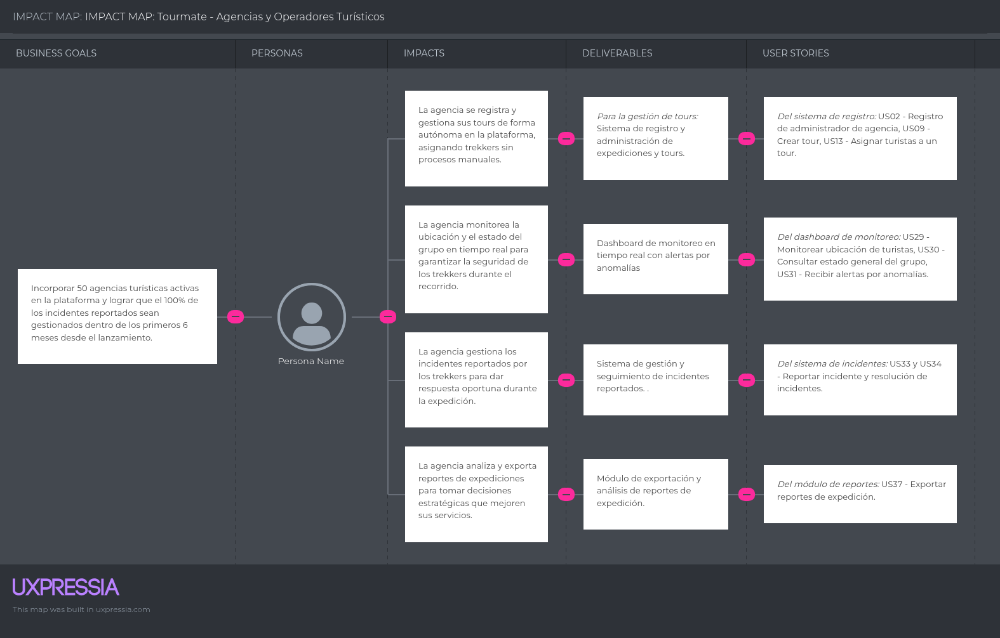

### Impact Map - Segmento 2: Turistas de Aventura

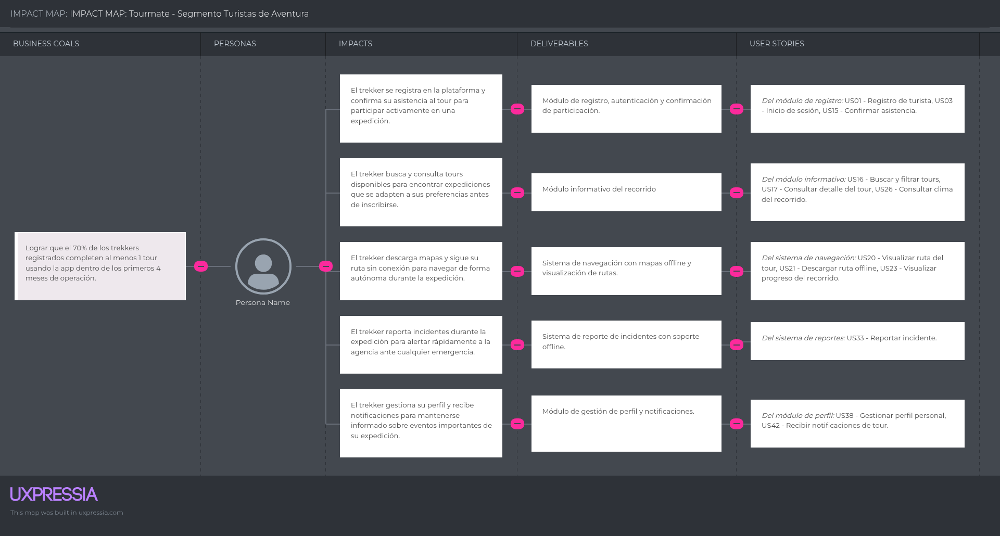

### 3.3. Product Backlog

A continuación se presenta el Product Backlog de Tourmate con la priorización y estimación de todas las historias identificadas. El orden refleja el valor para el negocio, priorizando las funcionalidades del Landing Page, las historias de usuario de los distintos roles y las tareas técnicas de desarrollo.

Para acceder al Product Backlog en la herramienta de gestión del equipo, visitar el siguiente enlace: [Product Backlog — Tourmate](https://trello.com/invite/b/6aa7135dcbb03c6075b9944b/ATTI3d6ca6c13b23e9df6f2ebe962e859d9aE7098EAF/tourmate-product-backlog)

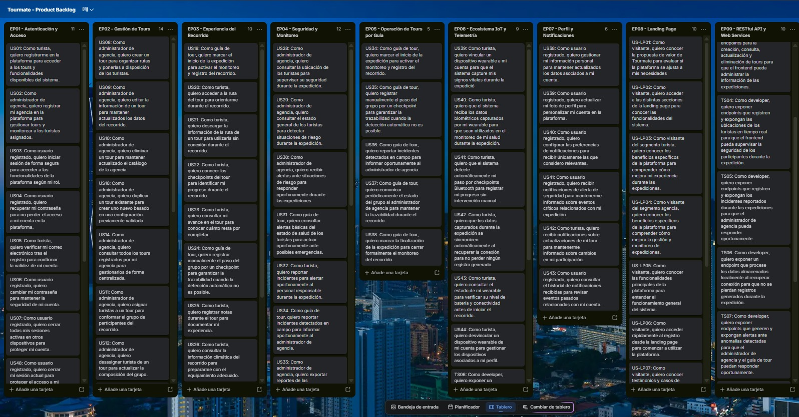

| #Orden | User Story ID | Título | Descripción | Story Points |
| :---: | :--- | :--- | :--- | :---: |
| 1 | US-LP01 | Conocer la propuesta de valor | Como visitante, quiero conocer la propuesta de valor de Tourmate para evaluar si la plataforma se ajusta a mis necesidades. | 3 |
| 2 | US-LP02 | Navegar entre secciones de la landing | Como visitante, quiero acceder a las distintas secciones de la landing page para conocer las funcionalidades del sistema. | 2 |
| 3 | US-LP03 | Conocer beneficios para turistas | Como visitante del segmento turista, quiero conocer los beneficios específicos de la plataforma para comprender cómo mejora mi experiencia durante las expediciones. | 2 |
| 4 | US-LP04 | Conocer beneficios para administradores de agencia | Como visitante del segmento agencia, quiero conocer los beneficios específicos de la plataforma para comprender cómo mejora la gestión y monitoreo de expediciones. | 2 |
| 5 | US-LP05 | Conocer las funcionalidades principales | Como visitante, quiero conocer las funcionalidades principales de la plataforma para entender el funcionamiento general del sistema. | 2 |
| 6 | US-LP06 | Acceder al registro desde la landing | Como visitante, quiero acceder rápidamente al registro desde la landing page para comenzar a utilizar la plataforma. | 1 |
| 7 | US-LP07 | Acceder a una demostración del sistema | Como visitante, quiero acceder a una demostración del sistema para comprender el funcionamiento de la plataforma antes de registrarme. | 3 |
| 8 | US-LP08 | Conocer la compatibilidad offline | Como visitante, quiero conocer la compatibilidad offline de la plataforma para confiar en su funcionamiento en zonas sin cobertura. | 1 |
| 9 | US-LP09 | Contactar al equipo de Tourmate | Como visitante, quiero contactar al equipo de Tourmate para resolver dudas relacionadas con la plataforma. | 3 |
| 10 | US-LP10 | Conocer las medidas de seguridad de datos | Como visitante, quiero conocer cómo la plataforma protege la información personal para confiar en el sistema. | 1 |
| 11 | US-LP11 | Conocer testimonios y casos de uso | Como visitante, quiero conocer testimonios y casos de uso reales para tomar una decisión informada sobre la plataforma. | 2 |
| 12 | US-LP12 | Conocer el equipo de la startup | Como visitante, quiero conocer al equipo detrás de Tourmate para construir confianza en la propuesta de valor. | 2 |
| 13 | US01 | Registro de turista | Como turista, quiero registrarme en la plataforma para acceder a los tours y funcionalidades disponibles del sistema. | 5 |
| 14 | US02 | Registro de administrador de agencia | Como administrador de agencia, quiero registrar mi agencia en la plataforma para gestionar tours y monitorear a los turistas asignados. | 5 |
| 15 | US03 | Inicio de sesión | Como usuario registrado, quiero iniciar sesión de forma segura para acceder a las funcionalidades de la plataforma según mi rol. | 3 |
| 16 | US04 | Recuperación de contraseña | Como usuario registrado, quiero recuperar mi contraseña para no perder el acceso a mi cuenta en la plataforma. | 3 |
| 17 | US05 | Verificación de correo electrónico | Como turista, quiero verificar mi correo electrónico tras el registro para confirmar la validez de mi cuenta. | 2 |
| 18 | US06 | Cambio de contraseña | Como usuario registrado, quiero cambiar mi contraseña para mantener la seguridad de mi cuenta. | 2 |
| 19 | US07 | Cierre de sesiones activas | Como usuario registrado, quiero cerrar todas mis sesiones activas en otros dispositivos para proteger mi cuenta. | 2 |
| 20 | US08 | Crear tour | Como administrador de agencia, quiero crear un tour para organizar rutas y ponerlas a disposición de los turistas. | 5 |
| 21 | US09 | Editar tour | Como administrador de agencia, quiero editar la información de un tour para mantener actualizados los datos del recorrido. | 3 |
| 22 | US10 | Eliminar tour | Como administrador de agencia, quiero eliminar un tour para mantener actualizado el catálogo de la agencia. | 2 |
| 23 | US11 | Asignar turistas a un tour | Como administrador de agencia, quiero asignar turistas a un tour para conformar el grupo de participantes del recorrido. | 5 |
| 24 | US12 | Desasignar turista de un tour | Como administrador de agencia, quiero desasignar un turista de un tour para actualizar la composición del grupo. | 3 |
| 25 | US13 | Confirmar asistencia | Como turista, quiero confirmar mi asistencia a un tour para asegurar mi participación en el recorrido. | 2 |
| 26 | US14 | Consultar tours de la agencia | Como administrador de agencia, quiero consultar todos los tours registrados por mi agencia para gestionarlos de forma centralizada. | 2 |
| 27 | US15 | Consultar turistas asignados a un tour | Como administrador de agencia, quiero consultar la información de los turistas asignados a un tour para conocer la composición del grupo. | 2 |
| 28 | US16 | Duplicar tour | Como administrador de agencia, quiero duplicar un tour existente para crear uno nuevo basado en una configuración previamente validada. | 3 |
| 29 | US17 | Buscar tours | Como turista, quiero buscar tours mediante términos para localizar opciones acordes a mis intereses. | 3 |
| 30 | US18 | Filtrar tours | Como turista, quiero filtrar los tours disponibles según criterios definidos para encontrar opciones ajustadas a mis preferencias. | 3 |
| 31 | US19 | Consultar detalle del tour | Como turista, quiero acceder a la información completa de un tour para tomar una decisión informada antes de participar. | 2 |
| 32 | US20 | Visualizar ruta del tour | Como turista, quiero acceder a la ruta del tour para orientarme durante el recorrido. | 8 |
| 33 | US21 | Descargar ruta offline | Como turista, quiero descargar la información de la ruta de un tour para utilizarla sin conexión durante el recorrido. | 8 |
| 34 | US22 | Visualizar checkpoints del recorrido | Como turista, quiero conocer los checkpoints del tour para identificar mi progreso durante el recorrido. | 5 |
| 35 | US23 | Visualizar progreso del recorrido | Como turista, quiero consultar mi avance en el tour para conocer cuánto resta por completar. | 5 |
| 36 | US24 | Finalizar tour | Como turista, quiero marcar un tour como finalizado para cerrar formalmente mi participación en el recorrido. | 2 |
| 37 | US25 | Consultar información del recorrido | Como turista, quiero acceder a la información detallada del recorrido para prepararme adecuadamente antes y durante la expedición. | 2 |
| 38 | US26 | Consultar clima del recorrido | Como turista, quiero consultar la información climática del recorrido para prepararme con el equipamiento adecuado. | 3 |
| 39 | US27 | Registrar experiencia del recorrido | Como turista, quiero registrar notas e imágenes durante el tour para documentar mi experiencia. | 3 |
| 40 | US28 | Monitorear ubicación de turistas | Como administrador de agencia, quiero consultar la ubicación de los turistas para supervisar su seguridad durante la expedición. | 8 |
| 41 | US29 | Consultar estado general del grupo | Como administrador de agencia, quiero consultar el estado general de los turistas para detectar situaciones de riesgo durante la expedición. | 8 |
| 42 | US30 | Recibir alertas por anomalías | Como administrador de agencia, quiero recibir alertas ante situaciones de riesgo para responder oportunamente durante las expediciones. | 5 |
| 43 | US31 | Consultar estado de salud básico | Como guía de tour, quiero consultar alertas básicas del estado de salud de los turistas para actuar oportunamente ante posibles emergencias. | 5 |
| 44 | US32 | Reportar incidentes | Como turista, quiero reportar incidentes para alertar oportunamente al personal responsable durante la expedición. | 3 |
| 45 | US33 | Exportar reportes de expedición | Como administrador de agencia, quiero exportar reportes de las expediciones para analizar la información operativa. | 5 |
| 46 | US34 | Iniciar expedición | Como guía de tour, quiero marcar el inicio de la expedición para activar el monitoreo y registro del recorrido. | 3 |
| 47 | US35 | Registrar paso por checkpoint manual | Como guía de tour, quiero registrar manualmente el paso del grupo por un checkpoint para garantizar la trazabilidad cuando la detección automática no es posible. | 3 |
| 48 | US36 | Reportar incidente desde el rol guía | Como guía de tour, quiero reportar incidentes detectados en campo para informar oportunamente al administrador de agencia. | 3 |
| 49 | US37 | Comunicar estado del grupo | Como guía de tour, quiero comunicar periódicamente el estado del grupo al administrador de agencia para mantener la trazabilidad durante el recorrido. | 3 |
| 50 | US38 | Gestionar perfil personal / Finalizar expedición | Como usuario registrado / guía, quiero gestionar mi perfil o finalizar la expedición para cerrar formalmente las actividades del sistema. | 2 |
| 51 | US39 | Vincular dispositivo wearable | Como turista, quiero vincular un dispositivo wearable a mi cuenta para que el sistema capture mis signos vitales durante la expedición. | 3 |
| 52 | US40 | Recibir datos biométricos del wearable | Como turista, quiero que el sistema reciba los datos biométricos capturados por mi wearable para que sean utilizados en el monitoreo de mi salud durante la expedición. | 5 |
| 53 | US41 | Detección automática por checkpoint Bluetooth | Como turista, quiero que el sistema detecte automáticamente mi paso por checkpoints Bluetooth para registrar mi progreso sin intervención manual. | 8 |
| 54 | US42 | Sincronización asincrónica de telemetría | Como turista, quiero que los datos capturados durante la expedición se sincronicen automáticamente al recuperar la conexión para no perder ningún registro generado. | 8 |
| 55 | US43 | Consultar estado del wearable | Como turista, quiero consultar el estado de mi wearable para verificar su nivel de batería y conectividad antes de iniciar el recorrido. | 2 |
| 56 | US44 | Desvincular dispositivo wearable | Como turista, quiero desvincular un dispositivo wearable de mi cuenta para gestionar los dispositivos asociados a mi perfil. | 2 |
| 57 | US46 | Recibir notificaciones | Como usuario registrado, quiero recibir notificaciones relevantes para mantenerme informado sobre eventos importantes relacionados con mi cuenta o expedición. | 5 |
| 58 | US47 | Configurar preferencias de notificaciones | Como usuario registrado, quiero configurar las preferencias de notificaciones para recibir únicamente las que considero relevantes. | 3 |
| 59 | US48 | Cerrar sesión actual | Como usuario registrado, quiero cerrar mi sesión actual para proteger el acceso a mi cuenta cuando termino de utilizar la plataforma. | 1 |
| 60 | US49 | Desactivar cuenta personal | Como usuario registrado, quiero desactivar mi cuenta para dejar de utilizar la plataforma cuando lo considere necesario. | 2 |
| 61 | TS01 | Endpoint de registro de usuarios | Como developer, quiero exponer un endpoint que registre usuarios validando los datos del request para que los clientes puedan crear cuentas de forma segura en la plataforma. | 5 |
| 62 | TS02 | Endpoint de autenticación y JWT | Como developer, quiero exponer un endpoint que valide credenciales y genere tokens de acceso JWT para que los clientes puedan autenticarse y consumir recursos protegidos del sistema. | 5 |
| 63 | TS03 | Endpoint de gestión de tours | Como developer, quiero exponer endpoints para la creación, consulta, actualización y eliminación de tours para que el frontend pueda administrar la información de las expediciones. | 5 |
| 64 | TS04 | Endpoint de monitoreo de ubicación | Como developer, quiero exponer endpoints que registren y expongan las ubicaciones de los turistas en tiempo real para que el frontend pueda supervisar la seguridad de los participantes durante la expedición. | 8 |
| 65 | TS05 | Endpoint de gestión de incidentes | Como developer, quiero exponer endpoints que registren y expongan los incidentes reportados durante las expediciones para que el administrador de agencia pueda responder oportunamente. | 5 |
| 66 | TS06 | Endpoint de sincronización offline | Como developer, quiero exponer un endpoint que procese los datos almacenados localmente al recuperar conexión para que no se pierdan registros generados durante la expedición. | 8 |
| 67 | TS07 | Endpoint de gestión de alertas | Como developer, quiero exponer endpoints que generen y expongan alertas ante anomalías detectadas para que el administrador de agencia y el guía de tour puedan responder oportunamente. | 5 |
| 68 | TS08 | Endpoint de exportación de reportes | Como developer, quiero exponer un endpoint que genere reportes exportables de las expediciones para que el administrador de agencia pueda analizar la información operativa. | 5 |
| 69 | TS09 | Endpoint de ingesta de telemetría IoT | Como developer, quiero exponer un endpoint que reciba y procese la telemetría enviada por los dispositivos wearables para que la información biométrica esté disponible para el monitoreo en tiempo real. | 8 |
| 70 | TS10 | Endpoint de gestión de dispositivos wearables | Como developer, quiero exponer endpoints para vincular, desvincular y consultar dispositivos wearables para que los turistas puedan administrar los dispositivos asociados a su cuenta. | 5 |
| 71 | TS11 | Endpoint de gestión de perfiles de usuario | Como developer, quiero exponer endpoints para consultar y actualizar la información de perfiles de usuario para que las aplicaciones cliente mantengan actualizados los datos personales. | 3 |
| 72 | TS12 | Endpoint de rutas y checkpoints offline | Como developer, quiero exponer endpoints que sirvan la estructura geométrica de rutas y metadatos de checkpoints para permitir la descarga y lectura local en mapas móviles. | 8 |
| 73 | TS13 | Endpoint de motor de notificaciones push | Como developer, quiero exponer un servicio y endpoints de mensajería para disparar notificaciones en tiempo real a los clientes ante eventos críticos o alertas operativas. | 5 |

# Capítulo IV: Product Design
## 4.1. Style Guidelines
### 4.1.1. General Style Guidelines
### **Branding**

La identidad visual de la nueva landing page está orientada a transmitir una estética relacionada con la naturaleza, la aventura y una experiencia cercana y humana. El diseño combina tonalidades verdes y neutras con acentos cálidos, generando una apariencia sobria y natural.

La interfaz utiliza principalmente una paleta clara, donde el color de fondo tipo arena y las tonalidades verdes constituyen la base visual. Los colores cálidos se emplean como elementos de acento para destacar determinados componentes de la interfaz.

La identidad visual se complementa con fotografías relacionadas con expediciones y actividades de aventura. La misma imagen principal de la sección **Hero** es reutilizada en otras secciones mediante diferentes filtros de color y saturación para mantener coherencia visual.

### **Tone of Communication**

El tono de comunicación de la landing page se caracteriza por ser:

| Eje | Posición |
|---|---|
| Divertido / Serio | **Serio y cercano** — se busca comunicar profesionalismo sin generar una experiencia visual fría. |
| Formal / Casual | **Casual y directo** — el contenido utiliza mensajes breves y fáciles de comprender. |
| Respetuoso / Irreverente | **Respetuoso** — la comunicación mantiene una presentación profesional. |
| Entusiasta / Sereno | **Sereno con elementos de aventura** — las imágenes y los acentos visuales transmiten dinamismo sin sobrecargar la interfaz. |

La interfaz utiliza el español como idioma principal, establecido mediante `lang="es"` en el documento HTML.

### **Colors**

La paleta de colores está definida principalmente mediante variables CSS dentro de `:root`, permitiendo mantener consistencia entre los diferentes componentes de la landing page.

### **Color Palette**

| Variable / Color | Valor | Uso |
|---|---|---|
| `--background` / `--sand` | `#f8f7f2` | Fondo principal de la interfaz. |
| `--foreground` / `--primary` / `--forest` | `#29433a` | Color principal, textos destacados y elementos de navegación. |
| `--primary-foreground` | `#f8f7f2` | Texto utilizado sobre fondos de color primario. |
| `--border` | `#d9ded5` | Bordes de componentes y tarjetas. |
| `--muted` | `#6e7d73` | Variable definida para textos secundarios, aunque actualmente no presenta referencias en CSS. |
| `--sage` | `#dfe9dc` | Fondos y elementos visuales secundarios. |
| `--clay` | `#b87859` | Color de acento para elementos destacados. |
| `--white` | `#fffefb` | Fondos y elementos blancos. |

También se utilizan colores definidos directamente en el CSS para determinados componentes:

| Color | Valor | Uso |
|---|---|---|
| Peach | `#efc5a6` | Énfasis visual en determinados encabezados. |
| Green light | `#718078` | Variación de color para textos. |
| Green medium | `#65756c` | Variación de color para textos. |
| Green dark | `#496457` | Variación de color para textos. |
| Green hover | `#416253` | Estado `hover` de botones oscuros. |
| Peach hover | `#f1d4bd` | Estado `hover` de botones claros. |
| Clay light | `#c98b6c` | Fondo de la sección de contacto. |
| Traveler background | `#eee9df` | Fondo utilizado en la sección de viajeros. |
| Footer background | `#20362e` | Fondo del footer. |

El **Hero** utiliza además un gradiente verde con valores `rgba(35, 63, 53, ...)`, reforzando la integración visual de las imágenes con la paleta de la interfaz.

### **Typography**

La landing page utiliza principalmente la familia tipográfica **Geist**, complementada con **Geist Mono** y la familia serif **Georgia** en elementos específicos.

| Familia | Peso / Uso | Rol |
|---|---|---|
| Geist | `400`, `420`, `430`, `650` y otros pesos definidos por el diseño | Tipografía principal de títulos, cuerpo, navegación y componentes. |
| Geist Mono | Definida en el proyecto | Familia monoespaciada disponible en el sistema, sin uso visual identificado actualmente. |
| Georgia | `38px` en elementos específicos | Iniciales mostradas en las fotografías de los miembros y determinados elementos de énfasis. |

### **Escala tipográfica**

| Elemento | Familia | Tamaño | Peso | Uso |
|---|---|---|---|---|
| H1 | Geist | `clamp(54px, 8vw, 104px)` | `430` | Título principal del Hero. |
| H2 | Geist | `clamp(39px, 5.3vw, 70px)` | `420` | Encabezados principales de las secciones. |
| Eyebrow / Section label | Geist | `10px` | `650` | Etiquetas superiores de las secciones. |

El **H1** utiliza además un `letter-spacing` de `-0.07em`, mientras que los elementos **eyebrow** utilizan `letter-spacing: 0.18em`. Estos valores permiten establecer contraste entre los diferentes niveles de información.

### **Principios tipográficos**

La jerarquía tipográfica se construye principalmente mediante variaciones de tamaño, peso y espaciado dentro de la familia Geist. Los encabezados utilizan tamaños considerablemente mayores para establecer una jerarquía visual clara.

El **H1** utiliza la función `clamp()` para permitir una adaptación fluida de su tamaño según el ancho de la pantalla.

La familia **Georgia** se utiliza de manera puntual para aportar contraste visual en determinados elementos gráficos.

### **Spacing**

El diseño no utiliza una escala formal de espaciado basada en tokens, sino valores definidos directamente según las necesidades de cada sección.

Los principales valores identificados son:

| Valor | Uso principal |
|---|---|
| `12%` | Separación utilizada en determinados layouts. |
| `18px` | Gaps y espaciados internos. |
| `36px` | Separación entre determinados elementos. |
| `45px` | Gaps principales en componentes. |
| `108px` | Espaciado vertical de la sección de contacto. |
| `118px` | Espaciado utilizado en la sección del equipo. |
| `120px` | Espaciado estándar de determinadas secciones. |
| `88px` | Espaciado vertical utilizado en mobile. |

El contenedor principal utiliza un ancho máximo de `1160px`, acompañado de márgenes horizontales de `24px`.

### **Border Radius**

La interfaz utiliza diferentes niveles de redondeado según el componente:

| Valor | Uso |
|---|---|
| `999px` | Elementos tipo pill y botones redondeados. |
| `18px` | Tarjetas de miembros del equipo. |
| `50%` | Iconos circulares, como los elementos `.check-icon`. |

No se utilizan variables CSS específicas para definir tokens de `border-radius`.

### **Shadows**

La interfaz utiliza un enfoque visual plano y **no presenta sombras (`box-shadow`) en sus componentes**.

La sensación de profundidad se consigue principalmente mediante diferencias de color, bordes y transformaciones durante las interacciones. En particular, los botones utilizan una transformación de `translateY(-2px)` durante el estado `hover`.

### 4.1.2. Web Style Guidelines

### **Layout y Grid System**

La estructura de la landing page utiliza principalmente **Flexbox** para organizar los elementos de navegación y diferentes componentes de la interfaz, complementándose con estructuras de layout específicas para cada sección.

El contenido principal está limitado a un ancho máximo de:

`max-width: min(1160px, calc(100% - 48px))`

Esto establece un ancho máximo de **1160px** y mantiene un margen horizontal de **24px** en pantallas donde el contenido necesita adaptarse.

Las diferentes secciones utilizan distribuciones que se adaptan al tamaño disponible de la pantalla mediante reglas responsive.

### **Navbar**

La barra de navegación se presenta de forma transparente sobre la sección Hero.

Características principales:

- Padding superior de `26px`.
- Distribución mediante Flexbox.
- Links de navegación ubicados en la parte central/derecha.
- Separación de `42px` entre determinados elementos de navegación.
- No utiliza posición `fixed` ni `sticky`.
- No implementa un menú hamburguesa.
- En pantallas de hasta `780px`, los links de navegación dejan de mostrarse.

La navegación incluye además una etiqueta accesible mediante `aria-label="Navegación principal"`.

### **Buttons**

La landing page utiliza dos variantes principales de botones:

| VarianteAparienciaUso |                             |                                                     |
| --------------------- | --------------------------- | --------------------------------------------------- |
| `.button-light`       | Fondo claro con texto verde | Acciones principales sobre fondos oscuros o verdes. |
| `.button-dark`        | Fondo verde con texto claro | Acciones principales sobre fondos claros.           |

Los botones modifican su apariencia durante el estado `hover`. La variante clara utiliza el color `#f1d4bd`, mientras que la variante oscura utiliza `#416253`.

También existen enlaces de texto mediante `.text-link`, con variantes `.light-link` y `.dark-link` según el fondo donde se presentan.

Los botones utilizan una transformación visual de `translateY(-2px)` durante el estado hover para proporcionar retroalimentación visual al usuario.

### **Cards**

Las tarjetas utilizan un estilo visual plano y minimalista.

La tarjeta de miembros del equipo (`.member-card`) presenta:

- Fondo color arena.
- Borde de `1px`.
- `border-radius: 18px`.
- `overflow: hidden`.

La sección de fotografía de cada miembro utiliza:

- Fondo color sage.
- Altura mínima de `145px`.
- Iniciales representadas mediante Georgia con un tamaño de `38px`.

### **Section Elements**

Los elementos tipo eyebrow utilizados como identificadores de sección presentan:

- Tamaño de fuente de `10px`.
- Peso `650`.
- `letter-spacing: 0.18em`.

Estos elementos funcionan como etiquetas visuales que preceden a los encabezados principales y ayudan a establecer una jerarquía clara dentro de cada sección.

### **Hero Images**

La imagen utilizada en el Hero corresponde a `hero-expedition.png`.

Esta misma imagen se reutiliza en diferentes secciones de la landing page aplicando modificaciones visuales mediante CSS:

- Para la sección relacionada con agencias se utiliza `filter: saturate(.7)`.
- Para la sección relacionada con viajeros se utiliza `filter: saturate(.55) hue-rotate(8deg)`.

Estas variaciones permiten reutilizar el recurso visual manteniendo una apariencia diferenciada entre las secciones.

### **Responsive Breakpoints**

La landing page utiliza un único breakpoint responsive:

| BreakpointValorDescripción |                    |                                                                            |
| -------------------------- | ------------------ | -------------------------------------------------------------------------- |
| Mobile                     | `max-width: 780px` | Adapta la navegación y distribución del contenido para pantallas pequeñas. |

En pantallas de hasta `780px`, los links de navegación dejan de mostrarse y determinados layouts modifican su distribución.

El footer utiliza una distribución de dos columnas en mobile, mientras que el elemento correspondiente a la identidad de la marca ocupa el ancho completo.

No se utiliza un breakpoint independiente para tablet.

### **Accessibility**

La landing page incorpora diferentes elementos orientados a mejorar la accesibilidad:

- Uso de elementos semánticos como `<main>`, `<section>`, `<nav>`, `<footer>`, `<article>`, `<ul>` y `<li>`.
- La navegación utiliza `aria-label="Navegación principal"`.
- Los elementos SVG decorativos utilizan `aria-hidden="true"`.
- Las imágenes implementadas mediante fondos CSS utilizan `role="img"` y `aria-label` para proporcionar una descripción accesible.
- Las fotografías de los miembros cuentan con `aria-label`.
- El documento HTML establece `lang="es"`.
- Se utiliza antialiasing para mejorar la representación visual de los textos.

Actualmente no se encuentra implementado un tratamiento específico mediante `:focus-visible` ni una configuración de `prefers-reduced-motion`.

### **Internationalization**

La implementación actual de la landing page establece el español como idioma del documento mediante:

`<html lang="es">`

No se identifica en la implementación actual un sistema de internacionalización que permita alternar entre diferentes idiomas.

# 4.2. Information Architecture

La arquitectura de información de Tourmate está diseñada para un landing page de una sola página. El contenido se organiza mediante secciones verticales, navegación interna por anclas, llamadas a la acción y un pie de página con enlaces adicionales. La estructura permite presentar progresivamente la propuesta de valor, diferenciar el contenido según las principales audiencias y conducir al usuario hacia el contacto.

No se observan pantallas independientes, autenticación, perfiles, áreas privadas, sistemas de búsqueda ni filtros. Por ello, la arquitectura se centra principalmente en la organización del contenido, el etiquetado, la navegación y la presentación de información dentro de una única página.

---

#### 4.2.1. Organization Systems

**Organización visual del contenido**

La información del landing page se distribuye en las siguientes secciones principales:

- **Inicio (`#inicio`)**: presenta la identidad de Tourmate, el mensaje principal y las primeras llamadas a la acción.
- **Nuestra idea (`#vision`)**: explica el propósito de la propuesta y presenta los conceptos “Más claridad”, “Más confianza” y “Más recuerdos”.
- **Agencias (`#agencias`)**: comunica el valor de la propuesta para agencias y guías.
- **Viajeros (`#viajeros`)**: presenta el valor de la propuesta para las personas que desean viajar.
- **Team Development (`#team-development`)**: presenta al equipo y sus áreas de trabajo.
- **Contacto (`#contacto`)**: contiene el cierre de la propuesta y una llamada a la acción.
- **Footer**: agrupa enlaces de exploración, contacto y redes sociales.

Esta organización permite recorrer la propuesta desde una presentación general hacia explicaciones específicas por audiencia y, finalmente, hacia una acción de contacto.

***Jerarquía visual (Visual Hierarchy)***

La jerarquía visual se utiliza para establecer diferentes niveles de importancia dentro del contenido. Se construye mediante:

- Un mensaje principal destacado en el hero: **“Más camino. Menos ruido.”**
- Títulos de sección con elementos destacados en cursiva, como “conexión”, “bien acompañada”, “historia”, “en equipo” y “algo más sencillo”.
- Etiquetas superiores de sección, como:
    - “TURISMO DE AVENTURA, SIN COMPLICACIONES”
    - “UNA FORMA MÁS NATURAL DE VIAJAR”
    - “PARA AGENCIAS Y GUÍAS”
    - “PARA VIAJEROS”
    - “TEAM DEVELOPMENT”
    - “EL PRÓXIMO DESTINO EMPIEZA AQUÍ”
- Listas de beneficios en las secciones dirigidas a agencias y viajeros.
- Diferenciación mediante imágenes, fondos de color, botones, enlaces subrayados y separadores.

La jerarquía orienta al usuario primero hacia la propuesta de valor, posteriormente hacia los públicos principales y finalmente hacia el contacto.

***Organización secuencial (Step-by-step)***

Se aplica una organización secuencial o narrativa mediante el orden vertical de las secciones. El recorrido principal es:

**Presentación de la marca → Nuestra idea → Agencias/Viajeros → Team Development → Contacto → Footer**

Esta secuencia acompaña al usuario desde el conocimiento inicial de Tourmate hasta una posible acción de contacto.

***Organización por audiencia (Audience-based)***

La categorización por audiencia se aplica de forma explícita en el landing page. El contenido dirigido a los principales públicos se separa en dos secciones:

| Audiencia | Sección | Contenido |
|---|---|---|
| Agencias y guías | Agencias | Presentación de recorridos, acompañamiento de grupos y construcción de confianza |
| Viajeros | Viajeros | Elección de experiencias, preparación del viaje y búsqueda de una experiencia acorde |

Esta organización permite que cada audiencia identifique rápidamente el contenido relacionado con sus intereses.

***Organización temática (Topic-based)***

El contenido también se organiza mediante diferentes temas:

- Propuesta general de Tourmate.
- Claridad, confianza y recuerdos.
- Servicios o beneficios para agencias y guías.
- Experiencia para viajeros.
- Equipo de trabajo.
- Contacto y canales externos.

Esta organización permite presentar diferentes aspectos de la propuesta sin mezclar los contenidos dirigidos a cada contexto.

***Organización matricial (Matrix)***

No implementado. El landing page no contiene tablas de datos, matrices comparativas, catálogos ni estructuras que permitan consultar simultáneamente diferentes categorías o atributos.

***Organización cronológica (Chronological)***

No implementado. El contenido no se organiza mediante fechas, eventos históricos, publicaciones ni información ordenada cronológicamente.

***Organización jerárquica (Hierarchical)***

Sí está implementada a nivel de página. Existe una estructura principal compuesta por el hero, las secciones de contenido, la sección de contacto y el footer. Dentro de cada sección se utilizan títulos, subtítulos, párrafos, listas, imágenes y llamadas a la acción con diferentes niveles de importancia.

---

#### 4.2.2. Labeling Systems

Las etiquetas utilizadas en Tourmate buscan identificar de forma directa las diferentes secciones y acciones disponibles en el landing page.

***Etiquetas de navegación principal***

| Etiqueta | Destino | Función |
|---|---|---|
| TOURMATE | `#inicio` | Identifica la marca y permite regresar al inicio |
| Agencias | `#agencias` | Dirige a la sección para agencias y guías |
| Viajeros | `#viajeros` | Dirige a la sección para viajeros |
| Team Development | `#team-development` | Dirige a la sección del equipo |
| Nuestra idea | `#vision` | Dirige a la explicación de la propuesta |
| Conocer más | `#contacto` | Dirige a la sección de contacto |

La navegación principal se encuentra dentro de un elemento `<nav>` que utiliza la etiqueta accesible **“Navegación principal”**.

***Etiquetas de acciones principales***

| Etiqueta | Destino | Función |
|---|---|---|
| Conoce Tourmate | `#vision` | Dirige a la explicación de la propuesta |
| Descubre para quién es | `#agencias` | Dirige hacia la segmentación principal por audiencia |
| Hablemos | `#contacto` | Dirige al contacto desde la sección de agencias |
| Quiero explorar | `#contacto` | Dirige al contacto desde la sección de viajeros |
| Conoce la propuesta | `#agencias` | Dirige hacia la sección dirigida a agencias |

Las etiquetas de las llamadas a la acción utilizan textos breves relacionados directamente con el contenido o la acción que el usuario puede realizar.

***Títulos y etiquetas de contenido***

| Etiqueta o título | Sección |
|---|---|
| Más camino. Menos ruido. | Inicio |
| Todo empieza con una buena conexión. | Nuestra idea |
| Más claridad | Beneficios generales |
| Más confianza | Beneficios generales |
| Más recuerdos | Beneficios generales |
| Tu experiencia, bien acompañada. | Agencias y guías |
| Elige tu próxima historia. | Viajeros |
| Construimos el viaje en equipo. | Team Development |
| Hagamos del viaje algo más sencillo. | Contacto |

***Etiquetas del footer***

| Categoría | Enlaces |
|---|---|
| Explora | Nuestra idea, Para agencias, Para viajeros |
| Conversemos | hola@tourmate.experience, Quiero conocer más |
| Síguenos | Instagram, LinkedIn, Facebook |

Los enlaces de redes sociales existentes apuntan actualmente a `#inicio`. No se implementan destinos externos específicos para dichas redes.

---

#### 4.2.3. SEO Tags and Meta Tags

Los metadatos del landing page se definen principalmente en `app/layout.tsx`.

| Elemento | Valor actual | Propósito |
|---|---|---|
| `<title>` | `Tourmate \| Gestión de experiencias al aire libre` | Define el título mostrado por el navegador y utilizado por los buscadores |
| `description` | `La plataforma que conecta agencias, guías y viajeros para crear expediciones más claras, seguras y memorables.` | Resume el contenido principal del sitio |
| `generator` | `v0.app` | Identifica la herramienta de generación del proyecto |
| `lang` | `es` | Indica que el documento está en español |
| `themeColor` | `#f4f1e9` | Define el color asociado a la interfaz del navegador |
| `colorScheme` | `light` | Declara que el sitio utiliza un esquema visual claro |
| `userScalable` | `true` | Permite el escalado del contenido por parte del usuario |
| `icons.icon` | `/icon-light-32x32.png`, `/icon-dark-32x32.png`, `/icon.svg` | Define los iconos del sitio |
| `icons.apple` | `/apple-icon.png` | Define el icono para dispositivos Apple |

Los siguientes elementos no se encuentran implementados explícitamente:

- `keywords`: No implementado.
- `author`: No implementado.
- Open Graph: No implementado.
- Twitter Cards: No implementado.
- `robots`: No implementado.
- Canonical URL: No implementado.
- Datos estructurados Schema.org: No implementado.

La etiqueta `lang="es"` sí se encuentra implementada en el elemento `<html>`.

---

#### 4.2.4. Searching Systems

***Landing Page***

La landing page no implementa un sistema de búsqueda textual debido a que su contenido es estático y se encuentra organizado en secciones claramente diferenciadas.

Tampoco se implementan:

- Búsqueda textual.
- Filtros.
- Búsqueda por categorías.
- Ordenamiento de resultados.
- Autocompletado.
- Campos de búsqueda.
- Página de resultados.

En lugar de un sistema de búsqueda, la navegación mediante anclas permite localizar directamente las diferentes secciones. El usuario puede acceder al contenido mediante la navegación principal, las llamadas a la acción y los enlaces del footer.

Esta solución resulta adecuada para la estructura actual del proyecto, ya que el contenido corresponde a una landing page informativa y no a un catálogo o repositorio con grandes cantidades de información.

---

#### 4.2.5. Navigation Systems

***Landing Page***

La landing page implementa un sistema de navegación interna mediante enlaces a las diferentes secciones de la página. Estos enlaces utilizan identificadores HTML y permiten desplazarse directamente hacia el contenido correspondiente.

| Enlace | Destino |
|---|---|
| TOURMATE | `#inicio` |
| Agencias | `#agencias` |
| Viajeros | `#viajeros` |
| Team Development | `#team-development` |
| Nuestra idea | `#vision` |
| Conocer más | `#contacto` |

El documento utiliza `scroll-behavior: smooth`, por lo que el desplazamiento hacia las anclas se realiza de manera suave.

***CTA del Hero***

El hero contiene dos acciones principales:

- **“Conoce Tourmate”** → `#vision`
- **“Descubre para quién es”** → `#agencias`

Estas acciones conducen al usuario desde la introducción hacia la explicación de la propuesta y posteriormente hacia la segmentación por audiencia.

***Navegación contextual***

Dentro del contenido también existen enlaces que continúan el recorrido del usuario:

- **“Conoce la propuesta”** → `#agencias`
- **“Hablemos”** → `#contacto`
- **“Quiero explorar”** → `#contacto`

No existe navegación entre páginas independientes ni un sistema de breadcrumbs.

***Comportamiento Desktop***

En desktop, la barra de navegación presenta:

- La marca a la izquierda.
- Los enlaces principales en la zona central o derecha.
- El CTA **“Conocer más”** al extremo derecho.

La navbar no está implementada como un elemento fijo o sticky. Forma parte del hero y deja de estar visible al avanzar por la página.

***Comportamiento Responsive / Mobile***

En resoluciones de hasta `780px`:

- Los enlaces de `.nav-links` dejan de mostrarse.
- El CTA **“Conocer más”** permanece visible.
- No se implementa un menú hamburguesa.
- El contenido principal se reorganiza en una sola columna en las secciones correspondientes.
- Las acciones del hero se apilan verticalmente.
- El footer adopta una distribución de dos columnas, mientras la marca ocupa todo el ancho.

Por lo tanto, la versión móvil utiliza una navegación reducida y no implementa un menú alternativo para acceder a todos los enlaces de la navegación principal.

***Footer***

El footer funciona como un sistema de navegación complementario y se organiza en cuatro áreas principales:

**Marca**

- Tourmate
- “Viajes con sentido, conexiones más humanas.”

**Explora**

- Nuestra idea → `#vision`
- Para agencias → `#agencias`
- Para viajeros → `#viajeros`

**Conversemos**

- `hola@tourmate.experience` → enlace `mailto:`
- Quiero conocer más → `#contacto`

**Síguenos**

- Instagram → `#inicio`
- LinkedIn → `#inicio`
- Facebook → `#inicio`

El footer también muestra:

- © 2026 Tourmate
- “Experiencias para recordar.”

***Recorrido esperado del usuario***

El recorrido principal propuesto por la arquitectura actual es:

**Inicio → Nuestra idea → Agencias / Viajeros → Team Development → Contacto → Footer**

El usuario también puede saltar directamente a una sección utilizando los enlaces de la navegación principal, las llamadas a la acción o los enlaces del footer.

No se implementan flujos de registro, compra, autenticación, búsqueda, filtrado ni navegación hacia un área privada.

## 4.3 Landing Page UI Design
###  4.3.1 Landing Page Wireframe
Para la landing page se realizaron low-fi Wireframes de cada una de las pantallas del sitio:

### 4.3.2 Landing Page Mock-up

**Estructura general y lineamientos visuales**

El Mock-Up de la landing page de Tourmate se desarrolla con un nivel de fidelidad alta, empleando contenido real, imágenes representativas y componentes visuales funcionales, siguiendo una línea gráfica moderna orientada a los viajes, la conexión entre personas y las experiencias al aire libre.

**Aplicación del Branding**

Se incorporan los elementos de identidad visual de Tourmate, como el logotipo, el icono lineal de montaña, la paleta cromática y los mensajes principales de la marca. El logotipo se ubica en la parte superior izquierda dentro de la barra de navegación, fortaleciendo el reconocimiento de marca.

La propuesta visual transmite confianza, cercanía y conexión con la naturaleza mediante el uso de verdes, tonos arena, blanco y terracota, asociados con los viajes, la exploración y las experiencias al aire libre.

**Estructura visual:**

- **Zona superior:** barra de navegación con el logotipo de Tourmate, enlaces principales hacia las secciones de la landing page y botón de llamada a la acción “Conocer más”.

- **Sección principal (Hero):** mensaje central “Más camino. Menos ruido.”, acompañado por una imagen relacionada con viajes y naturaleza, un texto introductorio y los botones “Conoce Tourmate” y “Descubre para quién es”.

- **Sección Nuestra idea:** presentación del propósito de Tourmate mediante el mensaje “Todo empieza con una buena conexión”, acompañado de los conceptos “Más claridad”, “Más confianza” y “Más recuerdos”.

- **Sección Agencias y guías:** presentación de la propuesta dirigida a agencias y guías mediante el mensaje “Tu experiencia, bien acompañada.”, incluyendo una descripción, beneficios y una llamada a la acción.

- **Sección Viajeros:** presentación de la propuesta dirigida a los usuarios que buscan nuevas experiencias mediante el mensaje “Elige tu próxima historia.”, acompañado de contenido descriptivo y elementos visuales relacionados con los viajes.

- **Sección Team Development:** presentación de los integrantes del equipo mediante tarjetas que incluyen el nombre, rol o área de trabajo y un espacio visual para cada integrante.

- **Zona de contacto:** sección con fondo terracota que presenta el mensaje “Hagamos del viaje algo más sencillo.”, un texto de cierre y el botón de llamada a la acción “Hablemos”.

- **Zona inferior (Footer):** presentación de la identidad de Tourmate, enlaces de navegación, correo de contacto y enlaces a redes sociales.

**Aplicación de guía de estilos:**

- **Tipografía:** uso de Geist como tipografía principal, con títulos de gran tamaño y peso ligero para generar una apariencia moderna y editorial.

- **Jerarquía tipográfica:**
    - Títulos principales: 48–64 px.
    - Títulos secundarios: 32–40 px.
    - Texto base: 16–18 px.
  

- **Paleta cromática:**
    - Verde oscuro (#29433A) como color principal para textos, botones y fondos.
    - Verde suave (#DFE9DC) para superficies secundarias.
    - Arena (#F8F7F2) y blanco (#FFFEFB) para fondos claros.
    - Terracota (#B87859) como color de acento y llamados a la acción.
    - Gris verdoso (#6E7D73) para textos secundarios.
  

- **Elementos visuales:** botones con forma de píldora, bordes sutiles, tarjetas con esquinas redondeadas, líneas horizontales y espacios amplios entre secciones.

- **Layout:** estructura modular basada principalmente en bloques de una y dos columnas, con imágenes y contenido textual distribuidos de manera equilibrada. En dispositivos móviles, las columnas se reorganizan verticalmente para mantener la legibilidad.

**Principios de diseño y arquitectura de la información:**

El contenido se organiza de manera progresiva para conducir al usuario desde la presentación de Tourmate hasta sus propuestas para agencias, guías y viajeros, finalizando con una llamada a la acción.

Se prioriza la claridad mediante títulos directos, textos breves y secciones diferenciadas. La jerarquía visual se establece mediante el tamaño de los títulos, el contraste de colores, las imágenes y la ubicación estratégica de los botones.

La consistencia se mantiene mediante el uso repetido de la paleta cromática, tipografía, botones y estilos de contenido. Asimismo, los enlaces internos permiten desplazarse entre las diferentes secciones de la landing page y facilitan el recorrido del usuario.

**Diseño inclusivo:**

El Mock-Up considera principios de accesibilidad mediante una estructura semántica, textos legibles, contraste adecuado entre fondos y contenidos, botones visibles y navegación claramente identificable.

La interfaz también presenta un diseño responsive que adapta las columnas, imágenes, botones y contenidos a diferentes tamaños de pantalla. En dispositivos móviles, las acciones principales se apilan verticalmente y los contenidos se reorganizan para facilitar la lectura y navegación.

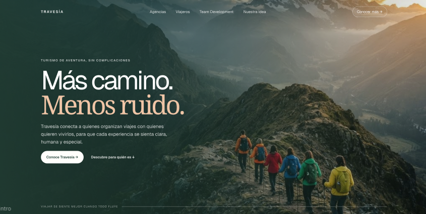
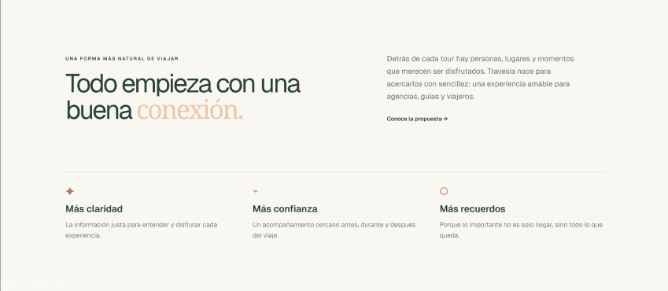
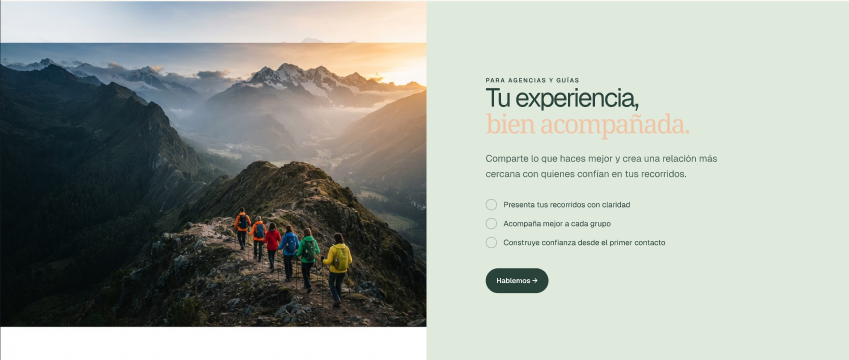
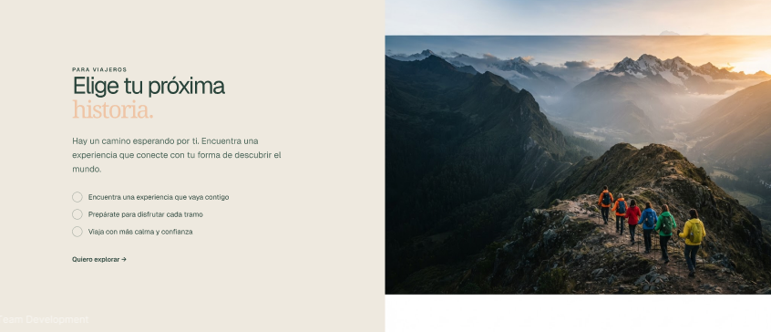
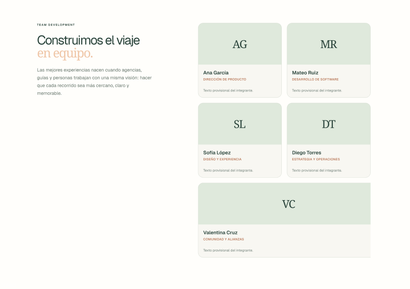
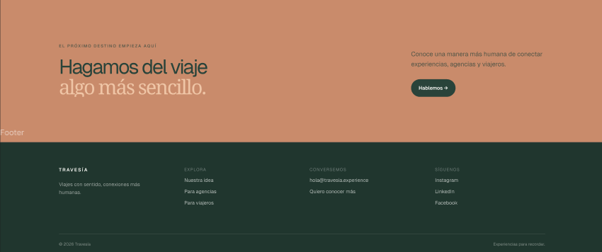

# 4.4. Web Applications UX/UI Design

## 4.4.1. Web Applications Wireframes

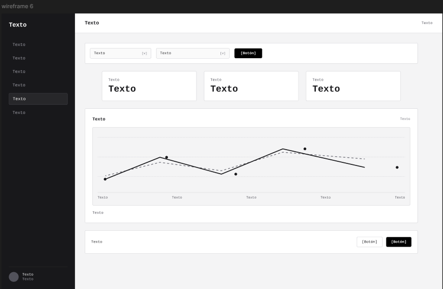

## 4.4.2. Web Applications Wireflow Diagrams

User Goal: Crear una ruta comercial con puntos de control BLE preconfigurados, verificar el inventario de hardware IoT y conformar el grupo de turistas asignando dispositivos y un guía líder antes de la salida a campo.

User Goal: Supervisar la posición y constantes vitales de los participantes en rutas de baja conectividad, detectar desvíos o anomalías biométricas de manera oportuna y ejecutar el protocolo de emergencia hasta el cierre formal del incidente.

User Goal: Finalizar administrativamente un tour completado, auditar los tiempos reales frente a los proyectados y generar informes técnicos en PDF y CSV para clientes y auditorías de seguridad.

## 4.4.3. Web Applications Mock-ups

## 4.4.4. Web Applications User Flow Diagrams

User Goal: Crear una ruta comercial con puntos de control BLE preconfigurados, verificar el inventario de hardware IoT y conformar el grupo de turistas asignando dispositivos y un guía líder antes de la salida a campo.

User Goal: Supervisar la posición y constantes vitales de los participantes en rutas de baja conectividad, detectar desvíos o anomalías biométricas de manera oportuna y ejecutar el protocolo de emergencia hasta el cierre formal del incidente.

User Goal: Finalizar administrativamente un tour completado, auditar los tiempos reales frente a los proyectados y generar informes técnicos en PDF y CSV para clientes y auditorías de seguridad.

### 4.5. Web Applications Prototyping

Link del figma: [Enlace](https://www.figma.com/design/SKEFgPxKRE4cJmEnGjuAx3/DAOS_final?node-id=0-1&t=tXUhENNxmbTL7x4j-1)

Link del video de la explicación del prototipo: [Enlace](https://upcedupe-my.sharepoint.com/:v:/g/personal/u20221g231_upc_edu_pe/IQCuFKbOpmiiSJeRYyHyCHURAbzlqqLM2OWZEzgkSSqIqzo?nav=eyJyZWZlcnJhbEluZm8iOnsicmVmZXJyYWxBcHAiOiJPbmVEcml2ZUZvckJ1c2luZXNzIiwicmVmZXJyYWxBcHBQbGF0Zm9ybSI6IldlYiIsInJlZmVycmFsTW9kZSI6InZpZXciLCJyZWZlcnJhbFZpZXciOiJNeUZpbGVzTGlua0NvcHkifX0&e=pKQoRJ)

## 4.6. Domain-Driven Software Architecture

### 4.6.1. Design-Level EventStorming

En esta sección se presenta el Design-Level EventStorming del proyecto Tourmate, el cúal se desarrollo en 4 pasos, los cúales se van a explicar a continuación:

* Para empezar, identificamos todos los Domain Events de Tourmate. En esta etapa analizamos cada funcionalidad obtenida durante el análisis del negocio y registramos todos los eventos importantes que modifican el estado del sistema, como el registro de usuarios, la creación de tours, el inicio de recorridos, el reporte de incidentes o la generación de reportes:

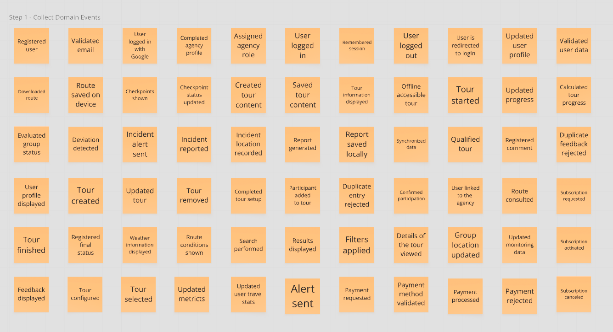

* Luego, procedimos a organizar los Domain Events, eliminando los eventos repetidos, agrupamos aquellos que pertenecían al mismo flujo de negocio y ordenamos la secuencia lógica de cada proceso. Este refinamiento permitió obtener una visión más clara de los distintos procesos que forman parte de Tourmate antes de incorporar elementos adicionales del modelo:

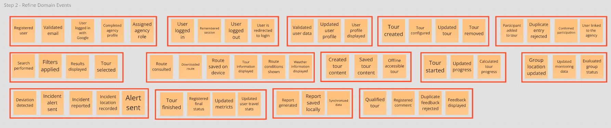

* Después de esto, comenzamos a construir cada flujo funcional. Para cada Domain Event identificamos el comando que lo desencadena, representado por notas azules. Además, agregamos los actores responsables de ejecutar cada comando mediante notas amarillas, cada Read Model para la toma de decisiones de los actores antes de realizar un comando y las políticas representadas en color morado, las cuales automatizan determinadas acciones cuando ocurre un evento. De esta manera logramos modelar el comportamiento completo de cada proceso de negocio:

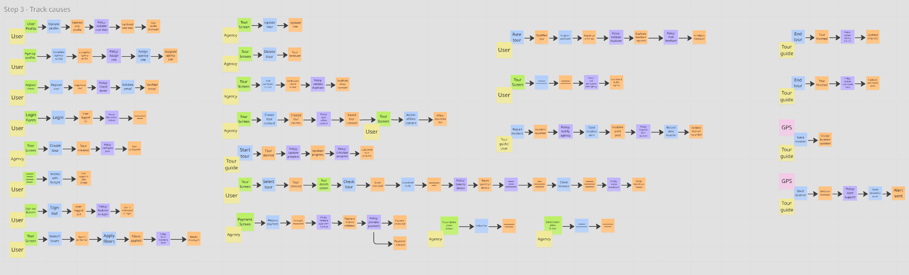

* Finalmente, integramos todos los flujos individuales en los respectivos Bounded Context del dominio:

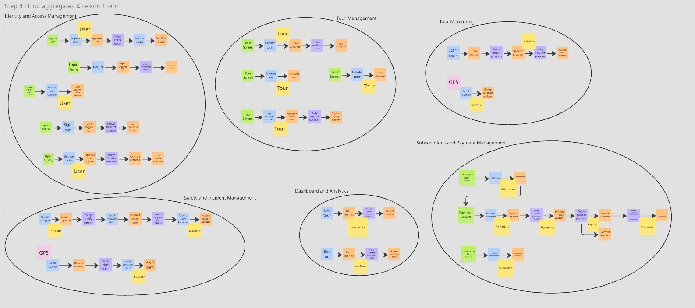

Enlace para acceder al tablero de Miro:
https://miro.com/app/board/uXjVHrbqRdA=/?share_link_id=127054225300

### 4.6.2. Software Architecture Context Level Diagram

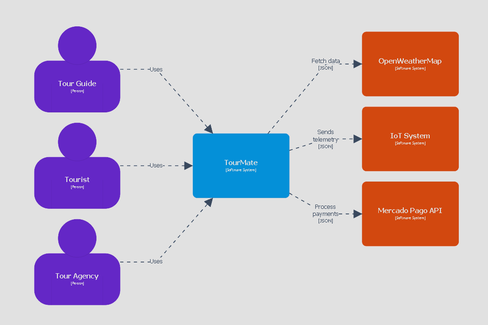

### 4.6.3. Software Architecture Container Level Diagrams

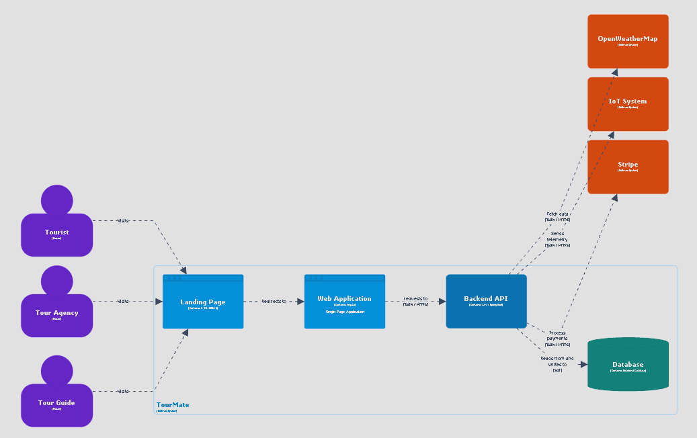

### 4.6.4. Software Architecture Component Level Diagrams

#### 4.6.4.1. Subscriptions and Payment Management Component Diagram
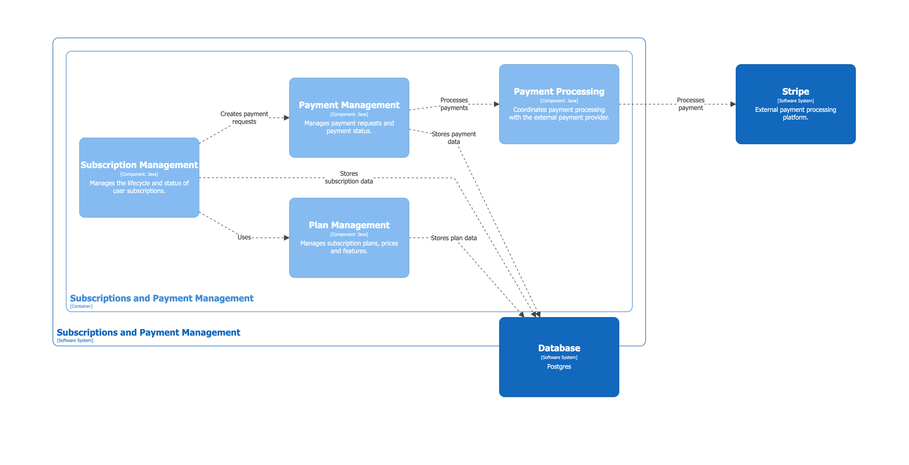

#### 4.6.4.2. Tour Monitoring Component Diagram
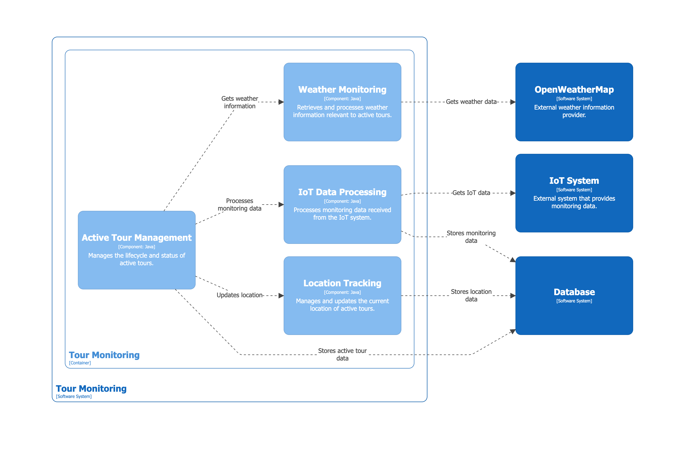

#### 4.6.4.3. Safety Incident Component Diagram
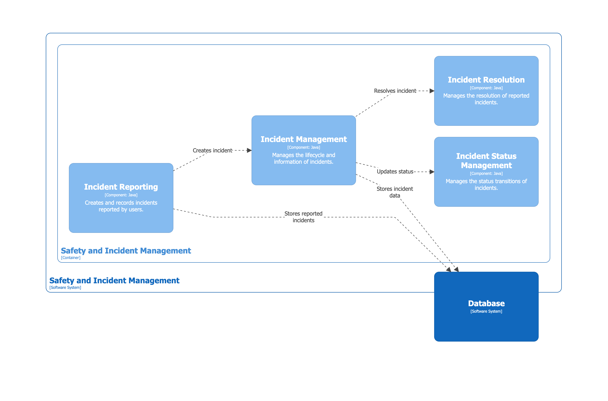

#### 4.6.4.4. Tour Management Component Diagram
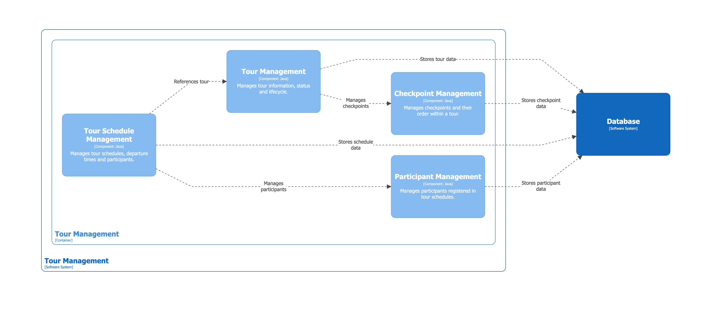

#### 4.6.4.5. Feedback and Review Component Diagram
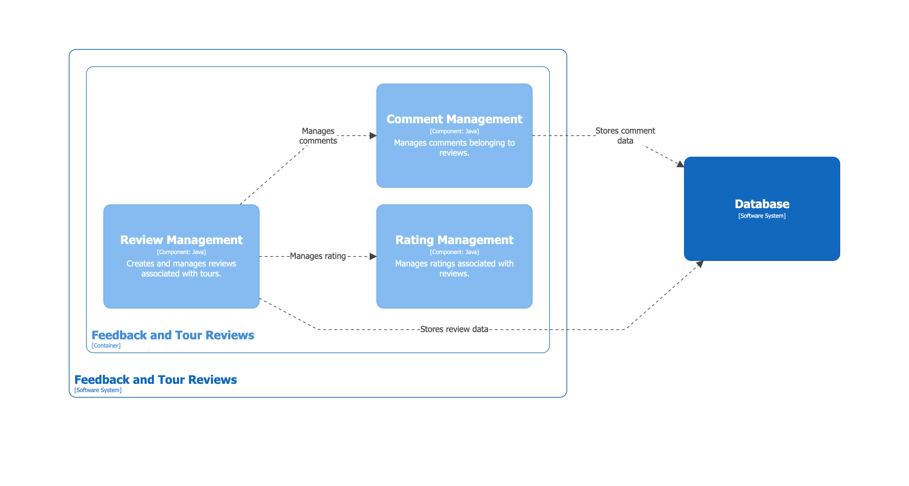

#### 4.6.4.6. IAM Component Diagram
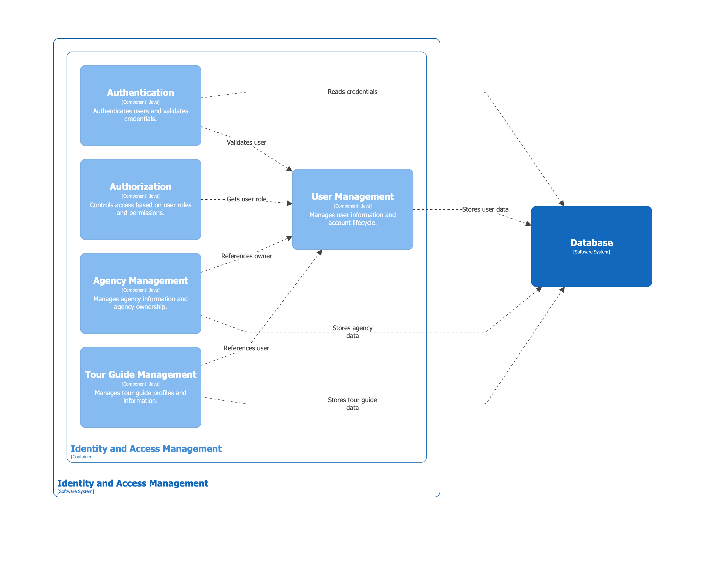

## 4.7. Software Object-Oriented Design

### 4.7.1. Class Diagrams

**Bounded Context: Shared**
Agrupa los Value Objects transversales reutilizados por todo el dominio de la aplicación. Incluye `Money`, `Currency`, `ActiveTourId`, 
`Coordinates`, `TourId`, `TourScheduleId`, `AgencyId` y `UserId`.
.

**Bounded Context: Safety and Incident Management**
Supervisa y documenta incidentes de los turistas o guias durante la expedición mediante monitoreo en tiempo real. Administra `Incident` y sus dos estados `REPORTED` y `RESOLVED`, permitiendo detectar anomalías y exportar reportes operativos.

**Bounded Context: Tour Monitoring**
Gestiona la información de tours en actividad mediante el aggregate root `ActiveTour`. Administra quien es el guia asignado, el estado del tour, la locación actual del grupo, a que hora inició y a que hora terminó. Permite empezar y finalizar los tours.

**Bounded Context: Identity and Access Management**
Gestiona el registro, ciclo de vida de las cuentas de usuario. Se centra en `User` como puerta de entrada para la creación de cuentas con roles definidos. `TourGuide` y `Agency` son aggregates centrados en un segmento objetivo distinto a un user común.

**Bounded Context: Tour Management**
Controla la creación y administración del catálogo de tours por parte de las agencias. La entidad principal es `Tour` que se compone de `Checkpoint` y se asocia con `TourSchedule` que se compone de `Participant` para la gestión de un tour programado con turistas participantes.

**Bounded Context: Feedback and Tour Reviews**
Administra los ratings y comentarios que puede hacer un turista luego de finalizar un tour. Se tiene a `Review` como punto de entrada para la creación de ratings y comentarios. Además se puede validar la información de un comentario con el entity `Comment` y manejar un estandar en rating que van de 0 a 5 puntos con el value object `Rating`.

**Bounded Context: Subscriptions and Payment Management**  
Gestiona los planes de suscripción y el procesamiento de pagos de los usuarios. Incluye `Subscription`, `Plan` y `Payment`. 

## 4.8. Database Design
### 4.8.1. Database Diagrams

El diseño de base de datos de Tourmate está estructurado en 6 bounded contexts con  tablas, siguiendo los principios de Domain-Driven Design para garantizar modularidad, escalabilidad y mantenibilidad. Cada contexto —Safety and Incident Management, Tour Monitoring, Identity and Access Management, Tour Management,  Feedback and Tour Reviews y Subscriptions and Payment Management— gestiona de forma autónoma una parte específica del sistema, pero todos están integrados mediante claves foráneas UUID que reflejan el flujo operativo del negocio: desde el registro del usuario y la configuración del tour, hasta la ejecución de la expedición, el monitoreo de seguridad en tiempo real y la creación de Reviews. Esta arquitectura desacoplada pero conectada logicamente garantiza trazabilidad completa del recorrido, monitoreo biométrico continuo, sincronización y una gestión eficiente de toda la operación de turismo de aventura.

#### 4.8.1.1. IAM Component Diagram

#### 4.8.1.2. Tour Management Component Diagram

#### 4.8.1.3. Tour Monitoring Component Diagram

#### 4.8.1.4. Safety Incident Component Diagram

#### 4.8.1.5. Feedback and Review Component Diagram

#### 4.8.1.6. Subscriptions and Payment Management Component Diagram

---

## Capítulo V: Product Implementation, Validation & Deployment
### 5.1. Software Configuration Management
#### 5.1.1. Software Development Environment Configuration
Con el objetivo de garantizar un desarrollo fluido, estandarizado y consistente entre todos los miembros del equipo, se ha definido el siguiente entorno de desarrollo para el ecosistema TourMate:

| Actividad                              | Producto                 | Propósito / Uso                                                                 |
|---------------------------------------|--------------------------|----------------------------------------------------------------------------------|
| Project Management                    | Trello                   | Gestión del Product Backlog, planificación de Sprints y seguimiento de tareas.  |
| Requirements Management               | UXPressia                | Elaboración de artefactos de descubrimiento (User Personas, Empathy Maps, Journey Maps) para la definición de requisitos. |
| UX/UI Design                          | Figma                    | Diseño de la guía de estilo, prototipos de baja fidelidad (wireframes) y alta fidelidad (mockups). |
| User Flows & Wireflows                | LucidChart               | Elaboración de Wireflows y User Flows.                                          |
| Class Diagrams & Data Base Design     | PlantUML                 | Elaboración de diagramas de clases y diseño de base de datos.                   |
| Software Development (Backend)        | JetBrains Rider          | IDE para el desarrollo de Web Services bajo estilo RESTful utilizando ASP.NET Core y C#. |
| Software Development (Frontend)       | JetBrains WebStorm       | IDE para el desarrollo de la Web Application con Vue Framework, PrimeVue (HTML5, CSS3, JS). |
| Software Development (Landing Page)   | Visual Studio Code       | IDE para el desarrollo de la Landing Page con HTML5, CSS y JS.                  |
| Version Control                       | GitHub                   | Alojamiento de repositorios y gestión de versiones aplicando GitFlow y Conventional Commits. |
| Documentation                         | Markdown                 | Documentación del reporte del proyecto.                                         |

#### 5.1.2. Source Code Management

El código fuente del proyecto se gestionará utilizando **Git** como sistema de control de versiones y **GitHub** como plataforma de alojamiento, bajo una organización pública. Se adoptará un enfoque estructurado que favorezca la colaboración, la modularidad y el despliegue continuo mediante repositorios independientes para cada componente del sistema.

- **Report:** [https://github.com/axiom-daos/tourmate-report](https://github.com/axiom-daos/tourmate-report)
- **Landing Page:** [https://github.com/axiom-daos/tourmate-landing](https://github.com/axiom-daos/tourmate-landing)
- **Frontend Web Application:** [https://github.com/axiom-daos/tourmate-web-application](https://github.com/axiom-daos/tourmate-web-application)
- **RESTful Web Services:** [https://github.com/axiom-daos/tourmate-platform](https://github.com/axiom-daos/tourmate-platform)

#### Estrategia de Ramas (GitFlow)

Se implementará un flujo de trabajo basado en GitFlow con el objetivo de garantizar la estabilidad y trazabilidad del desarrollo:

- **main**: Rama principal que contiene únicamente código estable, probado y desplegado en producción. Cada versión liberada deberá estar debidamente etiquetada.

- **develop**: Rama de integración continua donde se consolidan los avances del desarrollo antes de su liberación a producción.

- **feature/[nombre]**: Ramas temporales creadas a partir de *develop* para el desarrollo de nuevas funcionalidades o User Stories  
  (ej. *feature/order-registration*). Una vez finalizadas, se integran nuevamente a *develop* mediante un Pull Request (PR).

- **hotfix/[nombre]**: Ramas destinadas a la corrección de errores críticos detectados en producción (*main*), que requieren una solución inmediata.

#### Convención de Commits (Conventional Commits)

Para mantener un historial claro, consistente y facilitar la generación automática de *changelogs*, todos los commits deberán seguir el estándar de **Conventional Commits**:

#### Tipos permitidos

- **feat**: Nueva funcionalidad  
  (ej. *feat(ordering): add automated order validation policy*)

- **fix**: Corrección de errores  
  (ej. *fix(auth): resolve token expiration on mobile devices*)

- **docs**: Cambios en documentación  
  (ej. *docs(interviews): update stakeholder interview records*)

- **style**: Cambios de formato que no afectan la lógica del código (espacios, indentación, etc.)

#### 5.1.3. Source Code Style Guide & Conventions

Para mantener la legibilidad y calidad del código, todo el equipo aplicará **nomenclatura estrictamente en inglés** para clases, variables, métodos y bases de datos. Además, se adoptan las siguientes guías de estilo oficiales:

- **HTML & CSS:** Se seguirán las directrices de la [HTML Style Guide and Coding Conventions](https://www.w3schools.com/html/html5_syntax.asp) de W3C y la [Google HTML/CSS Style Guide](https://google.github.io/styleguide/htmlcssguide.html).
- **Frontend (Angular / TypeScript):** Se respetará la [Angular Coding Style Guide](https://angular.io/guide/styleguide). Las clases usarán `PascalCase`, variables/métodos `camelCase`, y archivos `kebab-case`. Se utilizará Prettier y ESLint para automatizar el formato.
- **Backend (Spring Boot / Java):** Se aplicará la [Google Java Style Guide](https://google.github.io/styleguide/javaguide.html). La arquitectura se dividirá en capas estrictas (Controllers, Services, Repositories, Entities). Los endpoints RESTful usarán sustantivos en plural (ej. `GET /api/v1/parking-spots`).
- **Requerimientos:** Se emplearán las [Gherkin Conventions](https://specflow.org/gherkin/gherkin-conventions-for-readable-specifications/) para la redacción estructurada de los criterios de aceptación (Given/When/Then).

#### 5.1.4. Software Deployment Configuration
En esta sección se describe la configuración del despliegue de la solución TourMate, detallando los pasos necesarios para publicar los productos digitales a partir de sus repositorios de código fuente.

Para el presente proyecto, el despliegue se realiza utilizando GitHub como plataforma de alojamiento, aprovechando el servicio de **GitHub Pages** para la publicación de contenido estático.

#### Landing Page

El despliegue de la Landing Page y del reporte del proyecto se realiza mediante GitHub Pages, siguiendo los siguientes pasos:

1. Creación del repositorio en GitHub bajo la organización del equipo.
2. Configuración de la rama de despliegue (main o gh-pages).
3. Subida del código fuente mediante commits y push al repositorio remoto.
4. Activación de GitHub Pages desde la configuración del repositorio.
5. Selección de la rama y carpeta raíz como fuente de publicación.
6. Generación automática de la URL pública del sitio.

Una vez configurado, cada actualización enviada al repositorio se refleja automáticamente en la versión publicada del sitio.

#### Consideraciones

- El despliegue está orientado a contenido estático (HTML, CSS, JavaScript).
- No se requiere infraestructura adicional ni servidores externos.
- El acceso al sitio es público mediante una URL generada por GitHub Pages.

### 5.2.1. Sprint 1

#### *5.2.1.1. Sprint Planning 1*

Para el desarrollo del primer sprint nos centramos en el desarrollo de la landing page de nuestra aplicación. Para ello designamos tareas específicas para cada sección, de modo que podamos repartirnos estas tareas entre los integrantes del grupo por sección de la landing, agilizando su desarrollo. Dentro de la landing se presenta quienes somos, funcionalidades, planes, manera de contactarnos y sobre la organización.

| **Sprint #** | 1                                                                                                                                                                                                                                        |
| --- |------------------------------------------------------------------------------------------------------------------------------------------------------------------------------------------------------------------------------------------|
| **Sprint Planning Background** |                                                                                                                                                                                                                                          |
| **Date** | 2026-09-10                                                                                                                                                                                                                               |
| **Time** | 4:00 PM                                                                                                                                                                                                                                  |
| **Location** | Reunión virtual                                                                                                                                                                                                                          |
| **Prepared By** | Giancarlo Verastigue Martinez                                                                                                                                                                                                            |
| **Attendees** | Giancarlo Verastigue Martinez, Matias Carrillo Acho, Frank Anthony Huingo Tello, Manuel Alejandro Molina Vasquez, Tony Jhunior Quispe Palomino                                                                                                                                                                     |
| **Sprint n – 1 Review Summary** | N/A (Primer Sprint del proyecto. Se establecieron las bases de la arquitectura, infraestructura en la nube y repositorios).                                                                                                              |
| **Sprint n – 1 Retrospective Summary** | N/A (Primer Sprint. El equipo acordó usar GitFlow y Conventional Commits rigurosamente desde el primer día).                                                                                                                             |
| **Sprint Goal & User Stories** |                                                                                                                                                                                                                                          |
| **Sprint 1 Goal** | Our focus is on delivering a fast, static Landing Page (HTML/CSS/JS) with language support to attract clients and validate our value proposition. This will be confirmed when the Landing Page is deployed and fully navigable by users. |
| **Sprint 1 Velocity** | 10 Story Points (Velocidad estimada para el primer ciclo del equipo).                                                                                                                                                                    |
| **Sum of Story Points** | 10                                                                                                                                                                                                                                       |

#### *5.2.1.2. Aspect Leaders and Collaborators*

A continuación se detalla la matriz de liderazgo y colaboración (LACX) para brindar claridad en la comunicación del equipo durante el desarrollo de las tareas de este Sprint.

| Team Member (Last Name, First Name) | GitHub Username | Landing Page UI/UX | Landing Page Structure | Basic Funcs | Special Funcs |
|-------------------------------------|-----------------| --- | --- | --- | --- |
| Verastigue Martinez, Giancarlo      | @CaLoVM         | C | L | C | C |
| Carrillo Acho, Matias               | @lonybreux      | C | C | C | L |
| Huingo Tello, Frank Anthony         | @Franz2308      | C | C | L | C |
| Molina Vasquez, Manuel Alejandro    | @AleDusty       | C | C | L | C |
| Quispe Palomino, Tony Jhunior     | @GonzJunior18p  | L | C | C | C |

#### *5.2.1.3. Sprint Backlog 1*

El objetivo principal de este Sprint es desarrollar el sitio web estático (Landing Page) de TourMate, encargado de comunicar la propuesta de valor de la plataforma a los dos segmentos objetivo: turistas y agencias. Durante este Sprint se implementarán las secciones de contenido principal, navegación, beneficios diferenciados por segmento, funcionalidades del producto, testimonios, información del equipo y el formulario de contacto, además de los flujos de acceso al registro y el manejo de estados de error/no disponibilidad definidos en las User Stories asociadas a EP06.

**Trello link:** [https://trello.com/b/gCKcMjVR/tourmate-sprint-1)

## Sprint 1

| User Story Id | User Story Title | Work-Item / Task Id | Work-Item / Task Title | Description                                                                                    | Estimation (Hours) | Assigned To | Status |
| --- | --- |---------------------| --- |------------------------------------------------------------------------------------------------| --- | --- |--------|
| US-LP01 | Conocer la propuesta de valor | TS-LP01.1           | Setup base del proyecto Landing | Inicializar el repositorio con la estructura base HTML5/CSS para la Landing Page.              | 2 | @lonybreux | Done   |
| US-LP01 | Conocer la propuesta de valor | TS-LP01.2           | Implementar Hero Section | Desarrollar la sección principal con el propósito y beneficio central de TourMate.             | 4 | @lonybreux | Done  |
| US-LP02 | Navegar entre secciones | TS-LP02.1           | Implementar Navbar | Crear el componente de navegación con enlaces a cada sección de la Landing.                    | 2 | @Franz2308 | Done  |
| US-LP03 | Conocer beneficios para turistas | TS-LP03.1           | Diseñar sección de beneficios – Turista | Maquetar la sección con los beneficios orientados al segmento turista.                         | 3 | @GonzJunior18p | Done  |
| US-LP03 | Conocer beneficios para turistas | TS-LP03.2           | Contenido de seguridad y navegación offline | Redactar e integrar el contenido sobre funcionalidades de seguridad y modo offline.            | 2 | @lonybreux | Done  |
| US-LP03 | Conocer beneficios para turistas | TS-LP03.3           | CTA de registro – Turista | Implementar botón que redirige al proceso de registro del segmento turista.                    | 1 | @CaLoVM | Done  |
| US-LP04 | Conocer beneficios para agencias | TS-LP04.1           | Diseñar sección de beneficios – Agencia | Maquetar la sección con los beneficios orientados al segmento agencia.                         | 3 | @Franz2308 | Done  |
| US-LP04 | Conocer beneficios para agencias | TS-LP04.2           | Contenido de monitoreo, alertas y gestión | Redactar e integrar el contenido sobre funcionalidades de monitoreo y gestión de expediciones. | 2 | @Franz2308 | Done  |
| US-LP04 | Conocer beneficios para agencias | TS-LP04.3           | CTA de registro – Agencia | Implementar botón que redirige al proceso de registro del segmento agencia.                    | 1 | @AleDusty | Done  |
| US-LP05 | Conocer las funcionalidades principales | TS-LP05.1           | Sección de funcionalidades principales | Desarrollar grid/cards con las funcionalidades clave de TourMate.                              | 3 | @AleDusty | Done  |
| US-LP05 | Conocer las funcionalidades principales | TS-LP05.2           | Contenido de operatividad offline | Integrar contenido claro sobre la compatibilidad y uso sin conexión.                           | 2 | @GonzJunior18p | Done  |
| US-LP08 | Contactar al equipo de Tourmate | TS-LP08.1           | Formulario de contacto | Maquetar el formulario de contacto con los campos requeridos.                                  | 3 | @Franz2308 | Done  |
| US-LP08 | Contactar al equipo de Tourmate | TS-LP08.2           | Endpoint de envío de mensaje | Implementar el servicio que registra el mensaje y retorna confirmación de recepción.           | 4 | @GonzJunior18p | Done  |
| US-LP09 | Conocer al equipo de la startup | TS-LP09.1           | Sección "Sobre el equipo" | Maquetar la sección con la información de los miembros de Axiom.                               | 2 | @CaLoVM | Done  |

#### *5.2.1.4. Development Evidence for Sprint Review*

En la siguiente tabla se resumen los principales commits realizados en los repositorios de Axiom correspondientes al alcance del primer Sprint, aplicando Conventional Commits.

| Repository | Branch | Commit Id | Commit Message | Commit Message Body | Committed on |
|---|---|---|---|---|---|
| axiom/tourmate-landing | feature/plans-section | da1f6c1 | style: add smooth scrolling and enhance plans section layout and resp... | Añade desplazamiento suave (smooth scrolling) y mejora el diseño y la adaptabilidad de la sección de planes. | 2026-09-17 |
| axiom/tourmate-landing | feature/plans-section | d820385 | feat: add plans section with pricing options for tourists and agencies | Implementa la sección de planes con las opciones de precios para turistas y agencias. | 2026-09-17 |
| axiom/tourmate-landing | feature/team-development-section | b9d8364 | feat: add social media links for team members in the team section | Añade los enlaces a las redes sociales de los miembros en la sección del equipo. | 2026-09-16 |
| axiom/tourmate-landing | feature/team-development-section | 0cb46b6 | style: enhance team section layout and responsiveness | Mejora el diseño y la adaptabilidad de la sección del equipo para dispositivos móviles. | 2026-09-16 |
| axiom/tourmate-landing | feature/navigation | 9208502 | style: enhance navigation links with hover effects and transitions | Mejora los enlaces de navegación añadiendo efectos hover y transiciones visuales. | 2026-09-16 |
| axiom/tourmate-landing | refactor | e4f16c0 | refactor: rename sections for clarity and consistency in index.html | Refactoriza y renombra las secciones en el archivo index.html para mantener consistencia y claridad. | 2026-09-16 |
| axiom/tourmate-landing | main | 8b89273 | fix(i18n): move team-dev block out of nested plans object in en.json | Corrige la ubicación del bloque team-dev sacándolo del objeto anidado en el archivo de traducciones al inglés. | 2026-09-16 |
| axiom/tourmate-landing | main | c343560 | chore: delete docs file | Elimina el archivo de documentación innecesario del repositorio. | 2026-09-16 |
| axiom/tourmate-landing | feature/team-development-section | 83b3f1d | feat: add Matias Carrillo photo in team development section | Añade la fotografía de Matias Carrillo a la sección del equipo de desarrollo. | 2026-09-16 |
| axiom/tourmate-landing | feature/inicio-section | 16c1f03 | fix: resolve i18n error in hero section | Resuelve un error de internacionalización (i18n) en la sección hero. | 2026-09-16 |
| axiom/tourmate-landing | feature/team-development-section | c764aa8 | fix: delete team section styles and put it on global styles css | Elimina los estilos locales de la sección de equipo y los unifica en los estilos globales. | 2026-09-16 |
| axiom/tourmate-landing | develop | 898542c | Merge branch 'feature/team-development-section' into develop | Integra los cambios de la rama de la sección de equipo de desarrollo en la rama develop. | 2026-09-16 |
| axiom/tourmate-landing | feature/agencias-viajeros-section | aaa60ed | fix: delete test button in viajeros-turistas section | Elimina un botón de prueba que había quedado en la sección de viajeros/turistas. | 2026-09-16 |
| axiom/tourmate-landing | develop | 99e6cd7 | Merge branch 'feature/inicio-section' into develop | Integra los cambios de la rama de la sección de inicio en la rama develop. | 2026-09-16 |
| axiom/tourmate-landing | feature/agencias-viajeros-section | 2d01fd1 | fix: add agencias-viajeros section styles to global styles | Mueve y añade los estilos de la sección de agencias y viajeros a los estilos globales. | 2026-09-16 |
| axiom/tourmate-landing | develop | 651f25e | Merge branch 'feature/agencias-viajeros-section' into develop | Integra los cambios de la rama de la sección de agencias y viajeros en la rama develop. | 2026-09-16 |
| axiom/tourmate-landing | feature/inicio-section | 9da572d | Merge branch 'develop' into feature/inicio-section | Actualiza la rama de la sección de inicio con los últimos cambios de develop. | 2026-09-16 |
| axiom/tourmate-landing | feature/vision-section | 79a74f9 | feat: add i18n to vision section | Implementa el soporte de múltiples idiomas (i18n) para la sección de visión. | 2026-09-16 |
| axiom/tourmate-landing | feature/team-development-section | 7a20af0 | feat: add team development section with responsive design | Implementa la sección del equipo de desarrollo asegurando que su diseño sea responsivo. | 2026-09-15 |
| axiom/tourmate-landing | feature/agencias-viajeros-section | f5d0426 | feat(landing): add agencias and viajeros sections with language support and structure | Añade la estructura y soporte de idiomas para las secciones de agencias y viajeros en la landing. | 2026-09-15 |
| axiom/tourmate-landing | main | 0ede294 | feat(i18n): implement core i18n engine with language toggle and DOM translation support | Implementa el motor central de internacionalización, incluyendo el cambio de idioma y soporte de traducción en el DOM. | 2026-09-15 |
| axiom/tourmate-landing | feature/agencias-viajeros-section | b12acba | feat(i18n): add Spanish translations for agencias and viajeros sections | Añade las traducciones al español para los textos de las secciones de agencias y viajeros. | 2026-09-15 |
| axiom/tourmate-landing | feature/agencias-viajeros-section | 314f9f5 | feat(i18n): add English translations for agencias and viajeros sections | Añade las traducciones al inglés para los textos de las secciones de agencias y viajeros. | 2026-09-15 |
| axiom/tourmate-landing | feature/agencias-viajeros-section | 54d6f63 | feat(styles): add agencia-viajeros section styles | Implementa los estilos visuales principales para la sección de agencias y viajeros. | 2026-09-15 |
| axiom/tourmate-landing | feature/agencias-viajeros-section | d727252 | feat(assets): add viajeros-mockup.png | Agrega la imagen de mockup correspondiente a la sección de viajeros a los recursos del proyecto. | 2026-09-15 |
| axiom/tourmate-landing | feature/inicio-section | c983833 | feat(landing): add hero-expedition.png | Agrega la imagen hero-expedition a los recursos del proyecto para la sección de inicio. | 2026-09-15 |
| axiom/tourmate-landing | main | eea0313 | add | Añade archivos o cambios generales al repositorio. | 2026-09-15 |
| axiom/tourmate-landing | main | 1da7469 | added the logo | Añade el archivo del logo oficial al proyecto. | 2026-09-15 |
| axiom/tourmate-landing | feature/inicio-section | 672a92f | feat: add hero section and navigation to feature/inicio-section | Implementa la sección hero y la barra de navegación dentro de la rama de inicio. | 2026-09-15 |
| axiom/tourmate-landing | feature/contact-footer | ab8aed9 | feat: add contact and footer sections with responsive design | Implementa las secciones de contacto y el footer garantizando un diseño adaptable a diferentes dispositivos. | 2026-09-14 |
| axiom/tourmate-landing | feature/vision-section | a300ccd | feat: add vision section styles | Implementa y aplica los estilos visuales para la sección de visión. | 2026-09-14 |
| axiom/tourmate-landing | feature/vision-section | 2e2e0c2 | Merge branch 'develop' into feature/vision-section | Actualiza la rama de la sección de visión con los cambios más recientes de la rama develop. | 2026-09-14 |
| axiom/tourmate-landing | feature/vision-section | 65c74bd | feat: add vision section structure | Construye el marcado HTML y la estructura principal para la sección de visión. | 2026-09-14 |
| axiom/tourmate-landing | main | 01f9539 | chore: add project directories | Crea y organiza los directorios y carpetas base del proyecto. | 2026-09-14 |
| axiom/tourmate-landing | main | 1ad6c2b | add initial structure | Implementa la estructura base y los archivos iniciales del código. | 2026-09-14 |
| axiom/tourmate-landing | main | 1607422 | Initial commit | Realiza el commit inicial configurando la base del repositorio. | 2026-09-01 |

#### *5.2.1.5. Execution Evidence for Sprint Review*

Durante este Sprint, el equipo logró implementar la versión inicial del Landing Page funcional, rápido y estático, incluido el sistema de idiomas.

*Figura  (Landing Page)*

**Landing Page Demonstration Video:** [https://upcedupe-my.sharepoint.com/:v:/g/personal/u202419483_upc_edu_pe/IQDPy8lARpAQRp4FrzFWEwqxAe1KOWcMdKkZwhyLW45DKmo?nav=eyJyZWZlcnJhbEluZm8iOnsicmVmZXJyYWxBcHAiOiJPbmVEcml2ZUZvckJ1c2luZXNzIiwicmVmZXJyYWxBcHBQbGF0Zm9ybSI6IldlYiIsInJlZmVycmFsTW9kZSI6InZpZXciLCJyZWZlcnJhbFZpZXciOiJNeUZpbGVzTGlua0NvcHkifX0&e=jmEFH0](https://upcedupe-my.sharepoint.com/:v:/g/personal/u202419483_upc_edu_pe/IQDPy8lARpAQRp4FrzFWEwqxAe1KOWcMdKkZwhyLW45DKmo?nav=eyJyZWZlcnJhbEluZm8iOnsicmVmZXJyYWxBcHAiOiJPbmVEcml2ZUZvckJ1c2luZXNzIiwicmVmZXJyYWxBcHBQbGF0Zm9ybSI6IldlYiIsInJlZmVycmFsTW9kZSI6InZpZXciLCJyZWZlcnJhbFZpZXciOiJNeUZpbGVzTGlua0NvcHkifX0&e=jmEFH0)

#### *5.2.1.6. Services Documentation Evidence for Sprint Review*

Durante el Sprint 1 el esfuerzo de desarrollo se enfocó exclusivamente en la creación del sitio web estático promocional (Landing Page), por lo que aún no se han implementado APIs RESTful ni Endpoints backend que requieran ser documentados a través de Swagger/OpenAPI. Esta documentación se estructurará a partir del Sprint 2.

#### *5.2.1.7. Software Deployment Evidence for Sprint Review*

#### Despliegue de la Landing Page
El despliegue de la Landing Page de TourMate se realizó utilizando GitHub Pages, aprovechando sus capacidades para publicar sitios web estáticos directamente desde un repositorio. Este enfoque permitió una implementación sencilla, automatizada y accesible sin necesidad de servicios externos adicionales.

#### Infraestructura de Despliegue

- **Repositorio de código fuente:** GitHub
- **Plataforma de despliegue:** GitHub Pages
- **Tipo de aplicación:** Landing Page estática (HTML, CSS, JavaScript)
- **Acceso:** URL pública generada por GitHub

#### Proceso de Despliegue

1. **Creación del repositorio**
    - Se creó un repositorio en GitHub que contiene todos los archivos de la Landing Page (HTML, CSS, imágenes y scripts).
    - Se organizó el proyecto asegurando que el archivo principal sea `index.html`, requerido por GitHub Pages.

   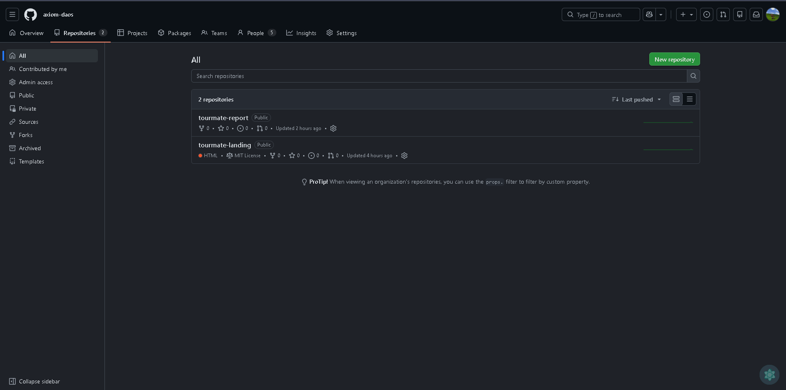

2. **Subida del código**
    - Se realizó el `push` del proyecto a la rama principal (`main`) del repositorio.
    - Se verificó que todos los recursos estén correctamente enlazados (rutas relativas).

   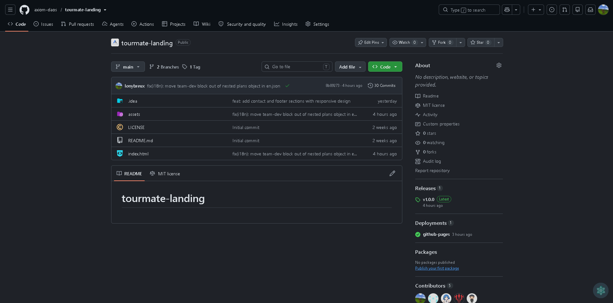

3. **Configuración de GitHub Pages**
    - En la sección *Settings* del repositorio, se habilitó **GitHub Pages**.
    - Se seleccionó la rama `main` como fuente de despliegue.
    - Se definió la carpeta raíz (`/root`) como directorio de publicación.

   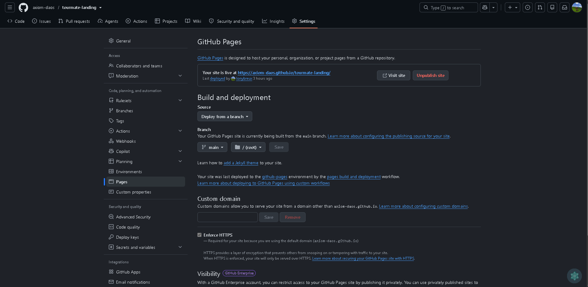

4. **Publicación automática**
    - GitHub Pages procesó automáticamente el contenido del repositorio.
    - En pocos minutos, generó una URL pública donde la Landing Page quedó disponible.

   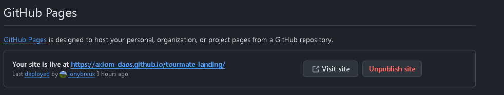

5. **Actualizaciones**
    - Cada vez que se realiza un nuevo `push` a la rama `main`, GitHub Pages actualiza automáticamente la página.
    - Esto permite mantener la Landing Page sincronizada con los cambios del repositorio sin intervención manual adicional.

#### Resultado
La Landing Page de TourMate fue desplegada exitosamente mediante GitHub Pages, permitiendo su acceso público a través de una URL estable. Esto facilita la presentación del producto a usuarios potenciales y valida la propuesta de valor del sistema de manera rápida y efectiva.

URL: https://axiom-daos.github.io/tourmate-landing/

#### *5.2.1.8. Team Collaboration Insights during Sprint*

Todos los miembros del equipo han participado activamente en la implementación de los productos del Sprint 1, lo cual se evidencia mediante los reportes de actividad y contribución del repositorio de GitHub de la organización Axiom.

**Insights**
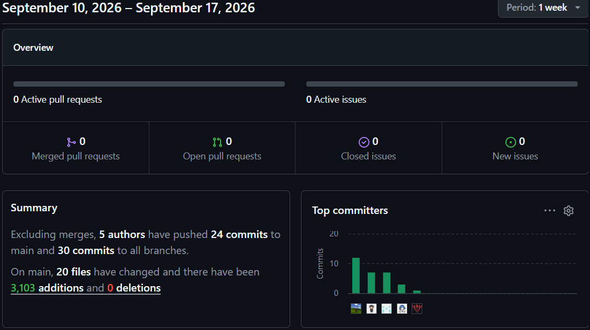

**Contributors**
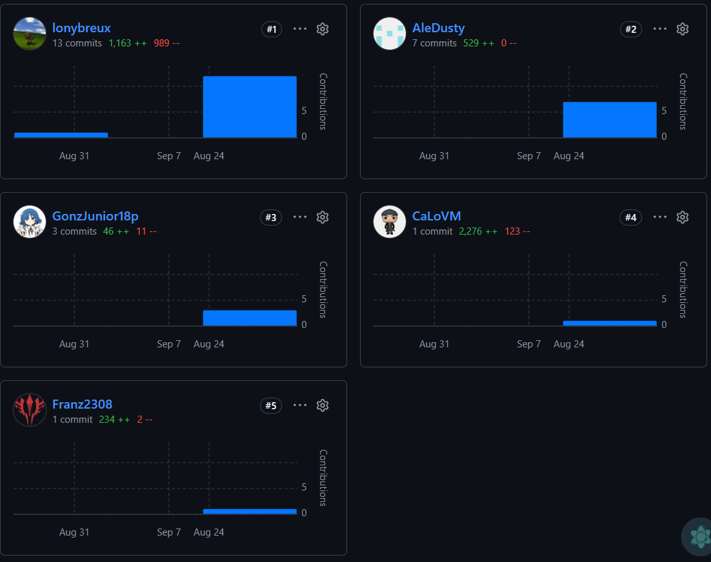

**Network graph**
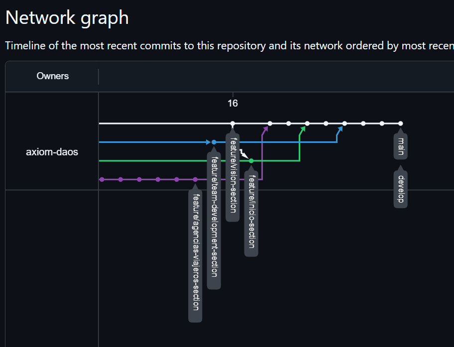

## Conclusiones

### Sprint 1 – Landing Page y documentación del proyecto

- **Sobre el análisis del problema y la investigación del usuario:** Se concluye que las entrevistas realizadas a dueños de agencias de tours y turistas de aventura permitieron identificar necesidades, expectativas y puntos de dolor relevantes para el desarrollo de SpotGo. La información recopilada fue fundamental para la definición de *User Personas*, *Empathy Maps* y *Journey Maps*, los cuales sirvieron como base para la priorización de funcionalidades y la elaboración del *Problem Statement*.

- **Sobre la propuesta de valor y validación inicial:** La elaboración de la *Landing Page* permitió comunicar de forma clara los objetivos, beneficios y funcionalidades principales de TourMate, funcionando como un medio de validación temprana de la idea de negocio. Se evidenció que presentar una interfaz informativa y accesible favorece la comprensión del problema y fortalece el interés de potenciales usuarios y clientes B2B.

- **Sobre la documentación y modelado del proyecto:** La construcción del reporte técnico permitió consolidar los hallazgos del *Problem Statement*, *Needfinding*, *User Personas*, *Empathy Maps*, *Journey Maps*, *Event Storming* y *Ubiquitous Language*, generando una visión integral del dominio del negocio. Asimismo, el uso de metodologías como *Domain-Driven Design (DDD)* facilitó la identificación de *Bounded Contexts* y responsabilidades del sistema desde etapas tempranas.

- **Sobre la definición de requerimientos:** La especificación inicial de *User Stories* y criterios de aceptación permitió transformar necesidades de usuarios en funcionalidades concretas, proporcionando una guía estructurada para el desarrollo de los siguientes sprints y reduciendo ambigüedades en la planificación técnica.

### Bibliografía

- Brown, S. (2020). *The C4 model for visualising software architecture*. C4Model.com. Recuperado de [https://c4model.com](https://c4model.com)
- Driessen, V. (2010). *A successful Git branching model*. Nvie. Recuperado de [https://nvie.com/posts/a-successful-git-branching-model](https://nvie.com/posts/a-successful-git-branching-model)
- Evans, E. (2003). *Domain-Driven Design: Tackling Complexity in the Heart of Software*. Addison-Wesley Professional. Recuperado de [https://www.domainlanguage.com/ddd](https://www.domainlanguage.com/ddd)
- Freeman, A. (2022). *Pro Angular 16*. Apress. Recuperado de [https://link.springer.com/book/10.1007/978-1-4842-8823-8](https://link.springer.com/book/10.1007/978-1-4842-8823-8)
- Newman, S. (2021). *Building Microservices: Designing Fine-Grained Systems* (2nd ed.). O'Reilly Media. Recuperado de [https://samnewman.io/books/building_microservices_2nd_edition](https://samnewman.io/books/building_microservices_2nd_edition)
- Walls, C. (2022). *Spring in Action* (6th ed.). Manning Publications. Recuperado de [https://www.manning.com/books/spring-in-action-sixth-edition](https://www.manning.com/books/spring-in-action-sixth-edition)

## Anexos

### Anexo A. Videos de exposiciones

- Exposición AV1: https://upcedupe-my.sharepoint.com/:v:/g/personal/u202419483_upc_edu_pe/IQDffa4P9uW3SqlkTMvmZIkDAdNuNWS0YpS-94osKLniRPY?nav=eyJyZWZlcnJhbEluZm8iOnsicmVmZXJyYWxBcHAiOiJPbmVEcml2ZUZvckJ1c2luZXNzIiwicmVmZXJyYWxBcHBQbGF0Zm9ybSI6IldlYiIsInJlZmVycmFsTW9kZSI6InZpZXciLCJyZWZlcnJhbFZpZXciOiJNeUZpbGVzTGlua0NvcHkifX0&e=gXbFhx

### Anexo B. Videos de entrevistas

- Entrevista 1 - Mateo Escudero, Agencia de Tour: https://upcedupe-my.sharepoint.com/:v:/g/personal/u20241f714_upc_edu_pe/IQCf3pj989dtRqsxlQP-cphyAdmHJbpSw14HLGTRks5qOyM?e=L98d2n&nav=eyJyZWZlcnJhbEluZm8iOnsicmVmZXJyYWxBcHAiOiJTdHJlYW1XZWJBcHAiLCJyZWZlcnJhbFZpZXciOiJTaGFyZURpYWxvZy1MaW5rIiwicmVmZXJyYWxBcHBQbGF0Zm9ybSI6IldlYiIsInJlZmVycmFsTW9kZSI6IldpZXcifX0%3D
- Entrevista 2 - Aarón Espinosa, Agencia de Tour: https://upcedupe-my.sharepoint.com/:v:/g/personal/u20221g231_upc_edu_pe/IQAofZYR8ATPSbWHvKq3vOSvAZ1mk5uCZxK_sr8rN9qoqI4?nav=eyJyZWZlcnJhbEluZm8iOnsicmVmZXJyYWxBcHAiOiJPbmVEcml2ZUZvckJ1c2luZXNzIiwicmVmZXJyYWxBcHBQbGF0Zm9ybSI6IldlYiIsInJlZmVycmFsTW9kZSI6IldpZXciLCJyZWZlcnJhbFZpZXciOiJNeUZpbGVzTGlua0NvcHkifX0&e=CzroE4
- Entrevista 3 - Carlos Gutierrez, Agencia de Tour: https://upcedupe-my.sharepoint.com/personal/u202319057_upc_edu_pe/_layouts/15/stream.aspx?id=/personal/u202319057_upc_edu_pe/Documents/Entrevista+DAOP.mp4&nav=eyJyZWZlcnJhbEluZm8iOnsicmVmZXJyYWxBcHAiOiJPbmVEcml2ZUZvckJ1c2luZXNzIiwicmVmZXJyYWxBcHBQbGF0Zm9ybSI6IldlYiIsInJlZmVycmFsTW9kZSI6InZpZXciLCJyZWZlcnJhbFZpZXciOiJNeUZpbGVzTGlua0NvcHkifX0&ga=1&referrer=StreamWebApp.Web&referrerScenario=AddressBarCopied.view.2461ff76-283b-41f2-bb72-df3bc61e4215&ClientRender=1
- Entrevista 4 - Sofia Mendoza, Turista de aventura: https://upcedupe-my.sharepoint.com/:v:/g/personal/u20241f714_upc_edu_pe/IQBPxk5ihQP7Qpk1EiObhUKMAcqE0PkmidpljYmgsKZhw60?e=y94DfE&nav=eyJyZWZlcnJhbEluZm8iOnsicmVmZXJyYWxBcHAiOiJTdHJlYW1XZWJBcHAiLCJyZWZlcnJhbFZpZXciOiJTaGFyZURpYWxvZy1MaW5rIiwicmVmZXJyYWxBcHBQbGF0Zm9ybSI6IldlYiIsInJlZmVycmFsTW9kZSI6IldpZXcifX0%3D
- Entrevista 5 - Romina Antonella Molina Vásquez, Turista de aventura: https://upcedupe-my.sharepoint.com/:v:/g/personal/u20221g231_upc_edu_pe/IQAQPNKuz_cKS4krk8KnLmoKAaAOQuWIL6WmZXL4T30cJJQ?nav=eyJyZWZlcnJhbEluZm8iOnsicmVmZXJyYWxBcHAiOiJPbmVEcml2ZUZvckJ1c2luZXNzIiwicmVmZXJyYWxBcHBQbGF0Zm9ybSI6IldlYiIsInJlZmVycmFsTW9kZSI6IldpZXciLCJyZWZlcnJhbFZpZXciOiJNeUZpbGVzTGlua0NvcHkifX0&e=B3HGgd
- Entrevista 6 - Miler Rodriguez, Turista de aventura: https://upcedupe-my.sharepoint.com/:v:/g/personal/u202419483_upc_edu_pe/IQDe0UWGvKUwRojgbs_XPIuJAclsUfNSUJK04_8jjCFOE7A?nav=eyJyZWZlcnJhbEluZm8iOnsicmVmZXJyYWxBcHAiOiJPbmVEcml2ZUZvckJ1c2luZXNzIiwicmVmZXJyYWxBcHBQbGF0Zm9ybSI6IldlYiIsInJlZmVycmFsTW9kZSI6InZpZXciLCJyZWZlcnJhbFZpZXciOiJNeUZpbGVzTGlua0NvcHkifX0&e=Szx6cw

### Anexo D. Materiales de ideación y diseño

- Lean UX Canvas del proyecto TourMate: 
- Big Picture EventStorming y Design-Level EventStorming: [https://miro.com/app/board/uXjVHl1uCrg=/?share_link_id=456387536744](https://miro.com/app/board/uXjVHl1uCrg=/?share_link_id=456387536744)
- Wireframe de la landing page: [https://www.figma.com/design/byMOHsD6I3IV3fdNwVPg3C/Tourmate-Landing-Page-Mockup?node-id=0-1&t=tADie7c5MlXe8uc4-1](https://www.figma.com/design/byMOHsD6I3IV3fdNwVPg3C/Tourmate-Landing-Page-Mockup?node-id=0-1&t=tADie7c5MlXe8uc4-1)
- Mock-up de la landing page: [https://www.figma.com/design/GVX1ocXvc77A9A24OnWhom/Tourmate-Mockup?node-id=0-1&t=5e7BZiJAVQvdoPjv-1](https://www.figma.com/design/GVX1ocXvc77A9A24OnWhom/Tourmate-Mockup?node-id=0-1&t=5e7BZiJAVQvdoPjv-1)
- Wireframes de la aplicación web: [https://www.figma.com/design/SKEFgPxKRE4cJmEnGjuAx3/DAOS_final?node-id=0-1&t=yXf7imx6mdAPUOiO-1](https://www.figma.com/design/SKEFgPxKRE4cJmEnGjuAx3/DAOS_final?node-id=0-1&t=yXf7imx6mdAPUOiO-1)
- Wireflows de la aplicación web: [https://www.figma.com/design/SKEFgPxKRE4cJmEnGjuAx3/DAOS_final?node-id=0-1&t=yXf7imx6mdAPUOiO-1](https://www.figma.com/design/SKEFgPxKRE4cJmEnGjuAx3/DAOS_final?node-id=0-1&t=yXf7imx6mdAPUOiO-1)
- Mock-ups de la aplicación web: [https://www.figma.com/design/SKEFgPxKRE4cJmEnGjuAx3/DAOS_final?node-id=0-1&t=yXf7imx6mdAPUOiO-1](https://www.figma.com/design/SKEFgPxKRE4cJmEnGjuAx3/DAOS_final?node-id=0-1&t=yXf7imx6mdAPUOiO-1)
- Prototipo de la aplicación web: [https://www.figma.com/design/SKEFgPxKRE4cJmEnGjuAx3/DAOS_final?node-id=0-1&t=yXf7imx6mdAPUOiO-1](https://www.figma.com/design/SKEFgPxKRE4cJmEnGjuAx3/DAOS_final?node-id=0-1&t=yXf7imx6mdAPUOiO-1)

### Anexo E. Repositorios y despliegues

- Repositorio del informe del proyecto: https://github.com/axiom-daos/tourmate-report
- Repositorio de la landing page: https://github.com/axiom-daos/tourmate-landing
- Repositorio del Web Application: https://github.com/axiom-daos/tourmate-web-application
- Repositorio del Backend: https://github.com/axiom-daos/tourmate-platform
- Despliegue de la landing page: https://axiom-daos.github.io/tourmate-landing/
- Tablero del Sprint Backlog 1: https://trello.com/b/gCKcMjVR/tourmate-sprint-1

### Anexo F. Herramientas utilizadas

- Trello, para gestión del backlog y tareas del proyecto: https://trello.com
- Gherkin, para criterios de aceptación en formato Given-When-Then: https://cucumber.io/docs/gherkin/
- Miro, para dinámicas de EventStorming: https://miro.com/
- Figma, para wireframes, mock-ups y prototipos: https://www.figma.com
- Canva, para recursos visuales del producto: https://www.canva.com
- UXPressia, para User Personas y Customer Journey Maps: https://uxpressia.com
- Lucidchart, para diagramas del sistema: https://www.lucidchart.com/ / https://lucidchart.com
- GitHub, para control de versiones y colaboración: https://github.com
- Visual Studio Code, para edición de código y archivos Markdown: https://code.visualstudio.com/
- GitHub Pages, para despliegue de la landing page y frontend web: https://pages.github.com
- Structurizr, para diagramas C4: https://structurizr.com
- Vertabelo, para diagramas de base de datos: https://vertabelo.com

### Anexo G. Referencias bibliográficas con enlace

- Guía para ejecutar Big Picture Event Storming: https://bit.ly/bpes-guide
- Guía práctica de EventStorming remoto: https://ddd-practitioners.com/2023/03/20/remote-eventstorming-workshop/
- Material sobre historias de usuario: https://www.scrummanager.com/files/scrum_manager_historias_usuario.pdf
- Libro de ingeniería de software usado como referencia: https://www.javier8a.com/itc/bd1/ld-Ingenieria.de.software.enfoque.practico.7ed.Pressman.PDF